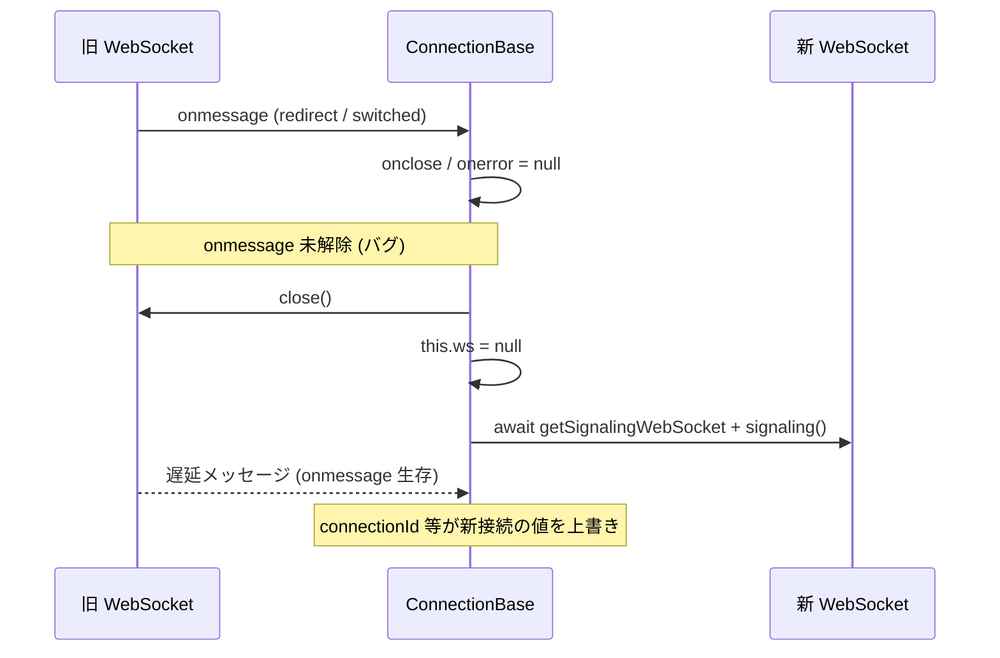

# redirect / switched で旧 WebSocket のハンドラが解除されず新接続の状態が壊れる

- Priority: High
- Created: 2026-05-21
- Polished: 2026-06-02
- Model: Opus 4.7
- Branch: feature/fix-ws-onmessage-leak-on-handover

## 目的

`type: redirect` 受信時および `type: switched` (`ignore_disconnect_websocket: true`) 受信時に、旧 WebSocket のメッセージ系ハンドラを解除しないまま `ws.close()` を呼んでいる経路を塞ぐ。

- **redirect**: `onmessage` が未解除（`onclose` / `onerror` は解除済み）
- **switched**: `onmessage` と `onerror` の両方が未解除（`onclose` のみ解除済み）

`ws.close()` だけでは close 完了前にキューに入った `MessageEvent` の dispatch は止まらない。旧 ws のハンドラが生存したまま追送メッセージが届くと、`signaling()` が載せた `onmessage` クロージャが再入し、新接続の `connectionId` / `sessionId` / `clientId` / `bundleId` 等を上書きしうる。switched 経路では post-connect で `onerror` に `abend("WEBSOCKET-ONERROR")` が載っているため、意図的な `close()` が `abend` を誘発しうる点がより重い。

`abendPeerConnectionState` / `abend` / `disconnect` では `ws.close()` の前に `onmessage = null` / `onerror = null` を行っている (`src/base.ts:622-623`, `733-734`, `1071-1072`)。redirect / switched だけ解除が抜けている。

## 優先度根拠

**redirect: High。** クラスタ運用では入口ノードが別ノードへ `type: redirect` を返す経路が通る。`signalingUrlCandidates` の件数に依存せず、入口 URL 1 件指定でも redirect は発生する。`await getSignalingWebSocket` / `await signaling` により race 窓が長い (`src/base.ts:2074-2075`)。

**switched: 付随修正。** `signalingOnMessageTypeSwitched` 自体は `await` を持たないため新たな race 窓は開かないが、ハンドラ未解除自体が `abend` / `disconnect` と同型の欠陥である。`onerror` 未解除は意図的 `close()` で `abend` を誘発しうる。`data_channel_signaling_only` + `ignoreDisconnectWebSocket: true` の典型経路では post-connect 切替が前提。

Sora が redirect / switched 送信後に旧接続へ何を追送するかは SDK 側では未確認で、本番観測ログも未取得。ただし旧 ws へのハンドラ未解除は WebSocket 仕様上 dispatch が成立するため、race の決定論的再現がなくても修正は正当。

## 現状

### 状態遷移



connect 後も ping / update / re-offer / switched / redirect は **`signaling()` が connect 時に付けた単一 `ws.onmessage`** (`src/base.ts:1270-1309`) が処理する。`monitorWebSocketEvent()` (`src/base.ts:1626-1652`) は `onclose` / `onerror` のみ上書きし `onmessage` は触らない。connect 後 switched では `this.ws` が null になり `disconnect()` 経由では旧 ws に届かないため、修正挿入点は `signalingOnMessageTypeSwitched` 本体である。

`signalingOnMessageTypeRedirect` (`src/base.ts:2067-2072`):

```ts
if (this.ws) {
  this.ws.onclose = null;
  this.ws.onerror = null;
  this.ws.close();
  this.ws = null;
}
```

`signalingOnMessageTypeSwitched` の `ignore_disconnect_websocket: true` 経路 (`src/base.ts:2045-2052`、先頭に `if (!this.ws) return` ガードあり: 2042-2044):

```ts
if (message.ignore_disconnect_websocket) {
  if (this.ws) {
    this.ws.onclose = null;
    this.ws.close();
    this.ws = null;
  }
  this.writeWebSocketSignalingLog("close");
}
```

**スコープ外 (別 issue 候補):** `signalingTerminate()` (`src/base.ts:582-598`) — connect 失敗時の `ws.close()` のみで `onmessage` 未解除。

## 設計方針

**handler 解除順序（両経路共通）:** `onclose` → `onmessage` → `onerror` → `close()` → `this.ws = null`。

**redirect:** `signalingOnMessageTypeRedirect` 内、既存 `this.ws.onclose = null;` (2068) の直後に `this.ws.onmessage = null;` を追加する（既存 `onerror = null` はその下に残す）。修正後の最終形:

```ts
if (this.ws) {
  this.ws.onclose = null;
  this.ws.onmessage = null;
  this.ws.onerror = null;
  this.ws.close();
  this.ws = null;
}
```

**switched:** 既存 `this.ws.onclose = null;` (2047) の直後に `this.ws.onmessage = null;` と `this.ws.onerror = null;` を追加する。修正後の最終形:

```ts
if (message.ignore_disconnect_websocket) {
  if (this.ws) {
    this.ws.onclose = null;
    this.ws.onmessage = null;
    this.ws.onerror = null;
    this.ws.close();
    this.ws = null;
  }
  this.writeWebSocketSignalingLog("close");
}
```

- **`onmessage = null` の置き場所:** redirect は `await getSignalingWebSocket` より前の同期部分で解除する。`onmessage` クロージャは `await this.signalingOnMessageTypeRedirect(message)` を `await` するため、redirect 分岐に入った invocation は `signalingOnMessageTypeRedirect` の同期部分（`onmessage = null` を含む）を実行しきってから `await` で中断する。outer `onmessage` 側に移すと中断後に解除が走り、解除前に届いた 2 件目を取りこぼす。
- **`onclose` 扱い:** redirect / switched では旧 ws の close イベントで `signalingTerminate()` や `abend()` を再入させないため `onclose = null` とする（`abend` / `disconnect` が `onclose` をログ専用ハンドラに差し替える点とは意図的に異なる）。
- **`onerror` 扱い:** redirect は connect 前で `monitorSignalingWebSocketEvent()` (`src/base.ts:1592-1614`) が `onerror` を付けうるため現行どおり `onerror = null` を維持。switched は connect 後で `monitorWebSocketEvent()` が `onerror = abend(...)` を付けているため `onerror = null` を追加する。

**設計限界:** `onmessage = null` は 2 件目以降の dispatch を止めるが、redirect 分岐に入る前に 2 件目が別 invocation として dispatch 済みなら並行 handler が走りうる（race-free ではない）。`signaling()` 内に `if (this.ws !== ws) return;` ガードは入れない（ハンドオーバー中に新 ws の正規メッセージを捨てうる）。`signaling()` のシグネチャ・内部実装は本 issue では変更しない。

## 関連 issue とマージ順

- **0009 → 0001 → 0008** の順でマージする。0001 は `signalingOnMessageTypeRedirect` / `signalingOnMessageTypeSwitched` のみ変更する。
- 0008 (`signaling()` 内 `ws.onmessage` 全体の例外ハンドリング): 編集箇所が重なるため 0001 後にマージ。0008 未マージ時の redirect 経路例外伝播は 0008 側で扱う。
- 0011 (timer 孤児化): 編集箇所・症状が異なり並行対応可能。0001 単独マージ後も connect 中 WS 監視競合は 0011 未修正なら残る。
- 0003 (switched 後 re-offer の DataChannel 同名上書き): 0001 修正後も残る別バグ。

## 変更対象ファイル

| ファイル                       | 内容                                                                                                         |
| ------------------------------ | ------------------------------------------------------------------------------------------------------------ |
| `src/base.ts`                  | `signalingOnMessageTypeRedirect` に `onmessage = null` 1 行、switched 経路に `onmessage` / `onerror` null 化 |
| `CHANGES.md`                   | `## develop` に FIX 追記                                                                                     |
| `e2e-tests/redirect/README.md` | 新規 (推奨・完了条件外。2 ノード手動スモーク手順)                                                            |

旧 ws から遅延到着した offer / notify 等を処理しなくなるのはバグ修正として意図した挙動変更。`callbacks.signaling` / `callbacks.notify` / `callbacks.connected` 等で旧 ws 由来追送が届かなくなる点は観測可能な挙動変更だが API 破壊ではない。

## 完了条件

- `signalingOnMessageTypeRedirect` で `ws.close()` の前に `this.ws.onmessage = null` が追加されている（既存の `onerror = null` 維持）
- `signalingOnMessageTypeSwitched` の `ignore_disconnect_websocket: true` 経路で `ws.close()` の前に `this.ws.onmessage = null` と `this.ws.onerror = null` が追加されている
- handler 解除順序が設計方針どおり（`onclose` → `onmessage` → `onerror` → `close()`）
- ローカルで `pnpm test` および単一ノード Sora 向け `pnpm e2e-test` が通ること
- CHANGES.md `## develop` に次を追記する

  ```
  - [FIX] type: redirect 受信時に旧 WebSocket の onmessage が、type: switched (ignore_disconnect_websocket) 経路では onmessage / onerror が解除されていなかったのを修正する
    - @voluntas
  ```

**検証の限界:** このバグの回帰は既存テストでは検出できない。redirect 向け Playwright テストはリポジトリに無く、`tests/` は WebSocket ライフサイクル未カバー（モック禁止）。既存 `e2e-tests/tests/type_switched.test.ts` / `switched_callback.test.ts` / `connected_callback.test.ts` は修正後も通ること（ただし race / `connectionId` 汚染 / post-close `abend` 非発火 / stale `onmessage` 非出力は検出しない）。修正の正しさはコードレビューと既存 E2E スモーク通過で担保し、`e2e-tests/redirect/README.md` に 2 ノード手動検証手順（timeline / signaling ログ、`connection_id` / `session_id`、`callbacks.connected` 1 回。redirect 後 `contactSignalingUrl` は入口 URL のまま: `src/base.ts:1330-1332`）を残すことを推奨する。
