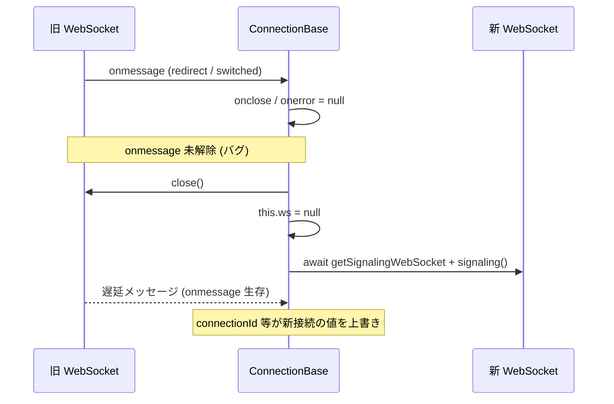

# redirect / switched で旧 WebSocket の `onmessage` が解除されず新接続の状態が壊れる

- Priority: High
- Created: 2026-05-21
- Model: Opus 4.7
- Branch: feature/fix-ws-onmessage-leak-on-handover

## 目的

`type: redirect` 受信時および `type: switched` (`ignore_disconnect_websocket: true`) 受信時に、旧 WebSocket の `onmessage` ハンドラが解除されないまま `ws.close()` を呼んでいる経路を塞ぐ。

`signalingOnMessageTypeRedirect` (`src/base.ts:2064-2077`) は `onclose` / `onerror` を null 化した後 `close()` → `this.ws = null` し、続けて `await this.getSignalingWebSocket(message.location)` と `await this.signaling(ws, true)` で制御を手放す。その間、旧 ws の `onmessage` クロージャがサーバー追送メッセージで呼ばれると、`this.connectionId` / `sessionId` / `clientId` / `bundleId` 等のシグナリング状態が新接続の値の上から書き換えられる。connect 中の `signaling()` Promise も、旧 ws から offer / redirect が遅延到着すると不正 resolve しうる。

同型の漏れが `signalingOnMessageTypeSwitched` (`src/base.ts:2045-2052`) の `ignore_disconnect_websocket: true` 経路にもある。connect 完了後 (`Promise.race` 完了後に `monitorWebSocketEvent()` が付与される) は `onerror` が `abend("WEBSOCKET-ONERROR")` になるため、意図的 `close()` で切替中に `abend` が発火しうる。connect 完了前に `switched` が来る経路では `monitorSignalingWebSocketEvent()` 側の `onerror` → `signalingTerminate()` が載る点に注意する (本 issue の主対象は post-connect の switched 経路)。

connect 後も ping / update / re-offer / switched / redirect は **`signaling()` が connect 時に付けた単一 `ws.onmessage`** (`src/base.ts:1270-1309`) が処理する。`monitorWebSocketEvent()` は `onclose` / `onerror` のみ上書きし、`onmessage` は触らない (`src/base.ts:1626-1651`)。connect 後 switched では `this.ws` が null になり `disconnect()` 経由では旧 ws に届かないため、修正挿入点は `signalingOnMessageTypeSwitched` である。

## 優先度根拠

**redirect 経路: High。** クラスタ運用では入口ノードが別ノードへ `type: redirect` を返す経路が通る。`signalingUrlCandidates` の件数に依存せず、入口 URL 1 件指定でも redirect は発生する。`await getSignalingWebSocket` / `await signaling` により race 窓が長い。

**switched 経路: 付随修正。** 同期処理で race 窓は redirect より短いが、ハンドラ未解除自体は `abend` / `disconnect` と同型の欠陥である。`data_channel_signaling_only` + `ignoreDisconnectWebSocket: true` の典型経路では post-connect 切替が前提。

旧 ws の `onmessage` が生きたままだと、ハンドラ未解除自体が明確な欠陥である。副次症状として `type: ping` が新 `this.ws` 経由で pong を送る (`src/base.ts:1991-1993`)、post-connect switched + DataChannel 移行後の re-offer / update 誤処理による意図しない DC 経由 re-answer (`sendSignalingMessage` `src/base.ts:2305-2321`) などが論理的に成立しうる (本番観測ログは未取得)。Sora が redirect 送信後に旧接続へ何を追送するかは SDK 側では未確認だが、旧 ws への dispatch 自体は WebSocket 仕様上成立するため、race 再現なくても修正は正当。

## 現状

### 状態遷移



根因は `signaling()` が引数 `ws` に載せる `ws.onmessage` が `async` クロージャ (`src/base.ts:1270-1309`) であること (redirect 到達時点では `this.ws === ws`)。redirect 処理は `await` で譲るため、旧 ws へ届いた 2 件目以降の MessageEvent が同じハンドラを再入する。**本修正の遮断メカニズムは `onmessage = null` によるハンドラ解除**であり、`ws.close()` だけでは close 完了前にキューに入ったイベントの dispatch は止まらない。

`abendPeerConnectionState` / `abend` / `disconnect` では `ws.close()` の前に `onmessage = null` と `onerror = null` が行われている (`src/base.ts:622-623`, `733-734`, `1071-1072`)。`close()` の呼び方は経路ごとに異なる (`abendPeerConnectionState` は handler 解除後に直接 `close()`、`abend` / `disconnect` は `disconnectWebSocket` 経由)。redirect / switched だけ `onmessage` 解除が抜けている。

`signalingOnMessageTypeRedirect` (`src/base.ts:2067-2071`):

```ts
if (this.ws) {
  this.ws.onclose = null;
  this.ws.onerror = null;
  this.ws.close();
  this.ws = null;
}
```

`switched` (`ignore_disconnect_websocket: true`) 経路 (`src/base.ts:2045-2050`):

```ts
if (message.ignore_disconnect_websocket) {
  if (this.ws) {
    this.ws.onclose = null;
    this.ws.close();
    this.ws = null;
  }
  this.writeWebSocketSignalingLog("close");
}
```

`disconnectWebSocket` の `signalingSwitched` 経路 (`src/base.ts:862-867`) も同型だが、`disconnect()` が先に `onmessage` / `onerror` を null 化する (`src/base.ts:1071-1072`) ため通常フローでは問題にならない。connect 後 switched ハンドオーバーでは旧 ws が `disconnect()` を経由しないため、`signalingOnMessageTypeSwitched` 本体の修正が必要である。

**スコープ外 (別 issue 候補):** `signalingTerminate()` (`src/base.ts:582-598`) — connect 失敗時の `ws.close()` のみで `onmessage` 未解除

## 設計方針

**redirect:** `signalingOnMessageTypeRedirect` 内、`await getSignalingWebSocket` より前で `this.ws.onmessage = null` を追加する (既存の `onerror = null` は維持。`onmessage` のみ追加)。

**switched:** `ignore_disconnect_websocket: true` 経路で `this.ws.onmessage = null` と `this.ws.onerror = null` を `close()` 前に追加する。

**handler 解除順序:** `onclose = null` → `onmessage = null` → `onerror = null` → `close()` → `this.ws = null`。

**`onclose` 扱い:** redirect / switched では旧 ws の close イベントで `signalingTerminate()` や `abend()` を再入させないため `onclose = null` とする。`abend` / `disconnect` が `onclose` をログ専用ハンドラに差し替える点とは意図的に異なる。

**解除タイミング:** 外側 `ws.onmessage` は `async` で、`await signalingOnMessageTypeRedirect(...)` に入る前の同期部分で handler 解除が走ることが race 遮断の要点である (outer `onmessage` 側に移さない)。

**`onerror` について:**

- **redirect** (connect 前): `monitorSignalingWebSocketEvent()` (`src/base.ts:1592-1614`) が `onerror` を付けうるため、現行どおり `onerror = null` を維持
- **switched** (connect 後): `monitorWebSocketEvent()` が `onerror` を付けているため、`onerror = null` も `close()` 前に追加する

**設計限界:** `onmessage = null` は 2 件目以降の dispatch を止める。redirect 分岐に入る前に 2 件目が別 invocation として dispatch された場合、並行 handler が走りうる (race-free ではない)。

`signaling()` 内に `if (this.ws !== ws) return;` ガードは入れない。ハンドオーバー中の `this.ws` とメッセージ処理対象 ws の不一致を招き、新 ws の正規メッセージを捨てうる。

`signaling()` のシグネチャ・内部実装は本 issue では変更しない。0008 (例外ハンドリング) 未マージ時の redirect 経路例外伝播は 0008 側で扱う。

**関連 issue:**

- 0011 (timer 孤児化): 編集箇所・症状が異なり並行対応可能。0001 単独マージ後も connect 中 WS 監視競合は 0011 未修正なら残る
- 0003: switched 後 re-offer の DataChannel 同名上書きは 0001 修正後も残る別バグ
- 0008: `signaling()` 内 `ws.onmessage` 全体を編集。0001 後にマージ

**変更対象ファイル:**

| ファイル                       | 内容                                                                                                         |
| ------------------------------ | ------------------------------------------------------------------------------------------------------------ |
| `src/base.ts`                  | `signalingOnMessageTypeRedirect` に `onmessage = null` 1 行、switched 経路に `onmessage` / `onerror` null 化 |
| `CHANGES.md`                   | `## develop` に FIX 追記                                                                                     |
| `e2e-tests/redirect/README.md` | 新規 (推奨・完了条件外。2 ノード手動スモーク手順)                                                            |

旧 ws から遅延到着した offer / notify 等を処理しなくなるのはバグ修正として意図した挙動変更。`callbacks.signaling` / `callbacks.notify` / `callbacks.connected` 等で旧 ws 由来追送が届かなくなる点は観測可能な挙動変更だが API 破壊ではない。

## 完了条件

- `signalingOnMessageTypeRedirect` で `ws.close()` の前に `this.ws.onmessage = null` が追加されている (既存の `onerror = null` 維持)
- `signalingOnMessageTypeSwitched` の `ignore_disconnect_websocket: true` 経路で `ws.close()` の前に `this.ws.onmessage = null` と `this.ws.onerror = null` が追加されている
- handler 解除順序が設計方針どおり (`onclose` → `onmessage` → `onerror` → `close()`)
- ローカルで `pnpm test` および単一ノード Sora 向け `pnpm e2e-test` が通ること
- switched 検証: 既存 `e2e-tests/tests/type_switched.test.ts` / `e2e-tests/tests/switched_callback.test.ts` / `e2e-tests/tests/connected_callback.test.ts` が修正後も通ること (いずれも race / `connectionId` 汚染 / post-close `abend` 非発火 / stale `onmessage-*` 非出力は検出しない)
- CHANGES.md `## develop` に次を追記する

  ```
  - [FIX] type: redirect 受信時に旧 WebSocket の onmessage が、type: switched (ignore_disconnect_websocket) 経路では onmessage / onerror が解除されていなかったのを修正する
    - @voluntas
  ```

**検証の限界:** redirect 修正は CI 上未カバー (リポジトリ内に redirect 向け Playwright テストなし)。`tests/` は WebSocket ライフサイクル未カバー (モック禁止)。修正の正しさはコードレビューと既存 E2E スモーク通過で担保する。2 ノード redirect 手動検証は race 決定論再現不可のため regression guard にならないが、`e2e-tests/redirect/README.md` に手順を残すことを推奨する (観測: timeline / signaling ログ、`connection_id` / `session_id`、`callbacks.connected` 1 回。redirect 後 `contactSignalingUrl` は入口 URL のまま `src/base.ts:1330-1332`)。

**マージ順 (0001 関連):** 0009 マージ後・0008 マージ前に 0001 をマージする。0001 は `signalingOnMessageTypeRedirect` / `signalingOnMessageTypeSwitched` のみ変更する。リポジトリ全体のマージ順は issue 0004 を正とする (0004 チェーンと 0007 issue 本文の 0007 位置は未統一。0001 実装者は **0009 → 0001 → 0008** の局所順を優先する)。
