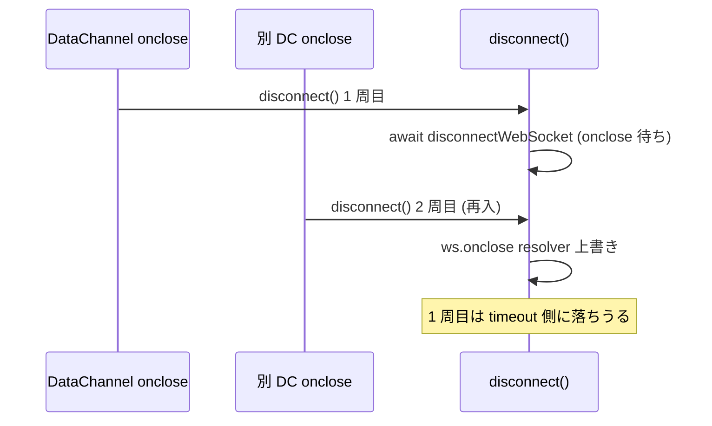

# DataChannel `onclose` で `disconnect()` が並列実行され callback が多重発火する

- Priority: High
- Created: 2026-05-21
- Polished: 2026-06-08
- Model: Opus 4.7
- Branch: feature/fix-disconnect-reentrancy

## 目的

`onDataChannel` (`src/base.ts:2144-2149`) が各 DataChannel の `onclose` に `await this.disconnect()` を設定しており、`disconnect()` に再入ガードがない。`disconnect()` が並列実行されると `callbacks.disconnect()` が複数回発火する。`disconnect()` を冪等化し、複数入口から同時に `disconnect()` が呼ばれても `callbacks.disconnect()` が 1 回しか呼ばれないようにする。

## 優先度根拠

High。`signalingSwitched === true` の DataChannel signaling 構成では、PeerConnection 切断やユーザー操作で `disconnect()` が短時間に複数回呼ばれうる。アプリ側で `callbacks.disconnect` を起点に再接続を組んでいると多重再接続を起こす。

## 現状

`onDataChannel` が各 DataChannel に設定する `onclose` (`src/base.ts:2144-2149`):

```ts
dataChannelEvent.channel.onclose = async (event): Promise<void> => {
  const channel = event.currentTarget as RTCDataChannel;
  this.writeDataChannelTimelineLog("onclose", channel);
  this.trace("CLOSE DATA CHANNEL", channel.label);
  await this.disconnect();
};
```

`disconnect()` (`src/base.ts:1053-1104`) は再入ガードを持たない。本体の最初の `await` は 1077 行 (`await this.disconnectDataChannel()`) で、1054-1076 は同期処理である。

### 再入が成立する経路



**A. 明示的な並列 `disconnect()` (本 issue の E2E 主対象)**

`Promise.all([disconnect(), disconnect()])` や UI 二重クリック等。`data_channel_signaling_only` fixture (`ignoreDisconnectWebSocket: true`, `signalingSwitched === true`) での実行順序は次のとおり (これが完了条件の Red 成立根拠):

1. 1 本目: 1054-1076 を同期実行 (`this.ws === null` のためハンドラ剥がしはスキップ)、`signalingSwitched === true` 経路で 1077 の `await this.disconnectDataChannel()` に入る。`disconnectDataChannel` は 951-968 で全 DC の `onclose` を resolve 専用ハンドラに同期で差し替えてから `await` する
2. 2 本目: 1 本目が `await` で制御を返した後、1054-1076 を同期実行し (この時点で `signalingSwitched` は未リセット)、2 本目も 1077 の `disconnectDataChannel` に入り、956 行で 1 本目の close 待ち resolver を上書きする
3. 2 本目は実 close で先に resolve → `initializeConnection()` → `callbacks.disconnect()` (1 回目発火)
4. 1 本目は close 待ち resolver を奪われ `disconnectWaitTimeout` 側 (942-946) に落ち、timeout 後に `forceCloseDataChannels` 経由で `callbacks.disconnect()` (2 回目発火、`code: 4999`)

→ **2 回目の callback は `disconnectWaitTimeout` 経過後に遅延発火する**。完了条件のテストは `disconnectWaitTimeout` を短く設定し、その経過後にカウンタが増えないことを確認する (後述)。

**B. `signalingSwitched === false` 経路での DC `onclose` 再入 (理論上の経路・本 E2E では検証対象外)**

`disconnectWebSocket("NO-ERROR")` (`src/base.ts:1087`) の `onclose` resolver 待ち (`src/base.ts:874-885`, `setTimeout(disconnectWaitTimeout)`) 中に別 DC `onclose` から 2 周目が入り、2 周目冒頭 (1063-1070) で 1 周目の `this.ws.onclose` resolver をログ専用ハンドラに上書きする経路。ただし `forceCloseDataChannels` (`src/base.ts:917`, `onclose = null`) 通過後の再発火は起きない。本 E2E fixture は `ignoreDisconnectWebSocket: true` で switched 後 `this.ws === null` (`src/base.ts:2045-2050`) のため、この経路は再現しない。

### 実害

- `callbacks.disconnect` の多重発火 (本 issue の主目的)
- 1 周目 `signalingSwitched === true` 処理中に 2 周目が `initializeConnection()` 経由で `signalingSwitched = false` (`src/base.ts:841`) にされ、分岐が混線する

### スコープ外

- `abend()` / `abendPeerConnectionState()` / `shutdown()` の多重 `callbacks.disconnect()` → issue 0030
- `disconnect()` 1078-1082 行の event 無条件上書き → issue 0031
- ユーザーが意図的に 1 回目完了後に再度 `disconnect()` を呼ぶ契約 → issue 0005
- `callbacks.disconnect()` 自体がユーザーコードで throw した場合の再発火 → 本 issue では扱わない (IIFE reject 後 `finally` で null 化され次回 `disconnect()` は新規実行されるため)
- `onclose` 内の `await this.disconnect()` 自体は変更しない

## 設計方針

`ConnectionBase` に `private disconnectingPromise: Promise<void> | null = null` を追加する (`src/base.ts:212` の `disconnectWaitTimeout` 宣言と同セクション)。

`disconnect()` 冒頭で `if (this.disconnectingPromise) return this.disconnectingPromise;` を置く。IIFE 開始前、`clearMonitorIceConnectionStateChange()` や handler 剥がしより前に置くことが必須 (2 周目が `this.ws.onclose` を再設定する race を防ぐため)。

**多重発火を防ぐ機構は 2 つあり、役割が異なる:**

1. **同時呼び出し (経路 A)** は `disconnectingPromise` ガードが防ぐ。2 本目は本体を実行せず同一 Promise を返すため、本体は 1 回しか走らず callback も 1 回。
2. **1 回目完了後の late `onclose` 呼び出し** は `disconnectingPromise` が `finally` で null 化済みのため新規本体が走るが、`initializeConnection()` 済み (`signalingSwitched === false` かつ `this.ws === null`) のため `event === null` のまま `if (event)` (`src/base.ts:1096`) を通らず callback は不発になる。これで吸収される。

`finally` で `disconnectingPromise = null` に戻すことで、`connect()` → `disconnect()` → `connect()` → `disconnect()` の繰り返しで 2 回目以降の `disconnect()` が新規実行できる。

**0030 連携の注意:** 本フィールドは中間 fix であり、0030 が導入する単一実行ラッパ (`runShutdownOnce` 想定) へ将来統合される見込み。ただし 0030 の設計は確定していないため「削除される」と断定はしない。0030 で統合する際は、上記機構 2 (late 呼び出しを `event === null` で吸収する性質) を落とさないこと。

`isDisconnecting` boolean フラグ案は採用しない。`onDataChannel` の `onclose` (2148) が `await this.disconnect()` で完了を待つため、後続呼び出しも同一 Promise を await して切断完了を待てる必要がある。boolean では 2 本目が即 return し、呼び出し側が切断完了前に処理を継続してしまう。

実装:

```ts
async disconnect(): Promise<void> {
  if (this.disconnectingPromise) {
    return this.disconnectingPromise;
  }
  this.disconnectingPromise = (async (): Promise<void> => {
    try {
      // 既存 disconnect() 本体 (1054-1103 行) をそのまま
    } finally {
      this.disconnectingPromise = null;
    }
  })();
  return this.disconnectingPromise;
}
```

## 関連 issue とマージ順

- 直近の依存順は **0031 → 0002 → 0030**。0002 は 0031 を PR に含めない。0005 は 0002 マージ後 (`0002 → 0005`)。
- 0030 は `disconnectingPromise` を単一実行ラッパへ統合する。

## 変更対象ファイル

| ファイル                                           | 内容                                                |
| -------------------------------------------------- | --------------------------------------------------- |
| `src/base.ts`                                      | `disconnectingPromise` 追加、`disconnect()` IIFE 化 |
| `e2e-tests/data_channel_signaling_only/index.html` | `#disconnect-count` (初期値 `0`) 追加               |
| `e2e-tests/data_channel_signaling_only/main.ts`    | disconnect カウンタ、`window` 露出、0031 統合       |
| `e2e-tests/tests/disconnect_reentrancy.test.ts`    | 新規                                                |
| `CHANGES.md`                                       | FIX 追記                                            |

## 完了条件

- `ConnectionBase` に `private disconnectingPromise: Promise<void> | null = null` が追加されている
- `disconnect()` 本体が async IIFE で包まれ、冒頭ガードが副作用より前、`finally` で null 化される
- `e2e-tests/data_channel_signaling_only/index.html` に `#disconnect-count` (hidden, 初期 `0`) を追加
- `main.ts` で次を実装する
  - `this.connection.on("disconnect", ...)` で `#disconnect-count` を increment (`textContent = String(n)`)
    - 0031 マージ済みなら 0031 の `#disconnect-event-type` を更新する既存 `on("disconnect")` ハンドラに increment を足す (handler 二重登録禁止)。0031 未マージで着手する場合は `on("disconnect")` を新規作成し increment のみ実装する
  - `onSwitched` ハンドラ内で `(window as unknown as { soraConnection: ConnectionPublisher | null }).soraConnection = this.connection` を設定し、`disconnect` ハンドラ内で `null` クリアする。テストは `#switched-status:not(:empty)` 待ち後に `page.evaluate` するため、この順序で `soraConnection` は必ず非 null になる
- 新規 `e2e-tests/tests/disconnect_reentrancy.test.ts`:
  - `data_channel_signaling_only` fixture、`checkSoraVersion` (2025.2.0+) は `switched_callback.test.ts` と同型
  - `disconnectWaitTimeout` を短く設定する (0031 が追加するクエリパラメータ経由、例: 1000ms)。これにより経路 A の 2 回目 callback (timeout 経路、Red) が短時間で決定論的に観測できる
  - `#switched-status:not(:empty)` 待ち後、`page.evaluate(async () => { const c = window.soraConnection; if (!c) throw new Error("soraConnection missing"); await Promise.all([c.disconnect(), c.disconnect()]); })` で **明示的並列 disconnect** を再現
  - `expect(page.locator("#disconnect-count")).toHaveText("1", { timeout: 5000 })`
  - **その後 `disconnectWaitTimeout` を超える時間 (例: 2000ms) 待機し、再度 `toHaveText("1")` を assert する (必須)。** `toHaveText("1")` 単独では一瞬 1 を通過するだけで通ってしまい、遅延発火する 2 回目 callback (Red) を見逃すため、この安定確認が回帰検出の本体である
  - 修正前はこの安定確認で `#disconnect-count` が `2` になる (Red → Green 確認)
  - 補足: 上記手順 3-4 は「実 DC close が `disconnectWaitTimeout` より先に届く」場合の代表的順序である。`disconnectWaitTimeout` を実 close 往復より短くすると 1 本目・2 本目とも timeout 経路に落ちるが、その場合も両方が `callbacks.disconnect()` を出すため修正前 count は `2` になる。Green の count=1 (本体が 1 本しか走らない) と Red の count=2 はいずれも close タイミングに依存せず成立するため、テストの回帰検出能力は保たれる
- ローカルで `pnpm test` および既存 `pnpm e2e-test` が通ること
- CHANGES.md `## develop` に次を追記 (0031 マージ後は 0031 エントリの直後)

  ```
  - [FIX] disconnect() が並列実行されたとき callbacks.disconnect() が複数回発火しないように冪等化する
    - @voluntas
  ```
