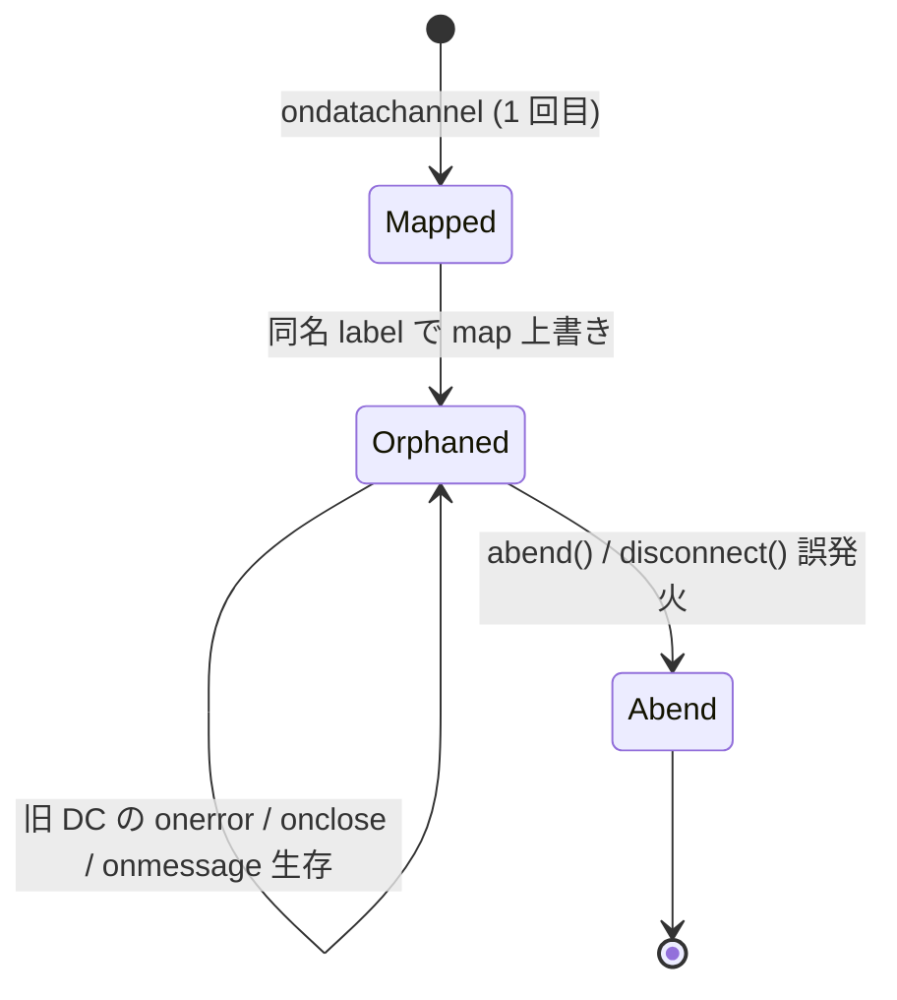

# `onDataChannel` で同名 label の DC を無条件に上書きし旧 DC のハンドラから誤って abend / disconnect が発火しうる

- Priority: Medium
- Created: 2026-05-21
- Polished: 2026-06-02
- Model: Opus 4.7
- Branch: feature/fix-ondatachannel-same-label-overwrite

## 目的

`onDataChannel` (`src/base.ts:2116-2294`) が `this.soraDataChannels[dataChannel.label]` に新しい DC を無条件代入する (`src/base.ts:2121`)。既存 DC のハンドラ解除と close を行わないため、同一 `RTCPeerConnection` 上で同名 label の **別インスタンス** の `RTCDataChannel` が `ondatachannel` された場合、旧 DC オブジェクトに残った `onerror` / `onclose` / `onmessage` から遅延 dispatch され、`abend()` / `disconnect()` / 二重 re-offer 処理が走りうる。代入前に旧 DC のハンドラを null 化し close する。

本 issue は論理上の防御ギャップであり、Sora 実運用で確定したバグではない。通常の re-offer では既存 negotiated DC が同一オブジェクトのまま維持され 2 回目 `ondatachannel` は出ないことが多いため、再現未確定。後述の着手前ゲートで実機再現を必須とする。

## 優先度根拠

Medium。発火条件は「re-offer または `type update` (`src/base.ts:1944-1949`, deprecated だがコード上は生存) による SDP 再ネゴの結果、ブラウザが同名 label で **新しい DC インスタンス** を `ondatachannel` する」ことに依存する。Sora / ブラウザ双方の挙動依存で、リポジトリ内に再現手順・テストは無い。実害（誤 `disconnect` / `abend`）は大きいが再現未確定のため Medium とし、再現が取れた時点で High 見直しを検討する。

redirect 経路 (`signalingOnMessageTypeRedirect` `src/base.ts:2064-2077`) では connect 中に完結し `soraDataChannels` 未生成のため本問題は発生しない。`type: switched` (`ignoreDisconnectWebSocket: true`) 後の re-offer では同一 PC を維持するため issue 対象になりうる (0001 の WS ハンドラ漏れとは別問題)。

## 現状

### 状態遷移



`src/base.ts:2121`

```ts
this.soraDataChannels[dataChannel.label] = dataChannel;
```

既存 channel があっても close せず、ハンドラを null 化せず代入で上書きする。代入は **ハンドラ登録 (2127-2293 行) より先** なので、上書き直後 map は新 DC、旧 DC は orphan になる。

主な副作用 (全 label 共通。signaling / notify / push / stats / rpc / `#...` ユーザ DC):

- `onerror` (`src/base.ts:2151-2158`) → `abend()` → `callbacks.disconnect`
- `onclose` (`src/base.ts:2144-2149`) → `disconnect()` → `callbacks.disconnect`
- `onmessage` (signaling label 等) → `signalingOnMessageTypeReOffer` / `signalingOnMessageTypeClose` 等

`onmessage = null` は dispatch 時に最新値を参照するため、`close()` 前に null 化すれば null 化後の追送 MessageEvent は遮断できる。本 fix が遮断できるのは「null 化時点でまだイベントループに載っていない未来のイベント」だけで、既に in-flight (`await this.disconnect()` 実行中) の `onclose` / `onmessage` は止まらない (→ 0002 / 0030)。

re-offer 入口は WebSocket (`src/base.ts:1283-1285`) と DataChannel signaling (`src/base.ts:2176-2177`) の 2 つ。`type update` (`src/base.ts:1944-1949`) は WS の `onmessage` でのみ処理され DataChannel signaling 経路では扱わない。いずれの `signalingOnMessageTypeReOffer` (`src/base.ts:1957-1962`) も同一 `this.pc` を使い回し `soraDataChannels` をクリアしない。`SignalingReOfferMessage` は `sdp` のみ (`src/types.ts:169-172`) で `data_channels` 更新が無いため、初回 offer の `signalingOfferMessageDataChannels` を使い回す。

同型の正しいパターン: `forceCloseDataChannels` (`src/base.ts:911-921`) — `onerror` / `onclose` / `onmessage` null 化 → `close()`。共通化リファクタは本 issue スコープ外 (issue 0030 は abend / shutdown 等の並列 shutdown 冪等化であり DC ハンドラ解除パターンの共通化は含まない)。`signalingTerminate()` (`src/base.ts:582-588`) のハンドラ未解除も同族だが別 issue。

## 設計方針

`src/base.ts:2121` の代入直前に stale DC を処理する。順序は `forceCloseDataChannels` と同型: `onerror` / `onclose` / `onmessage` null 化 → timeline ログ → `close()` → map 代入。`onopen` / `onbufferedamountlow` は abend / disconnect を呼ばないため null 化対象外 (遅延 `onopen` で timeline が汚れる可能性は許容)。

```ts
const existing = this.soraDataChannels[dataChannel.label];
if (existing && existing !== dataChannel) {
  existing.onerror = null;
  existing.onclose = null;
  existing.onmessage = null;
  this.writeDataChannelTimelineLog("close-stale-data-channel", existing);
  if (existing.readyState !== "closed" && existing.readyState !== "closing") {
    existing.close();
  }
}
this.soraDataChannels[dataChannel.label] = dataChannel;
```

| 項目       | `forceCloseDataChannels` | 本 fix (stale close)       |
| ---------- | ------------------------ | -------------------------- |
| timeline   | 無                       | `close-stale-data-channel` |
| readyState | 未チェック               | closed / closing スキップ  |
| 対象       | 全 DC                    | 同名 1 本                  |

- `existing === dataChannel` は self-close 防止。
- ハンドラを先に null 化してから `close()` を呼ぶため、自前で呼んだ `close()` による旧 DC の `onclose` / `onerror` は発火しない。
- `readyState` の closed / closing スキップは `close()` の冗長呼び出し回避 (仕様上 no-op だが整合性のため。`forceCloseDataChannels` に合わせるか両方に入れるかは共通化 issue で再検討)。
- `writeDataChannelTimelineLog` は `close()` 前 (`RTCDataChannel.id` 等が close 後に null になりうるため)。
- `signalingOfferMessageDataChannels[label]` は本 issue では触らない。
- 0003 単体の stale close では in-flight / 並列 `disconnect()` は残る (→ 0002 / 0030)。0002 未完了でも本 issue は独立に修正可能。

## 完了条件

**§着手前を満たさない限り §実装に進まない。**

### 着手前（必須）

実機 Sora で re-offer / `type update` 経路により同名 label の `ondatachannel` が **2 回目** 発火する条件を探索する。

調査対象の構成 (組合せ):

- `dataChannelSignaling: true` + `ignoreDisconnectWebSocket: true` (`e2e-tests/data_channel_signaling_only/`)
- `type update` 経路は WS 維持構成 (switched しない、または `ignoreDisconnectWebSocket: false`) でのみ到達するため、update を試す場合は WS を維持する設定にする
- RPC simulcast RID 切替 (`e2e-tests/tests/rpc.test.ts`)、spotlight 切替系 E2E
- signaling 以外の label (notify / push / stats / rpc / ユーザ `#...`) も観測対象に含める

観測手順: 既存 timeline (`writeDataChannelTimelineLog`) は `channel.id` / `channel.label` のみ記録しオブジェクト同一性を残さないため、再現探索では **一時的な計装** が要る。`onDataChannel` 冒頭に `const existing = this.soraDataChannels[dataChannel.label]` を読み、`existing && existing !== dataChannel` のとき trace ログを出すコードを暫定で挿入し、以下を観測する:

- 同一 `label` の `ondatachannel` が 2 回出るか
- 2 回目の `RTCDataChannel` が別オブジェクト (`existing !== dataChannel`) か
- 誤 `disconnect-normal` / `disconnect-abend` が旧 DC の `onclose` / `onerror` タイムスタンプ後に出るか

再現できなければ SDK 修正前に `issues/pending/` へ移動し、試した Sora バージョン・機能設定・SDP / timeline ログを issue 末尾に追記する (その場合 CHANGES 追記・Completed は付けない)。

### 実装 (再現確認後のみ)

- 上記設計方針どおり `onDataChannel` (`src/base.ts:2116-`) に stale DC 処理を追加する
- ローカルで `pnpm test` および既存 `pnpm e2e-test` が通ること

### 検証 (再現が取れた場合のみ close)

- 再現手順 (Sora バージョン、channel / 機能設定、期待 timeline イベント `close-stale-data-channel`、誤 `disconnect-normal` / `disconnect-abend` の見分け) を **PR 説明に記載**し、修正前後の `callbacks.disconnect` 誤発火有無を timeline ログで示す (新規 README は作らない)
- CHANGES.md `## develop` に次を追記する

  ```
  - [FIX] onDataChannel で同名 label の DataChannel を上書きする際に旧 DC のハンドラを解除し close するようにする
    - @voluntas
  ```
