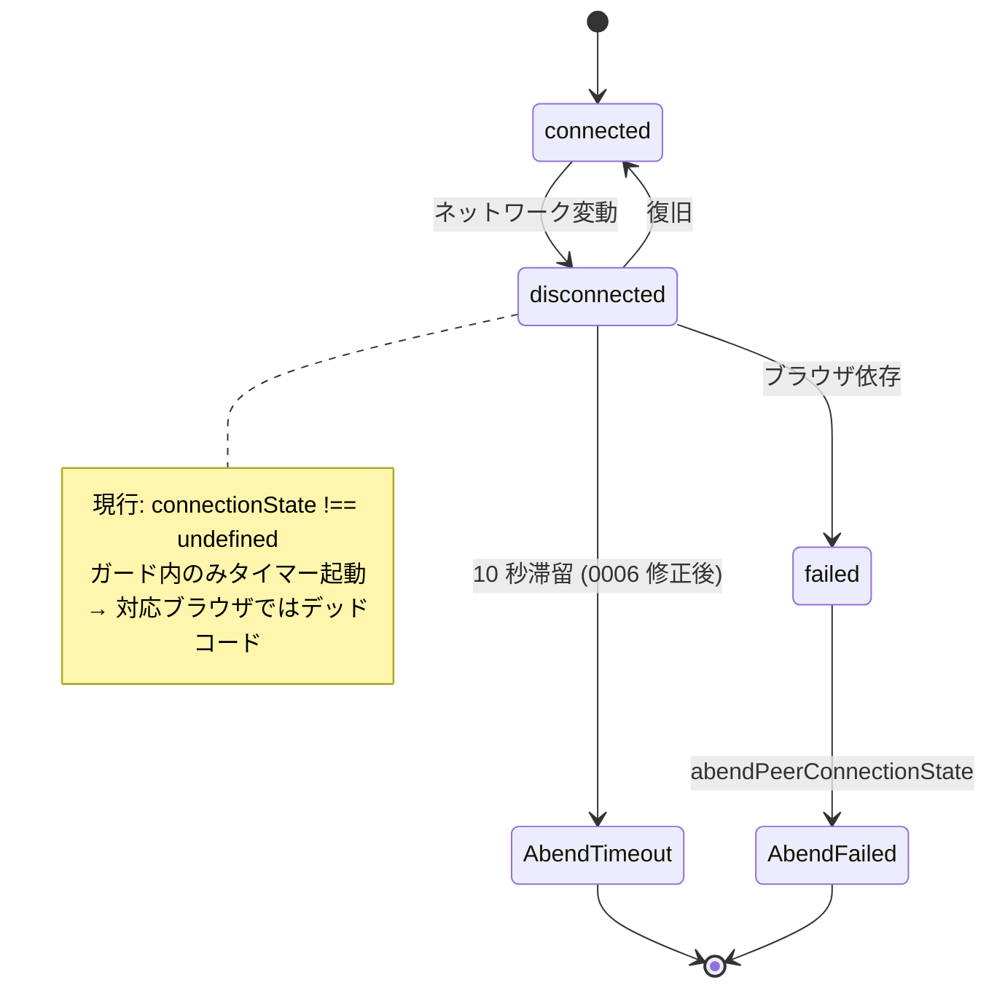

# `monitorPeerConnectionState` の `iceConnectionState: disconnected` 10 秒タイマーが現行ブラウザで動作しない

- Priority: High
- Created: 2026-05-21
- Polished: 2026-06-02
- Model: Opus 4.7
- Branch: feature/fix-monitor-ice-disconnected-timer

## 目的

`monitorPeerConnectionState` (`src/base.ts:1660-1707`) 内の `oniceconnectionstatechange` (`src/base.ts:1664-1687`) で `iceConnectionState === "disconnected"` の 10 秒タイマー (`src/base.ts:1680-1684`) を `if (this.pc && this.pc.connectionState === undefined)` (`src/base.ts:1666`) のガード内でしか起動していない。`README.md` 記載の対応ブラウザ (Chrome / Edge 80+、Firefox 113+、Safari 16.4+) はすべて `RTCPeerConnection.connectionState` を実装済みで `connectionState === undefined` を満たさないため、この分岐は常に false でデッドコードになっている。

`disconnected` から `failed` への遷移は WebRTC 仕様上実装依存で、ブラウザによっては `disconnected` のまま `failed` に遷移しない。ガードを外して `disconnected` 滞留検知を現行ブラウザでも動作させる。

## 優先度根拠

High。Wi-Fi / 5G 切り替え等で `iceConnectionState` が `disconnected` のまま `failed` に遷移しない実装に当たると、`onconnectionstatechange` の `failed` 分岐 (`src/base.ts:1698-1700`) も走らず `callbacks.disconnect` が発火せず接続失効を検知できない。SDK 利用者が ICE 状態を直接観測する公開 API は無い。

**残余リスク (本 issue スコープ外):** `connectionState === "disconnected"` 滞留は未監視。ice 側復旧で大半をカバーする前提だが、ice が `connected` に戻り connectionState だけ `disconnected` のまま等は検知不能。

## 現状

### 状態遷移



`oniceconnectionstatechange` (1664-1687) は `connectionState === undefined` ガード内にのみ `clearTimeout` / `iceConnectionState === "failed"` 切断 / `disconnected` 10 秒タイマーを持つ。`onconnectionstatechange` (1688-1702) は `connected` (→ `triggerConnectedCallbackIfReady`) と `failed` (→ `abendPeerConnectionState("CONNECTION-STATE-FAILED")`) を見る。

`clearMonitorIceConnectionStateChange` (`src/base.ts:1753-1755`) はタイマー ID (代入元は `setTimeout` 戻り値、`1680`) に対し `clearInterval` を使っている。ブラウザでは `setTimeout` / `setInterval` の timer ID 名前空間が共有されるため `clearInterval(id)` でも `setTimeout` の ID を解除でき**機能上は等価**だが、API ペアが不整合なので `clearTimeout` に揃える (clarity 改善)。

## 設計方針

ガード `connectionState === undefined` を削除し、`if (!this.pc) return;` の null ガードのみ残す。1665 行コメントは削除する。

```ts
this.pc.oniceconnectionstatechange = (_): void => {
  if (!this.pc) {
    return;
  }
  this.writePeerConnectionTimelineLog("oniceconnectionstatechange", {
    connectionState: this.pc.connectionState,
    iceConnectionState: this.pc.iceConnectionState,
    iceGatheringState: this.pc.iceGatheringState,
  });
  this.trace("ONICECONNECTIONSTATECHANGE ICECONNECTIONSTATE", this.pc.iceConnectionState);
  clearTimeout(this.monitorIceConnectionStateChangeTimerId);
  if (this.pc.iceConnectionState === "failed") {
    this.abendPeerConnectionState("ICE-CONNECTION-STATE-FAILED");
  } else if (this.pc.iceConnectionState === "disconnected") {
    this.monitorIceConnectionStateChangeTimerId = setTimeout(() => {
      if (this.pc?.iceConnectionState === "disconnected") {
        this.abendPeerConnectionState("ICE-CONNECTION-STATE-DISCONNECTED-TIMEOUT");
      }
    }, 10_000);
  }
};
```

`clearMonitorIceConnectionStateChange`: `clearInterval` → `clearTimeout`。

**副作用:**

- 目的: `disconnected` 10 秒タイマー再有効化
- 副作用 1: `iceConnectionState === "failed"` → `abendPeerConnectionState("ICE-CONNECTION-STATE-FAILED")` の再有効化 (現行はデッドコード)
- 副作用 2: `oniceconnectionstatechange` の timeline / trace ログ増加

**0030 との関係 (推奨同周期、必須ではない):** 副作用 1 で ICE failed が `oniceconnectionstatechange` と `onconnectionstatechange` の両方から検知されうるが、現コードでは `callbacks.disconnect` の二重発火は起きない。`abendPeerConnectionState` (`src/base.ts:605-659`) は同期メソッドで、`callbacks.disconnect` (657) を呼ぶ前に冒頭で `clearMonitorIceConnectionStateChange()` (606) と `oniceconnectionstatechange` / `onconnectionstatechange` の null 化 (610-612) を行う。JS は単一スレッドのため、先に走った片方のハンドラが同期的に相手のハンドラを剥がし、後続イベントは発火しない。よって 0006 は単独マージしても二重発火しない。ただし 0030 が `abendPeerConnectionState` を `runShutdownOnce` 化し、ハンドラ剥がしと `callbacks.disconnect` の間に `await` が入ると二重発火が再発しうるため、**0030 と同周期リリースを推奨**する (0030 側の冪等化が予防になる)。

**代替案 (記録のみ):** `disconnected` タイマーと `clearTimeout` だけをガード外へ移し、`ice failed` 検知は `onconnectionstatechange` 一本のままにすれば副作用 1 自体が発生せず 0030 依存が完全に消える。本 issue は採用案 (ガード全体削除) を実装する。代替案は 0030 が長期間マージされない場合のフォールバックとして記録する。

### 0011 との関係

0006 適用後にタイマーが実際に動き始める。`signalingTerminate` → `initializeConnection` は `clearMonitorIceConnectionStateChange` を呼ばない (`582-597`, `820-848`) ため、0011 の `initializeConnection` への clear 追加が孤児タイマー防止として有効になる。

**変更対象:** `src/base.ts` の `monitorPeerConnectionState` / `clearMonitorIceConnectionStateChange`

## 完了条件

- ガード `connectionState === undefined` を削除し、`disconnected` 10 秒タイマーが現行ブラウザで動作する
- `clearMonitorIceConnectionStateChange` が `clearTimeout` を使う
- stale コメント (1665 行) を削除する
- ローカルで `pnpm test` および既存 `pnpm e2e-test` が通ること
- CHANGES.md `## develop` に次を追記する (副作用 1・2 は PR 説明に明記)

  ```
  - [FIX] iceConnectionState が disconnected で 10 秒経過した際の検知が現行ブラウザで動作していなかったのを修正する
    - @voluntas
  ```

**検証の限界:** デッドコード修正の核心は CI 未カバー (`tests/` / `e2e-tests/` に ICE 状態遷移テストなし、モック禁止)。手動検証手順 (OS / ブラウザ、ネットワーク down 手順、期待 timeline `ICE-CONNECTION-STATE-DISCONNECTED-TIMEOUT`) は PR 説明に記載する (新規 README は作らない)。10 秒タイマー自体は既にコード上 `10_000` 実装済みで本 fix はガード削除のみ (CHANGES.md の旧 1000ms 記載との差は PR で触れる)。

**マージ順:** `0006 → 0011 → 0030` (0030 は推奨同周期)。リポジトリ全体の正本チェーンは issue 0004 を参照。
