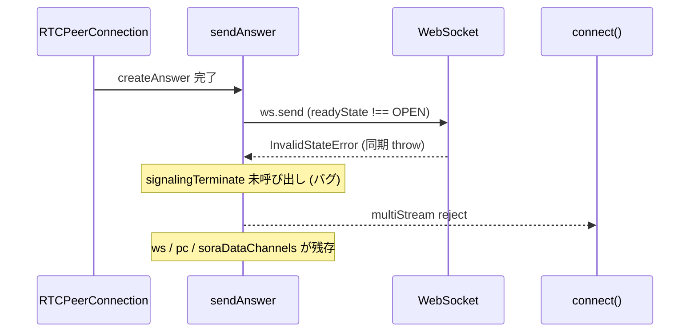

# `sendAnswer` の `ws.send` 同期例外がアンキャッチで内部リソースが残る

- Priority: High
- Created: 2026-05-21
- Model: Opus 4.7
- Branch: feature/fix-send-answer-ws-send-exception

## 目的

`sendAnswer` (`src/base.ts:1507-1515`) が `this.ws.send(JSON.stringify(message))` を try/catch せず同期呼び出ししているため、`ws.readyState !== 1` 時に `InvalidStateError` が同期 throw され、呼び出し元の `multiStream` (`src/publisher.ts` / `src/subscriber.ts` / `src/messaging.ts`) が reject する。`multiStream(...).finally(...)` で `clearConnectionTimeout` / `clearMonitorSignalingWebSocketEvent` は呼ばれるが、`signalingTerminate` 相当のクリーンアップ (ws / pc / dataChannel の close と `initializeConnection`) は走らないため、`this.ws` / `this.pc` / `this.soraDataChannels` が dangling 状態で残る。即座にアプリが `connect()` を再試行すると残骸を踏んで状態破壊が連鎖する (issue 0011 の interval 孤児化と相関)。

`sendAnswer` の同期 throw を try/catch で囲み、失敗時に `signalingTerminate()` を呼んで内部状態を初期化してから throw し直す。

## 優先度根拠

High。`createAnswer` 直後に Sora 側 TCP RST、ローカルネットワーク変動、`monitorSignalingWebSocketEvent` の close 検知レースなどで `ws.readyState` が `OPEN` 以外になっているケースが本番で発生しうる。発生すると `connect()` が reject するが、SDK 内部状態は中途半端なまま残るため、ユーザーが catch して再 `connect()` を呼ぶと「前回の残骸が干渉して再接続できない」状態になる。

## 現状

### 状態遷移



`src/base.ts:1507-1515`

```ts
protected sendAnswer(): void {
  if (this.pc && this.ws && this.pc.localDescription) {
    this.trace("ANSWER SDP", this.pc.localDescription.sdp);
    const { sdp } = this.pc.localDescription;
    const message = { sdp, type: SIGNALING_MESSAGE_TYPE_ANSWER };
    this.ws.send(JSON.stringify(message));
    this.writeWebSocketSignalingLog("send-answer", message);
  }
}
```

`ws.send` は `readyState !== 1` 時に `InvalidStateError` を同期 throw する。`sendAnswer` は `void` 同期メソッドで、呼び出し元 `multiStream` (例: `src/publisher.ts` の `multiStream` 内 `this.sendAnswer();`) でも try/catch されていない。同期 throw は `multiStream` が返す Promise の reject となり、`Promise.race` の prevent / `finally` 経由で `clearConnectionTimeout` / `clearMonitorSignalingWebSocketEvent` は呼ばれるが、`signalingTerminate` は呼ばれず `this.ws` / `this.pc` / `this.soraDataChannels` が初期化されないまま残る。

`sendUpdateAnswer` (`src/base.ts:1916-1924`) と `sendReAnswer` (`src/base.ts:1929-1937`) は async メソッドで、`this.ws.send` を直接呼ばず `this.sendSignalingMessage(...)` (`src/base.ts:2301-2322`) を介する。`sendSignalingMessage` の内部にも `this.soraDataChannels.signaling.send` と `this.ws.send` の try/catch 漏れがあるが、これは issue 0034 (`issues/0034-bug-fix-signaling-send-sync-exceptions.md`) でまとめて扱うため、本 issue の対象外とする。同様に `sendStatsMessage` (`src/base.ts:2329-2343`)、public API `sendMessage` (`src/base.ts:2428` 周辺) も本 issue の対象外。

`signalingTerminate` (`src/base.ts:582-598`) は冪等な作りになっており、内部の `ws.close()` / `pc.close()` / `dataChannel.close()` はすべて null/falsy ガード付きで二重呼び出しに安全。`initializeConnection` (`src/base.ts:820-848`) も冪等。

## 設計方針

`ws.readyState !== 1` を `try` 前に明示チェックし、`ws.send` 同期 throw 時はいずれも `signalingTerminate()` で内部状態を初期化してから `ConnectError` を throw する。`sendSignalingMessage` 系の修正は issue 0034 に委ね、本 issue は `sendAnswer` のみに限定する。

実装 (`src/base.ts:1507-1515`): `readyState !== WebSocket.OPEN` 早期検出 + `ws.send` try/catch (早期チェックと send の間に close されるレースがあるため try/catch も必須)。catch / 早期検出時は `signalingTerminate()` 後 `ConnectError` (`reason: "WS_SEND_INVALID_STATE"` / `"WS_SEND_FAILED"`) を throw。`ConnectError` は `src/utils.ts:414-417` で定義。

0009 未マージ時、`signalingTerminate` は `onicecandidate` を解除しない。0007 単体では `sendAnswer` 失敗時点で handler 未登録のため直撃しにくいが、0009 と同 PR または **0009 先行マージを推奨**。

**`signalingTerminate` 後の `ws.onclose` 再入:** `signaling()` が付けた `onclose` は offer resolve 後も生きる。`signalingTerminate()` → `ws.close()` で `onclose` が再度 `signalingTerminate()` を呼ぶ (冪等だが timeline ログ二重化しうる)。

**`ConnectError.reason`:** 早期 `readyState !== WebSocket.OPEN` 検出 → `"WS_SEND_INVALID_STATE"`。`ws.send` catch → `"WS_SEND_FAILED"`。

## 完了条件

- 上記設計方針どおり `sendAnswer` を修正する
- ローカルで `pnpm test` および既存 `pnpm e2e-test` が通ること
- 失敗経路では `writeWebSocketSignalingLog("failed-to-send-answer", ...)` を残す
- 手動検証手順を `e2e-tests/sendrecv/README.md`（新規可）に残す (TCP RST タイミング依存のため E2E 自動化はスコープ外)
- CHANGES.md `## develop` に次のエントリを追記する
  ```
  - [FIX] sendAnswer の ws.send が同期 throw したときに内部状態がクリーンアップされなかったのを修正する
    - @voluntas
  ```
- マージ順: **0021** → **0009** → **0001** → **0008** → **0007** → **0034** (0004 チェーン参照)
