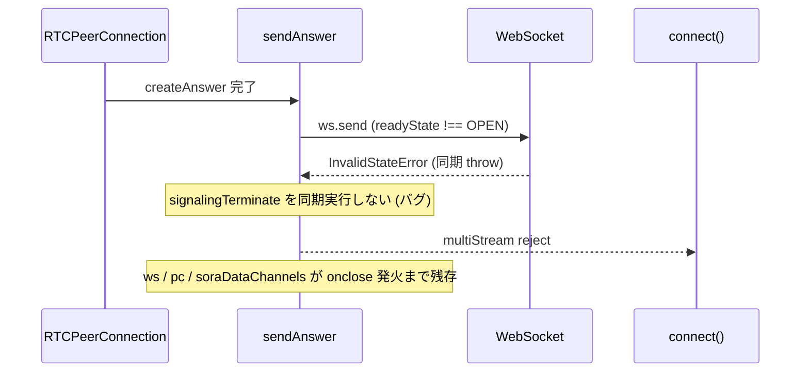

# `sendAnswer` の `ws.send` 同期例外がアンキャッチで内部リソースが残る

- Priority: High
- Created: 2026-05-21
- Polished: 2026-06-02
- Model: Opus 4.7
- Branch: feature/fix-send-answer-ws-send-exception

## 目的

`sendAnswer` (`src/base.ts:1507-1515`) が `this.ws.send(JSON.stringify(message))` を try/catch せず同期呼び出ししているため、`ws.readyState !== 1` 時に `InvalidStateError` が同期 throw され、呼び出し元 `multiStream` (publisher / subscriber / messaging で `this.sendAnswer()`) が reject する。`sendAnswer` 自身は内部状態を初期化しないため、ws を閉じた `onclose` ハンドラ (後述) が非同期に `signalingTerminate()` を呼ぶまで `this.ws` / `this.pc` / `this.soraDataChannels` が dangling のまま残る。ユーザーが `connect()` の reject を catch して即座に再 `connect()` すると、その残骸を踏んで状態破壊が連鎖しうる (issue 0011 の interval 孤児化と相関)。

`sendAnswer` 内で同期的に `signalingTerminate()` を呼んでクリーンアップを確定させ、`ConnectError` を throw し直す。

## 優先度根拠

High。`createAnswer` 直後に Sora 側 TCP RST、ローカルネットワーク変動、`monitorSignalingWebSocketEvent` の close 検知レースなどで `ws.readyState` が `OPEN` 以外になっているケースが本番で発生しうる。発生すると `connect()` が reject するが、SDK 内部状態の初期化が `onclose` の非同期発火に依存するため、それより先にユーザーが再 `connect()` を呼ぶと前回の残骸が干渉する。

## 現状

### 状態遷移



`src/base.ts:1507-1515`

```ts
protected sendAnswer(): void {
  if (this.pc && this.ws && this.pc.localDescription) {
    this.trace("ANSWER SDP", this.pc.localDescription.sdp);
    const { sdp } = this.pc.localDescription;
    const message = { sdp, type: SIGNALING_MESSAGE_TYPE_ANSWER };
    this.ws.send(JSON.stringify(message));
    this.writeWebSocketSignalingLog("send-answer", message);
  }
}
```

呼び出し元 `multiStream` (publisher.ts:93 / subscriber.ts:77 / messaging.ts:44) は `this.sendAnswer()` を try/catch せず呼ぶ。同期 throw は `multiStream` が返す Promise の reject となり、`connect()` の `Promise.race` を経て `connect()` が reject する。`multiStream(...).finally(...)` では `clearConnectionTimeout` / `clearMonitorSignalingWebSocketEvent` のみ呼ばれ、`signalingTerminate` は呼ばれない。

ws の `readyState` が OPEN 以外になる経路では、`signaling()` が設定した `ws.onclose` (`src/base.ts:1260-1269`、`signalingTerminate()` を呼ぶ) や `monitorSignalingWebSocketEvent` の onclose が **非同期に** 発火して結果的に `signalingTerminate` が走る場合もあるが、その発火タイミングは保証されず、`sendAnswer` 失敗直後の再 `connect()` には間に合わない。`sendAnswer` 内で同期的にクリーンアップを確定させる必要がある。

`sendUpdateAnswer` / `sendReAnswer` 等の他の send 系メソッドは `sendSignalingMessage` (`src/base.ts:2301-2322`) を介し、その send try/catch 漏れは issue 0034 でまとめて扱う。本 issue は `sendAnswer` のみに限定する。

`signalingTerminate` (`src/base.ts:582-598`) は `ws.close()` / `pc.close()` / `dataChannel.close()` がすべて null/falsy ガード付きで冪等。`initializeConnection` (`src/base.ts:820-848`) も冪等。

## 設計方針

`sendAnswer` 内、既存の `if (this.pc && this.ws && this.pc.localDescription)` ガードは維持する (ws が null の場合は従来どおり何もせず return)。ws が存在し OPEN 以外の場合のみ throw する。

1. `ws.readyState !== 1` (OPEN) を `send` 前に明示チェックし (既存 `disconnectWebSocket` の `readyState === 1` 判定 `src/base.ts:886` と表記を揃える)、該当時は send せず `signalingTerminate()` 後に `ConnectError` (reason `"WS_SEND_INVALID_STATE"`) を throw する。
2. それでも `ws.send` が throw する可能性に備え (DataChannel の send では Firefox で readyState が open でも例外が出る事象が既存コード `src/base.ts:759` 付近で確認されており、WebSocket の send でも防御的に同様の対処をする)、`send` を try/catch し、catch 時は `signalingTerminate()` 後に `ConnectError` (reason `"WS_SEND_FAILED"`) を throw する。

修正後の実装 (0021 マージ後の `ConnectError` constructor `(message, code?, reason?)` を使う):

```ts
protected sendAnswer(): void {
  if (this.pc && this.ws && this.pc.localDescription) {
    this.trace("ANSWER SDP", this.pc.localDescription.sdp);
    const { sdp } = this.pc.localDescription;
    const message = { sdp, type: SIGNALING_MESSAGE_TYPE_ANSWER };
    if (this.ws.readyState !== 1) {
      this.writeWebSocketSignalingLog("failed-to-send-answer", message);
      this.signalingTerminate();
      throw new ConnectError("Failed to send answer: WebSocket is not open", undefined, "WS_SEND_INVALID_STATE");
    }
    try {
      this.ws.send(JSON.stringify(message));
      this.writeWebSocketSignalingLog("send-answer", message);
    } catch (_e) {
      this.writeWebSocketSignalingLog("failed-to-send-answer", message);
      this.signalingTerminate();
      throw new ConnectError("Failed to send answer: ws.send threw", undefined, "WS_SEND_FAILED");
    }
  }
}
```

- **0021 依存:** `ConnectError` は現状 constructor を持たない (`src/utils.ts:414-417` はフィールド宣言のみ)。上記の `new ConnectError(message, undefined, reason)` 形式は 0021 が追加する constructor 前提。マージ順 (後述) で 0021 が 0007 より先。
- **reason の意味:** `"WS_SEND_INVALID_STATE"` / `"WS_SEND_FAILED"` は SDK 内部のエラー分類コード (大文字スネーク。0008 の分類コードと命名統一)。`ConnectError.reason` には CloseEvent 由来の生文字列が入る既存用途 (`src/base.ts:1265` 等) もあり二義的になるが、これは 0021 が分類コード用途を導入する設計に沿う。
- **0009 依存:** `signalingTerminate` は `onicecandidate` を解除しない。0007 単体では `sendAnswer` 失敗時点 (publisher.ts:93) が `onIceCandidate()` 登録 (publisher.ts:95) より前のため handler 未登録で直撃しにくいが、0009 先行マージを推奨。
- **`onclose` 再入:** `signaling()` の `onclose` (1260-1269) は offer resolve 後も生きており、`signalingTerminate()` → `ws.close()` で再度 `signalingTerminate()` を呼ぶ。冪等なので安全だが timeline ログが二重化しうる。
- **後方互換:** 修正後は `sendAnswer` 失敗時に `connect()` が必ず `ConnectError` で reject するようになる (従来は dangling のまま別経路で reject / timeout)。reject 型が `ConnectError` に統一される挙動変化だが、`connect()` が Promise を reject する契約自体は不変なので `[FIX]` とする。

## 完了条件

- 上記設計方針どおり `sendAnswer` を修正する
- 失敗経路で `writeWebSocketSignalingLog("failed-to-send-answer", message)` を残す (第 2 引数は送信しようとした message)
- 失敗時に `signalingTerminate()` を呼んでから `ConnectError` (reason `"WS_SEND_INVALID_STATE"` / `"WS_SEND_FAILED"`) を throw する
- ローカルで `pnpm test` および既存 `pnpm e2e-test` が通ること
- 手動検証手順 (TCP RST タイミング依存で E2E 自動化はスコープ外) は PR 説明に記載する (新規 README は作らない)
- CHANGES.md `## develop` に次のエントリを追記する (既存 FIX 群の後ろ、担当者行は 2 文字インデント)

  ```
  - [FIX] sendAnswer の ws.send が同期 throw したときに内部状態がクリーンアップされなかったのを修正する
    - @voluntas
  ```

**マージ順:** `0021 → 0009 → 0001 → 0008 → 0007 → 0034` (0004 正本チェーン参照)。0021 (ConnectError constructor) が前提、0008 (onmessage 例外基盤) の後。
