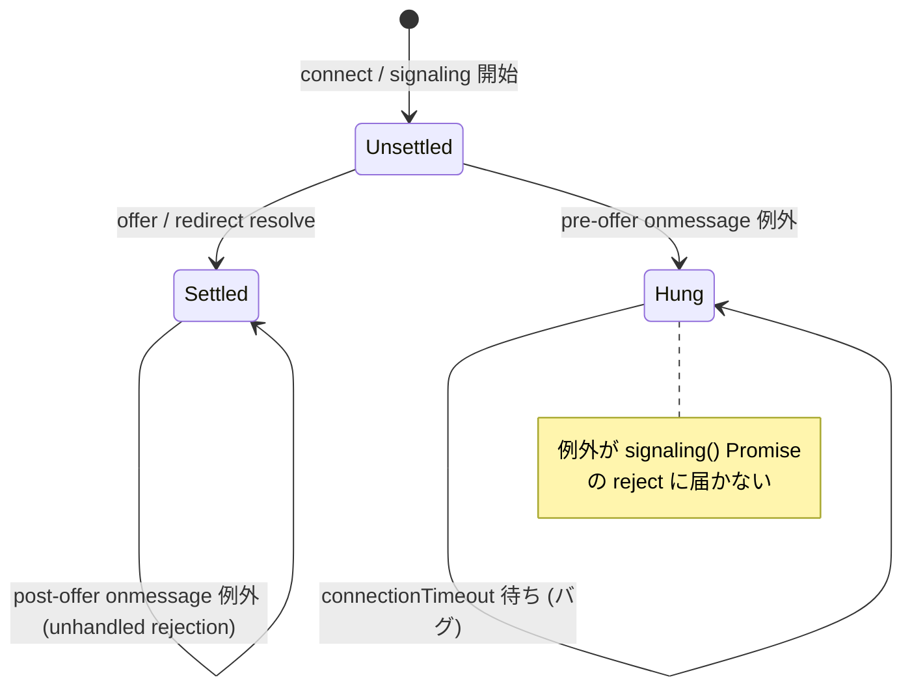

# `signaling()` の `ws.onmessage` 内例外で `connect()` が `connectionTimeout` まで固まる

- Priority: High
- Created: 2026-05-21
- Model: Opus 4.7
- Branch: feature/fix-signaling-onmessage-exception

## 目的

`signaling()` (`src/base.ts:1253-1336`) 内に登録される `ws.onmessage` (`src/base.ts:1270-1309`) は async クロージャで、内部で `TypeError` (1272 行の `throw new TypeError("Received invalid signaling data")`) や `JSON.parse` (1274 行) の `SyntaxError`、分岐済み handler (`signalingOnMessageTypeUpdate` 等) が投げる例外を `signaling()` の Promise の `reject` に伝えない。async 関数の throw は `ws.onmessage` プロパティ assignment の返り値 `Promise<void>` に reject として乗るが、WebSocket dispatcher は戻り値を捕捉しないため unhandled rejection になり、`signaling()` を包む `new Promise((resolve, reject) => ...)` の `reject` 引数には届かない。結果として `connect()` は `setConnectionTimeout` (`src/base.ts:1712-1734`) のタイマー発火 (`this.connectionTimeout` 経過後、デフォルト 60 秒、`options.connectionTimeout = 0` 指定なら永久) まで固まる。なお `message.type` が既知分岐に一致しない場合は else も throw もなく **無視される** (ハング原因にならない)。

`settled` フラグで `signaling()` Promise の resolve / reject 済みかを追跡し、**未 settle 時のみ** catch で `signalingTerminate()` + `reject(ConnectError)` する。offer / redirect resolve 後 (post-offer) の throw では `signalingTerminate()` を呼ばずログのみとし、接続中の ws/pc 破棄を避ける。

## 優先度根拠

High。`type: offer` 受信前に非 string の WebSocket frame、不正 JSON、または `type: offer` / `type: update` / `type: re-offer` / `type: ping` / `type: redirect` 等の分岐済み handler 内 throw が論理的に成立する。未定義の `message.type` は `ws.onmessage` に else 分岐がなく無視されるため、**未知 type 単体ではハングしない**。本番観測ログは取得していないため「論理的に成立しうる race」としての扱い。発生すると UX 上「`connect()` を呼んだあと反応がない」状態が `connectionTimeout` (デフォルト 60 秒) まで続き、`options.connectionTimeout = 0` の場合は無限に続く。

## 現状

### 状態遷移



`src/base.ts:1270-1309`

```ts
ws.onmessage = async (event): Promise<void> => {
  if (typeof event.data !== "string") {
    throw new TypeError("Received invalid signaling data");
  }
  const message = JSON.parse(event.data) as WebSocketSignalingMessage;
  if (message.type === SIGNALING_MESSAGE_TYPE_OFFER) {
    this.writeWebSocketSignalingLog("onmessage-offer", message);
    this.signalingOnMessageTypeOffer(message);
    this.connectedSignalingUrl = ws.url;
    resolve(message);
  } else if (message.type === SIGNALING_MESSAGE_TYPE_UPDATE) {
    this.writeWebSocketSignalingLog("onmessage-update", message);
    await this.signalingOnMessageTypeUpdate(message);
  } else if (message.type === SIGNALING_MESSAGE_TYPE_RE_OFFER) {
    this.writeWebSocketSignalingLog("onmessage-re-offer", message);
    await this.signalingOnMessageTypeReOffer(message);
  } else if (message.type === SIGNALING_MESSAGE_TYPE_PING) {
    await this.signalingOnMessageTypePing(message);
  } else if (message.type === SIGNALING_MESSAGE_TYPE_PUSH) {
    this.callbacks.push(message, TRANSPORT_TYPE_WEBSOCKET);
  } else if (message.type === SIGNALING_MESSAGE_TYPE_NOTIFY) {
    if (message.event_type === "connection.created") {
      this.writeWebSocketTimelineLog("notify-connection.created", message);
    } else if (message.event_type === "connection.destroyed") {
      this.writeWebSocketTimelineLog("notify-connection.destroyed", message);
    }
    this.signalingOnMessageTypeNotify(message, TRANSPORT_TYPE_WEBSOCKET);
  } else if (message.type === SIGNALING_MESSAGE_TYPE_SWITCHED) {
    this.writeWebSocketSignalingLog("onmessage-switched", message);
    this.signalingOnMessageTypeSwitched(message);
  } else if (message.type === SIGNALING_MESSAGE_TYPE_REDIRECT) {
    this.writeWebSocketSignalingLog("onmessage-redirect", message);
    try {
      const redirectMessage = await this.signalingOnMessageTypeRedirect(message);
      resolve(redirectMessage);
    } catch (error) {
      reject(error instanceof Error ? error : new Error(String(error)));
    }
  }
};
```

問題のシナリオ:

1. Sora 側が非 string の WebSocket frame、不正 JSON、または分岐済み handler 内で throw するメッセージを送る
2. `ws.onmessage` 内で `throw new TypeError(...)` (1272 行)、`JSON.parse` の `SyntaxError` (1274 行)、または `signalingOnMessageTypeUpdate` 等の分岐済み handler 内で throw
3. async 関数の throw は呼び出し元に届かず unhandled rejection になる
4. `signaling()` の `new Promise((resolve, reject) => ...)` の `reject` には誰も例外を渡さない
5. `multiStream` の `Promise.race` (例: `src/publisher.ts:23-30`) は `setConnectionTimeout` (`src/base.ts:1712-1734`) のタイマー発火を待つ。`this.connectionTimeout` のデフォルト値は `src/base.ts:274` で `60_000` (60 秒)。`options.connectionTimeout = 0` 指定時は `setConnectionTimeout` 内の `if (this.connectionTimeout > 0)` (`src/base.ts:1714`) で何もせず、無限に固まる

`type: redirect` 経路 (`src/base.ts:1300-1307`) は既に内側 try/catch で `reject(error)` を呼んでおり、redirect 内部 throw は正しく伝播する。本 issue で外側 try/catch を追加した場合、redirect 経路は内側で `reject` 済み → 外側 try を抜けて関数終了。Promise 仕様により 2 回目以降の `reject` は no-op なので二重 reject 問題は起きない。

スコープ: 本 issue は「`type: offer` 受信前 (= `signaling()` Promise が未 resolve)」での throw に絞る。offer 受信後の onmessage throw (`signalingOnMessageTypeUpdate` / `signalingOnMessageTypeReOffer` / `signalingOnMessageTypeNotify` 等の throw) は、`signaling()` Promise が既に resolve 済みのため `reject(error)` は no-op となり、本 issue の修正だけでは「接続後の不正メッセージ受信時にどう振る舞うか」を解決できない。これは本 issue スコープ外 (現時点では未登録。`abend` または `signalingTerminate` 経由でアプリに通知する経路を別途設計する)。

`signalingTerminate` (`src/base.ts:582-598`) は冪等。内部の `ws.close()` / `pc.close()` / `dataChannel.close()` はすべて null/falsy ガード付きで二重呼び出しに安全。`initializeConnection` (`src/base.ts:820-848`) も冪等で、`simulcast` / `spotlight` / `connectionId` 等の状態をリセットする。

## 設計方針

`settled` フラグで `signaling()` Promise の resolve / reject 済みかを追跡する。**未 settle 時のみ** catch で `signalingTerminate()` + `reject(ConnectError)` する。offer / redirect resolve 後 (post-offer) の throw では `signalingTerminate()` を呼ばずログのみ (接続中の ws/pc 破棄を避ける)。

```ts
let settled = false;
const settleReject = (error: ConnectError): void => {
  if (settled) return;
  settled = true;
  this.signalingTerminate();
  reject(error);
};

ws.onmessage = async (event): Promise<void> => {
  try {
    // ... 既存分岐 ...
    if (message.type === SIGNALING_MESSAGE_TYPE_OFFER) {
      // ...
      settled = true;
      resolve(message);
    } else if (message.type === SIGNALING_MESSAGE_TYPE_REDIRECT) {
      try {
        const redirectMessage = await this.signalingOnMessageTypeRedirect(message);
        settled = true;
        resolve(redirectMessage);
      } catch (error) {
        const wrapped = error instanceof ConnectError ? error : new ConnectError(String(error));
        if (!wrapped.reason) wrapped.reason = "SIGNALING_ONMESSAGE_EXCEPTION";
        settleReject(wrapped);
      }
    }
    // offer/redirect 以外の分岐は既存どおり
  } catch (error) {
    if (settled) {
      this.writeWebSocketSignalingLog("onmessage-exception-after-offer", { reason: String(error) });
      return;
    }
    const wrapped = new ConnectError(`Signaling failed. ws.onmessage threw: ${String(error)}`);
    wrapped.reason = "SIGNALING_ONMESSAGE_EXCEPTION";
    this.writeWebSocketSignalingLog("onmessage-exception", { reason: wrapped.message });
    settleReject(wrapped);
  }
};
```

redirect 内側 try/catch は `ConnectError` に統一し `settleReject` 経由で reject する (raw `Error` を渡さない)。

**`ws.onclose` も `settled` / `settleReject` に連携する (必須):** 現状 `:1260-1268` は always `reject` + `signalingTerminate`。pre-offer で `onclose` と `onmessage` 例外が競合すると二重 `signalingTerminate` / 二重 reject 試行が起きうる。`ws.onclose` も `settleReject` 経由に揃える (post-offer は `settled === true` なら terminate のみ、reject しない)。

post-offer throw の本格対策 (abend 通知等) は別 issue。本 issue は connect hang 防止に限定。

## 完了条件

- 上記 `settled` / `settleReject` パターンで pre-offer throw 時に `signalingTerminate()` + `reject(ConnectError)` する
- **`ws.onclose` も `settleReject` 経由** (pre-offer)。post-offer は reject しない
- post-offer throw では `signalingTerminate()` を呼ばない
- ローカルで `pnpm test` および既存 `pnpm e2e-test` が通ること
- 検証は実機 Sora で「壊れた WebSocket frame」「不正 JSON」を狙って送らせるのが難しいため、E2E では再現せず、コードレビューで try/catch の到達性を担保する。手動検証手順を `e2e-tests/sendrecv/README.md` (なければ新規追記) に「DevTools の WebSocket inspect で SDK の `ws.onmessage` を一時的に hook して JSON.parse 失敗を注入する手順」として残す
- CHANGES.md `## develop` に次のエントリを追記する
  ```
  - [FIX] signaling() の ws.onmessage 内で例外が発生したときに connect() が connectionTimeout まで固まっていたのを修正する
    - @voluntas
  ```
- 本 issue は issue 0001 と同じ `signaling()` 関数を編集するため、マージ順 **0009 → 0001 → 0008** (0001 後)。0004 チェーン参照
- offer 受信後の onmessage throw 対策 (resolve 済み Promise への reject 不能問題) は本 issue スコープ外 (現時点では未登録)。issue 0030 は 4 系統の冪等化リファクタであり、本件は含まない
