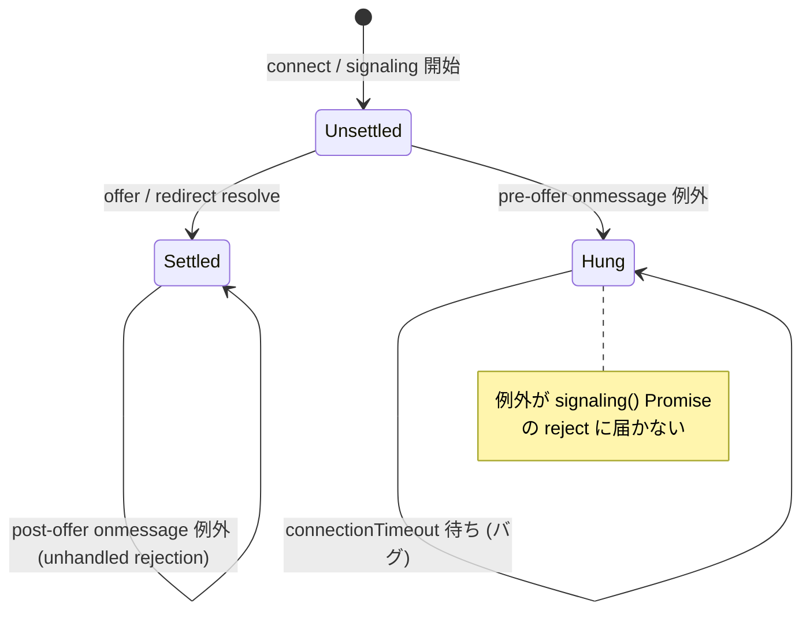

# `signaling()` の `ws.onmessage` 内例外で `connect()` が `connectionTimeout` まで固まる

- Priority: High
- Created: 2026-05-21
- Polished: 2026-06-02
- Model: Opus 4.7
- Branch: feature/fix-signaling-onmessage-exception

## 目的

`signaling()` (`src/base.ts:1253-1336`) が登録する `ws.onmessage` (`src/base.ts:1270-1309`) は async クロージャだが try/catch されていない。`typeof event.data !== "string"` での `throw new TypeError` (`src/base.ts:1272`)、`JSON.parse` の `SyntaxError` (`src/base.ts:1274`)、分岐済み handler (`signalingOnMessageTypeUpdate` / `signalingOnMessageTypeReOffer` / `signalingOnMessageTypePing` 等、いずれも `await` を含み reject しうる) の throw が、`signaling()` を包む `new Promise((resolve, reject) => ...)` の `reject` に届かない。async 関数を呼んだ際に返る Promise が reject されるが、WebSocket dispatcher は `onmessage` の戻り値を捕捉しないため unhandled rejection になるだけで `reject` は呼ばれない。結果として `connect()` は `setConnectionTimeout` (`src/base.ts:1712-1734`) のタイマー発火まで固まる (`connectionTimeout` デフォルト 60 秒 `src/base.ts:274`、`options.connectionTimeout = 0` なら `if (this.connectionTimeout > 0)` `src/base.ts:1714` ガードで無限)。

`ws.onmessage` を try/catch で包み、`type: offer` / `type: redirect` で resolve する前 (pre-offer) の throw のみ `signalingTerminate()` + `reject(ConnectError)` する。resolve 後 (post-offer) の throw はログのみとし、接続中の ws/pc 破棄を避ける。

## 優先度根拠

High。`type: offer` 受信前に非 string frame、不正 JSON、分岐済み handler 内 throw が論理的に成立する。未定義の `message.type` は `ws.onmessage` に else 分岐がなく無視されるため単体ではハングしない。本番観測ログは未取得で「論理的に成立しうる race」としての扱い。発生すると `connect()` が無反応のまま `connectionTimeout` (デフォルト 60 秒、`0` なら無限) まで続く。

## 現状

### 状態遷移



`ws.onmessage` (`src/base.ts:1270-1309`) は外側 try/catch を持たない。throw しうる箇所は `:1272` (TypeError)、`:1274` (`JSON.parse`)、各 `await this.signalingOnMessageType*(message)`。`type: redirect` 経路 (`src/base.ts:1300-1307`) のみ内側 try/catch で `reject` するが、raw `Error` を渡している。`type: offer` 受信時に `resolve(message)` する。

`ws.onclose` (`src/base.ts:1260-1268`) は無条件に `signalingTerminate()` + `reject` する。ただし connect 中は `monitorSignalingWebSocketEvent` (`src/base.ts:1592-1617`) が setInterval(100ms) の最初の tick で `ws.onclose` / `ws.onerror` を自前のハンドラ (同じく `signalingTerminate()` + reject) に**上書きする**ため、`signaling()` が設定した `ws.onclose` が有効なのは接続開始から最大 100ms 程度である。

`signalingTerminate` (`src/base.ts:582-598`) は `ws.close()` / `pc.close()` / `dataChannel.close()` がすべて null/falsy ガード付きで冪等。`initializeConnection` (`src/base.ts:820-848`) も冪等。

## 設計方針

`settled` フラグで `signaling()` Promise の resolve / reject 済みを追跡し、**未 settle 時のみ** catch で `signalingTerminate()` + `reject(ConnectError)` する。`settled = true` は **`resolve` の直前** に置く (offer 分岐で `signalingOnMessageTypeOffer` が resolve 前に throw した場合は `settled === false` のまま catch に入り pre-offer reject されるようにするため)。

```ts
let settled = false;
const settleReject = (error: ConnectError): void => {
  if (settled) {
    return;
  }
  settled = true;
  this.signalingTerminate();
  reject(error);
};

ws.onmessage = async (event): Promise<void> => {
  try {
    if (typeof event.data !== "string") {
      throw new TypeError("Received invalid signaling data");
    }
    const message = JSON.parse(event.data) as WebSocketSignalingMessage;
    if (message.type === SIGNALING_MESSAGE_TYPE_OFFER) {
      this.writeWebSocketSignalingLog("onmessage-offer", message);
      this.signalingOnMessageTypeOffer(message);
      this.connectedSignalingUrl = ws.url;
      settled = true;
      resolve(message);
    } else if (message.type === SIGNALING_MESSAGE_TYPE_UPDATE) {
      this.writeWebSocketSignalingLog("onmessage-update", message);
      await this.signalingOnMessageTypeUpdate(message);
    } else if (message.type === SIGNALING_MESSAGE_TYPE_RE_OFFER) {
      this.writeWebSocketSignalingLog("onmessage-re-offer", message);
      await this.signalingOnMessageTypeReOffer(message);
    } else if (message.type === SIGNALING_MESSAGE_TYPE_PING) {
      await this.signalingOnMessageTypePing(message);
    } else if (message.type === SIGNALING_MESSAGE_TYPE_PUSH) {
      this.callbacks.push(message, TRANSPORT_TYPE_WEBSOCKET);
    } else if (message.type === SIGNALING_MESSAGE_TYPE_NOTIFY) {
      // 既存の notify 処理を維持
      this.signalingOnMessageTypeNotify(message, TRANSPORT_TYPE_WEBSOCKET);
    } else if (message.type === SIGNALING_MESSAGE_TYPE_SWITCHED) {
      this.writeWebSocketSignalingLog("onmessage-switched", message);
      this.signalingOnMessageTypeSwitched(message);
    } else if (message.type === SIGNALING_MESSAGE_TYPE_REDIRECT) {
      this.writeWebSocketSignalingLog("onmessage-redirect", message);
      const redirectMessage = await this.signalingOnMessageTypeRedirect(message);
      settled = true;
      resolve(redirectMessage);
    }
  } catch (error) {
    if (settled) {
      this.writeWebSocketSignalingLog("onmessage-exception-after-offer", { reason: String(error) });
      return;
    }
    const wrapped = new ConnectError(
      `Signaling failed. ws.onmessage threw: ${String(error)}`,
      undefined,
      "SIGNALING_ONMESSAGE_EXCEPTION",
    );
    this.writeWebSocketSignalingLog("onmessage-exception", { reason: wrapped.message });
    settleReject(wrapped);
  }
};
```

- **redirect の再帰:** `signalingOnMessageTypeRedirect` は内部で `this.signaling(ws, true)` を再帰呼び出しし、内側 `signaling()` は独自の `settled` / `resolve` / `reject` を持つ。外側 onmessage は `await this.signalingOnMessageTypeRedirect(message)` を外側 try で包むため、内側が pre-offer reject すると外側 catch に伝わり、外側 `settled === false` なら外側 `settleReject` で外側 Promise を reject する。`signalingTerminate` は内側・外側で二重に呼ばれるが、1 回目で `this.ws` (= redirect で張り替えた新 ws) を close し null 化するため 2 回目は null ガードで no-op、旧 ws は redirect ハンドラ (`src/base.ts:2068-2071`) で既に close 済みなので漏れはなく安全。現状コードにある redirect 専用の内側 try/catch (1302-1307) は外側 try に集約して撤去する。
- **`ws.onclose` は変更しない:** 上記のとおり connect 中の `ws.onclose` は約 100ms 後に `monitorSignalingWebSocketEvent` のハンドラへ置き換わる。pre-offer の close で onmessage の reject と onclose の reject が競合しても、両者は `Promise.race` 内の別 Promise (signaling と monitor) を reject するだけで、race は最初の reject で settle し残りは無視される。`signalingTerminate` も冪等。よって onclose 側の `settled` 連携は不要で、`ws.onmessage` の try/catch だけでハングは解消する。
- **ConnectError と 0021 依存:** `new ConnectError(message, undefined, "SIGNALING_ONMESSAGE_EXCEPTION")` は 0021 が追加する constructor `(message, code?, reason?)` 前提。マージ順で 0021 が先 (後述)。reason `"SIGNALING_ONMESSAGE_EXCEPTION"` は SDK 内部のエラー分類コード (大文字スネーク。0007 の `WS_SEND_*` と命名統一)。`ConnectError.reason` には CloseEvent 由来の生文字列が入る既存用途 (`src/base.ts:1265` 等) もあり二義的になるが、これは 0021 が分類コード用途を導入する設計に沿う。

post-offer throw の本格対策 (abend 通知等) は別 issue。本 issue は connect hang 防止に限定する。

## 完了条件

- 上記 `settled` / `settleReject` パターンで pre-offer throw 時に `signalingTerminate()` + `reject(ConnectError)` する
- `settled = true` を各 `resolve` の直前に置く
- post-offer throw (`settled === true`) では `signalingTerminate()` を呼ばずログのみ
- redirect 専用の内側 try/catch を撤去し外側 try に集約する
- ローカルで `pnpm test` および既存 `pnpm e2e-test` が通ること
- 検証: 実機 Sora に「壊れた frame」「不正 JSON」を狙って送らせるのが難しく、SDK の `ws.onmessage` は `signaling()` 内のローカルクロージャで外部から差し替えできないため、E2E / 手動での再現はしない。try/catch の到達性はコードレビューで担保する (新規 README は作らない)
- CHANGES.md `## develop` に次を追記する (既存 FIX 群の後ろ、担当者行は 2 文字インデント)
  ```
  - [FIX] signaling() の ws.onmessage 内で例外が発生したときに connect() が connectionTimeout まで固まっていたのを修正する
    - @voluntas
  ```

**マージ順:** `0021 → 0009 → 0001 → 0008` (0004 正本チェーン参照)。0021 (ConnectError constructor) が前提。0001 と同じ `signaling()` 関数内を編集する (編集行は別だが衝突回避のため 0001 後)。
