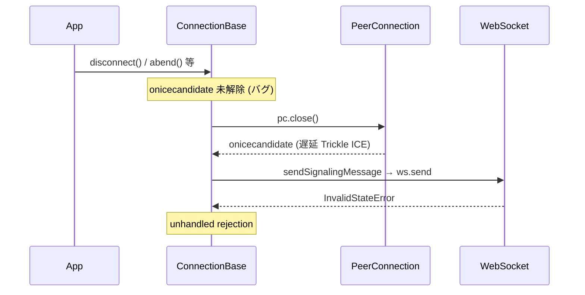

# `onicecandidate` ハンドラが切断時に解除されず遅延 ICE candidate 通知で例外が起きる

- Priority: High
- Created: 2026-05-21
- Model: Opus 4.7
- Branch: feature/fix-onicecandidate-not-cleared

## 目的

`disconnect()` (`src/base.ts:1056-1061`)、`abend()` (`src/base.ts:719-724`)、`abendPeerConnectionState()` (`src/base.ts:608-613`)、`shutdown()` (`src/base.ts:668-676`)、`signalingTerminate()` (`src/base.ts:582-598`) のいずれの切断系メソッドも `this.pc.onicecandidate` を null 化していない。切断処理の最中または完了後にローカル PeerConnection が Trickle ICE candidate を発火すると、`onIceCandidate` (`src/base.ts:1520-1558`) 内で `await this.sendSignalingMessage(message)` (`src/base.ts:1553`) が走り、`sendSignalingMessage` (`src/base.ts:2301-2322`) が CLOSING / CLOSED の WebSocket に対して `this.ws.send(JSON.stringify(message))` (`src/base.ts:2319`) を試みて `InvalidStateError` を同期 throw する。`onicecandidate` は async ハンドラなので throw は unhandled rejection になり、アプリ全体のグローバルエラーハンドラを叩く。本 issue では切断系メソッドで `pc.onicecandidate = null` を必ず呼ぶようにし、遅延発火経路自体を塞ぐ。

## 優先度根拠

High。Trickle ICE は WebRTC の標準動作で、切断のタイミングと無関係に候補発見ごとに発火する。ICE gathering が完了する前にユーザーが `disconnect()` を呼んだ場合、または ICE 状態遷移と切断処理がレースした場合に再現する。発生頻度は接続/切断のたびに数 ms オーダーのレースで踏みうる。実害は unhandled rejection で、アプリ側の Sentry など外部監視に大量にノイズを送り続ける。

## 現状

### 状態遷移



`onIceCandidate` (`src/base.ts:1520-1558`) は ICE candidate 発生時に `sendSignalingMessage` を呼ぶ。

```ts
this.pc.onicecandidate = async (event): Promise<void> => {
  this.writePeerConnectionTimelineLog("onicecandidate", event.candidate);
  if (this.pc) {
    this.trace("ONICECANDIDATE ICEGATHERINGSTATE", this.pc.iceGatheringState);
  }
  // TODO(yuito): Firefox は <empty string> を投げてくるようになったので対応する
  if (event.candidate === null) {
    resolve();
  } else {
    const candidate = event.candidate.toJSON();
    const message = Object.assign(candidate, {
      type: SIGNALING_MESSAGE_TYPE_CANDIDATE,
    }) as {
      type: string;
      [key: string]: unknown;
    };
    this.trace("ONICECANDIDATE CANDIDATE MESSAGE", message);
    await this.sendSignalingMessage(message);
  }
};
```

`sendSignalingMessage` (`src/base.ts:2301-2322`) は DataChannel または WebSocket 経由で送信するが、いずれも readyState チェックなしで `send` を呼ぶ。

```ts
private async sendSignalingMessage(message: {
  type: string;
  [key: string]: unknown;
}): Promise<void> {
  if (this.soraDataChannels.signaling) {
    // (compress 経路省略)
    this.soraDataChannels.signaling.send(JSON.stringify(message));
    // ...
  } else if (this.ws !== null) {
    this.ws.send(JSON.stringify(message));
    // ...
  }
}
```

切断系メソッドの pc ハンドラ解除ブロック:

- `disconnect()` (`src/base.ts:1056-1061`): `ondatachannel` / `oniceconnectionstatechange` / `onicegatheringstatechange` / `onconnectionstatechange` の 4 つを null 化。`onicecandidate` は null 化しない
- `abend()` (`src/base.ts:719-724`): 同上
- `abendPeerConnectionState()` (`src/base.ts:608-613`): 同上
- `shutdown()` (`src/base.ts:671-676`): 同上 (4 ハンドラ null 化済みだが `onicecandidate` は未解除)

- `signalingTerminate()` (`src/base.ts:582-598`): pc ハンドラを一切 null 化しない

`sendSignalingMessage` の readyState チェック欠落は issue 0034 で扱う。

## 設計方針

`disconnect()`、`abend()`、`abendPeerConnectionState()`、`shutdown()` (`src/base.ts:668-676`)、`signalingTerminate()` の **5 経路** で `pc.onicecandidate = null` を追加する。`pc.close()` より前に null 化する。

`disconnect()` (`src/base.ts:1056-1061`) の `if (this.pc)` ブロックを次の通り書き換える。

```ts
if (this.pc) {
  this.pc.ondatachannel = null;
  this.pc.oniceconnectionstatechange = null;
  this.pc.onicegatheringstatechange = null;
  this.pc.onconnectionstatechange = null;
  this.pc.onicecandidate = null;
}
```

`abend()` (`src/base.ts:719-724`)、`abendPeerConnectionState()` (`src/base.ts:608-613`)、`shutdown()` (`src/base.ts:668-676`) も同様に `this.pc.onicecandidate = null;` を追加する。

`signalingTerminate()` (`src/base.ts:582-598`) は元来 pc ハンドラを解除していないため、`signalingTerminate` の冒頭または既存処理の適切な位置に次のブロックを追加する。位置の判断は実装者が行う。

```ts
if (this.pc) {
  this.pc.onicecandidate = null;
  this.pc.ondatachannel = null;
  this.pc.oniceconnectionstatechange = null;
  this.pc.onicegatheringstatechange = null;
  this.pc.onconnectionstatechange = null;
}
```

`sendSignalingMessage` の修正は本 issue では行わない (issue 0034 で扱う)。

**設計限界:** `onicecandidate = null` は 2 件目以降の dispatch を止める。既に in-flight の `await sendSignalingMessage` は完走しうる (0034 で send 側 catch)。

## 完了条件

- `disconnect()`、`abend()`、`abendPeerConnectionState()`、`shutdown()`、`signalingTerminate()` の 5 経路に `this.pc.onicecandidate = null;` を追加する
- 修正後、新規 handler 経由の unhandled rejection は発生しなくなる (in-flight 完走分は 0034 まで残りうる)
- ローカルで `pnpm test` および既存 `pnpm e2e-test` が通ること
- E2E: `e2e-tests/sendrecv/main.ts` で `window.addEventListener("unhandledrejection", ...)` をフックして hidden DOM (例: `#unhandled-rejection-count`) に件数を出し、新規テスト `e2e-tests/tests/disconnect_unhandled_rejection.test.ts` で `connect()` resolve 直後に `disconnect()` を 10 回繰り返し `#unhandled-rejection-count === "0"` を assert (ICE 完了済み環境では再現しない可能性あり)
- CHANGES.md `## develop` に次のエントリを追記する
  ```
  - [FIX] 切断時に pc.onicecandidate が解除されず遅延発火する Trickle ICE 通知が ws.send を呼んで unhandled rejection を起こしていたのを修正する
    - @voluntas
  ```
- 0034 は send 側 catch。0009 は発火源停止。**0034 で 0009 を代替可能という意味ではない**
- マージ順: **0009** → 0001 → 0008 → 0007 → 0034 → 0030 (0004 チェーン参照)
