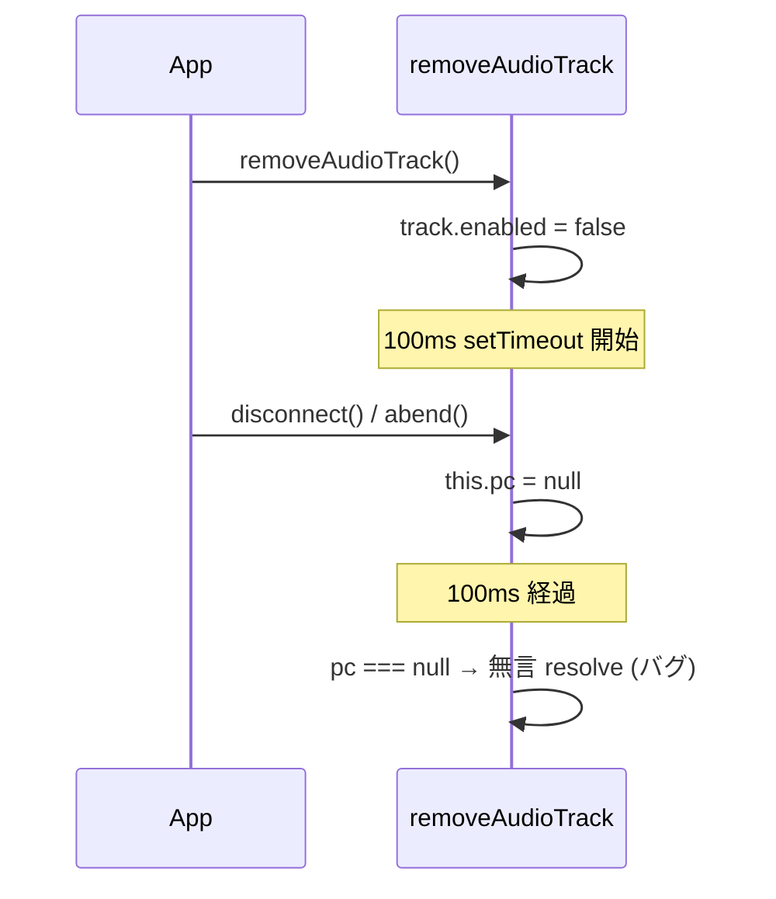

# `removeAudioTrack` / `removeVideoTrack` が disconnect レース時に無言で resolve する

- Priority: Low
- Created: 2026-05-21
- Polished: 2026-06-02
- Model: Opus 4.7
- Branch: feature/change-remove-track-race-with-disconnect

## 目的

`removeAudioTrack` (`src/base.ts:414-438`) と `removeVideoTrack` (`src/base.ts:490-515`) は 100ms の `setTimeout` 内で `track.stop()` と `stream.removeTrack(track)` を実行した後、`this.pc !== null` のときだけ `sender.replaceTrack(null)` で sender クリーンアップを行う。`setTimeout` の 100ms 間にユーザーが `disconnect()` を呼ぶか `abend` 等で `this.pc` が `null` に初期化されると、track 停止と stream 削除は走るが sender クリーンアップだけスキップされ、それでも `resolve()` で完了するため呼び出し側は「正常終了」と認識する。disconnect レース時に明示的に `reject` する API 契約に変更する。

## 優先度根拠

Low。`pc` が close 済みなら sender も無効化されており (`pc.close()` が併せて呼ばれる)、`sender.replaceTrack(null)` のスキップは GC 待ちで実害は出ない。論点は「切断中の `removeXxxTrack` が無言で resolve するのは API 契約として誤解を招く」点のみで、後方互換を壊す [CHANGE] に見合うかは実装着手判断として要検討 (アプリが resolve を「sender クリーンアップ完了」と読み替える運用がなければ致命的ではない)。発生条件 (100ms ウィンドウ内の `disconnect` / `abend`) も限定的。

## 現状

### 状態遷移



`src/base.ts:414-438` の `removeAudioTrack` は、`setTimeout` コールバック内で `stream.getAudioTracks().map()` から始まり、各 track で `track.stop()` / `stream.removeTrack(track)` を実行、`this.pc !== null` のときだけ sender を探して `replaceTrack(null)` する。`pc === null` だと `Promise.all` が sender クリーンアップなしで resolve する。`removeVideoTrack` (`src/base.ts:490-515`) も同型 (`getVideoTracks()` を使う。`removeVideoTrack` 側には `// replaceTrack は非同期操作なので catch(reject) しておく` のコメントがある点のみ差異)。

100ms の setTimeout は「視聴側に静止画像が残るのを防ぐ」目的で、最適化ディレイではない (既存コメント参照)。このディレイ廃止は本 issue スコープ外。

`this.pc = null` になる経路は `disconnect()` (`src/base.ts:1053-1104`) / `abend()` (`716-815`) / `abendPeerConnectionState()` (`605-659`) / `shutdown()` (`668-708`) で、いずれも `initializeConnection()` (`820-848`) の `this.pc = null` (`:832`) を通る。abend / shutdown の冪等化は 0030、disconnect event の abend 上書きは 0031 で扱う。

`removeXxxTrack` を `await` している API も同じ reject 影響を受ける: `replaceAudioTrack` (`538-546`) / `replaceVideoTrack` (`569-577`)、deprecated の `stopAudioTrack` (`385-393`、`removeAudioTrack` を呼ぶ) / `stopVideoTrack` (`461-469`、`removeVideoTrack` を呼ぶ)。これらのロジックは変更せず reject を伝播させる。

## 設計方針

- `setTimeout` コールバックの **先頭** で `this.pc === null` を検知したら即 `reject` する。`track.stop()` / `stream.removeTrack(track)` / `replaceTrack(null)` は実行しない (切断中の stream 変更を避ける)。
- エラー型は `ConnectError` (`src/utils.ts:414-417`)。マージ順 **0021 → 0012**。0021 が追加する constructor を使い `new ConnectError("Disconnected during removeAudioTrack", undefined, "REMOVE_TRACK_DURING_DISCONNECT")` とする (後付け代入 `error.reason = ...` は 0021 で廃止されるため使わない)。reason `"REMOVE_TRACK_DURING_DISCONNECT"` は SDK 内部のエラー分類コード (0007 の `WS_SEND_*` / 0008 の `SIGNALING_ONMESSAGE_EXCEPTION` と同じ大文字スネーク。`ConnectError.reason` には CloseEvent 由来文字列が入る既存用途もあり二義的になるが 0021 の設計に沿う)。
- 100ms ディレイと先行 `enabled = false` は維持する。
- **コールバック実行中** に `this.pc` が `null` になるケース (100ms 内の `replaceTrack(null)` 実行中の disconnect 等) は本 issue スコープ外。この場合 `track.stop()` / `removeTrack` は実行済みのまま resolve する非対称が残るが、低確率のため先頭チェックのみとする (= 途中 null 化では従来どおり resolve する旨を許容)。

`removeAudioTrack` の修正は次のとおり (`setTimeout` 先頭にガードを追加するのみ):

```ts
setTimeout(() => {
  if (this.pc === null) {
    reject(
      new ConnectError(
        "Disconnected during removeAudioTrack",
        undefined,
        "REMOVE_TRACK_DURING_DISCONNECT",
      ),
    );
    return;
  }
  // 既存の stream.getAudioTracks().map(...) 以降は変更しない
}, 100);
```

`removeVideoTrack` も同じパターン (エラーメッセージを `removeVideoTrack` に変える。既存の `catch(reject)` コメントは残す)。

## 完了条件

- `removeAudioTrack` (`414-438`) / `removeVideoTrack` (`490-515`) の `setTimeout` コールバック先頭で `this.pc === null` を検知したら `ConnectError` (reason `"REMOVE_TRACK_DURING_DISCONNECT"`、constructor 形式) で reject し、`track.stop()` / `stream.removeTrack(track)` も実行しない
- **副作用:** reject 時点で `track.enabled = false` は既に実行済みで、track は disabled かつ stream から未削除のまま残る
- `replaceAudioTrack` / `replaceVideoTrack` / `stopAudioTrack` / `stopVideoTrack` は変更しない (切断中は `removeXxxTrack` の reject が自動伝播)
- ローカルで `pnpm test` および既存 `pnpm e2e-test` が通ること
- CHANGES.md `## develop` に次を追記する (既存 `[CHANGE]` 群の並びに、担当者行は 2 文字インデント)
  ```
  - [CHANGE] removeAudioTrack / removeVideoTrack が切断中に呼ばれた場合に reject するように変更する
    - @voluntas
  ```

**検証の限界 (E2E は best-effort、主担保はコードレビュー):** `removeAudioTrack` の 100ms ウィンドウ内に `disconnect()` の `this.pc = null` (`initializeConnection` 経由、`disconnectWebSocket` の onclose 待ちの後) が間に合うかはサーバー RTT 依存で決定論的でない。E2E を行う場合は audio / video 両方について、(1) `SoraClient` に `mediaStream` フィールドを持たせ `connect(stream)` で代入、(2) `removeAudioTrack(this.mediaStream)` / `removeVideoTrack(this.mediaStream)` を await せず呼んだ直後に `disconnect()` を呼ぶボタンを `main.ts` / `index.html` に追加、(3) reject を `.catch((e) => textContent = JSON.stringify({ name: e.name, reason: e.reason }))` で hidden DOM に書く (Error は非列挙プロパティのため `JSON.stringify(e)` 直接は不可)、(4) `randomUUID()` で channelId 衝突回避、を計装する。pc が 100ms 内に null 化せず resolve した run は本バグの回帰を検出しない旨を PR 説明に明記する。回帰の主担保はコードレビューとする。

**マージ順:** `0021 → 0012` (0021 の ConnectError constructor が前提)。0012 は `removeXxxTrack` のみ編集し他 issue とファイル競合しないため 0004 正本チェーンには組み込まない。
