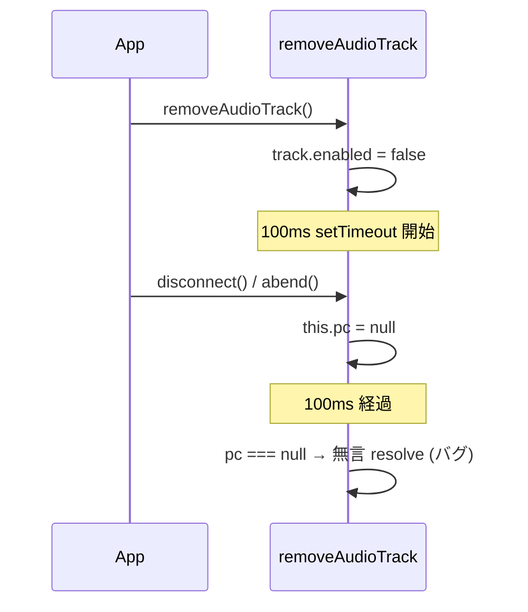

# `removeAudioTrack` / `removeVideoTrack` が disconnect レース時に無言で resolve する

- Priority: Low
- Created: 2026-05-21
- Polished: 2026-06-06
- Model: Opus 4.7
- Branch: feature/change-remove-track-race-with-disconnect

## 目的

`removeAudioTrack` (`src/base.ts:414-438`) と `removeVideoTrack` (`src/base.ts:490-515`) は 100ms の `setTimeout` 内で `track.stop()` と `stream.removeTrack(track)` を実行した後、`this.pc !== null` のときだけ `sender.replaceTrack(null)` で sender クリーンアップを行う。`setTimeout` の 100ms 間にユーザーが `disconnect()` を呼ぶか `abend` 等で `this.pc` が `null` に初期化されると、track 停止と stream 削除は走るが sender クリーンアップだけスキップされ、それでも `resolve()` で完了するため呼び出し側は「正常終了」と認識する。disconnect レース時は明示的に `reject` する API 契約に変更し、利用者がエラーで判別できるようにする。

## 優先度根拠

Low。`pc.close()` が同タイミングで sender を破棄するため `sender.replaceTrack(null)` のスキップは実害を出さない (GC 待ち)。`replaceAudioTrack` / `replaceVideoTrack` 経由でも track の `enabled = false` 書き換えだけは確定実行されるが、これは disconnect 中の自然な状態として利用者から解釈可能で、主たる用途 (publish 中の track 入れ替え) における disconnect レースの発生率も限定的。それでも「切断中の `removeXxxTrack` が無言で resolve する」のは API 契約として誤解を招き、デバッグの障害になるため、後方互換を壊す `[CHANGE]` で対応する (API 整合性優先)。本番観測ログは未取得で緊急度は高くない。

## 現状

### 状態遷移



### 既存コードの構造

`removeAudioTrack` (`src/base.ts:414-438`) は、Promise 化の前に `stream.getAudioTracks()` で全 audio track を `enabled = false` にしてから `setTimeout` (100ms) のコールバックで `track.stop()` / `stream.removeTrack(track)` を実行、`this.pc !== null` のときだけ sender を探して `replaceTrack(null)` する。`Promise.all(promises).then(resolve).catch(reject)` で完了し、`pc === null` の場合は sender クリーンアップなしで resolve する。`removeVideoTrack` (`src/base.ts:490-515`) も同型 (`getVideoTracks()` を使う。`removeVideoTrack` 側だけに `// replaceTrack は非同期操作なので catch(reject) しておく` のコメントが `if (sender) {` の直前 (`src/base.ts:503`) にある)。

`this.pc = null` になる経路は `disconnect()` (`src/base.ts:1053-1104`) / `abend()` (`716-815`) / `abendPeerConnectionState()` (`605-659`) / `shutdown()` (`668-708`) で、いずれも `initializeConnection()` (`820-848`) の `this.pc = null` (`:832`) を通る。abend / shutdown の冪等化は 0030、disconnect event の abend 上書きは 0031 で扱う。

`removeXxxTrack` を `await` している API: `replaceAudioTrack` (`538-546`) / `replaceVideoTrack` (`569-577`)、非推奨の `stopAudioTrack` (`385-393`) / `stopVideoTrack` (`461-469`)。

## 設計方針

- `setTimeout` コールバックの**先頭**で `this.pc === null` を検知したら即 `reject` する。`track.stop()` / `stream.removeTrack(track)` / `replaceTrack(null)` は実行しない (切断中の stream 変更を避ける)。
- エラー型は `ConnectError` (`src/utils.ts:414-417`)。マージ順 **0021 → 0012**。0021 が追加する 3 引数 constructor を使い `new ConnectError("Disconnected during removeAudioTrack", undefined, "REMOVE_TRACK_DURING_DISCONNECT")` とする。reason `"REMOVE_TRACK_DURING_DISCONNECT"` は SDK 内部のエラー分類コード (大文字スネーク、0021 で確定する規約に従う、詳細は 0021 参照)。0007 (`<サブシステム>_<失敗種別>` 軸) / 0008 (`<サブシステム>_EXCEPTION` 軸) と命名軸は異なる (`<操作>_DURING_<状態>` 軸) が、本 issue は `removeAudioTrack` / `removeVideoTrack` の状況条件を共通で表現する用途のためこの軸を採る。両関数で共通の reason 値とし、`error.message` の文言 (`Disconnected during removeAudioTrack` / `Disconnected during removeVideoTrack`) で個別操作を判別する。
- 100ms ディレイと先行 `enabled = false` ループは維持する。reject 経路でも 100ms 待ってから reject するのは、入り口で同期 reject に変えると Promise シグネチャの同期 / 非同期境界が変わる影響を避けるため (実装最小化)。
- **`setTimeout` 内の `replaceTrack(null)` 中に `pc` が `null` 化される**ケース: `replaceTrack(null)` の `await` 中に `pc.close()` で sender 状態が変わると DOMException で reject されうる。既存の `Promise.all(promises).catch(reject)` 経路で reject に伝播する。本 issue では新たに `ConnectError` でラップしない。理由は (1) `replaceTrack` 失敗は disconnect 以外の sender 状態異常 (例: track 種別不一致) でも発生するため `REMOVE_TRACK_DURING_DISCONNECT` で集約するのは意味論的に誤り、(2) 現状の DOMException 伝播動作との後方互換維持。先頭ガードの reject (`ConnectError`) と内側 reject (DOMException) は別経路として並立し、利用者は `error instanceof ConnectError && error.reason === "REMOVE_TRACK_DURING_DISCONNECT"` で先頭ガード経路を判別できる。`removeXxxTrack` の reject 型は `ConnectError | DOMException` の 2 種類になる。
- `replaceAudioTrack` (`src/base.ts:538-546`) / `replaceVideoTrack` (`src/base.ts:569-577`) 内の `await this.removeXxxTrack(stream)` は reject を素通しする。reject 後は `stream.addTrack(...)` / `transceiver.sender.replaceTrack(...)` は実行されず、結果として `stream` / `sender` は呼び出し前のまま残る (先頭ガードにより `removeXxxTrack` 側の破壊操作も未実行のため状態整合)。

### サンプル実装

`removeAudioTrack` / `removeVideoTrack` のいずれも、既存 `setTimeout(() => {` の直後に以下の先頭ガードを挿入するだけ。それ以降のコード (`stream.getXxxTracks().map(...)` から `}, 100);` まで) は変更しない。

`removeAudioTrack`:

```ts
setTimeout(() => {
  if (this.pc === null) {
    reject(
      new ConnectError(
        "Disconnected during removeAudioTrack",
        undefined,
        "REMOVE_TRACK_DURING_DISCONNECT",
      ),
    );
    return;
  }
  // 既存処理 (stream.getAudioTracks().map(...) 以降) は変更しない
}, 100);
```

`removeVideoTrack`:

```ts
setTimeout(() => {
  if (this.pc === null) {
    reject(
      new ConnectError(
        "Disconnected during removeVideoTrack",
        undefined,
        "REMOVE_TRACK_DURING_DISCONNECT",
      ),
    );
    return;
  }
  // 既存処理 (stream.getVideoTracks().map(...) 以降、`if (sender) {` 直前の既存コメントも含む) は変更しない
}, 100);
```

### 後方互換

本変更で挙動が変わるのは「100ms ウィンドウ内に `disconnect()` / `abend()` 等で `this.pc` が `null` に初期化された場合」のみ。利用者対応:

- `await removeXxxTrack(stream)` で呼んでいるコード: try/catch で `ConnectError` を捕捉する (`error instanceof ConnectError && error.reason === "REMOVE_TRACK_DURING_DISCONNECT"` で先頭ガード経路を判別)。fire-and-forget で呼んでいるコードは `.catch(() => {})` を追加して unhandled promise rejection を防ぐ。
- 非推奨の `stopAudioTrack` / `stopVideoTrack`、`replaceAudioTrack` / `replaceVideoTrack` 経由でも同じ reject が伝播する。`replaceXxxTrack` の場合、切断中に呼んでも track 入れ替えは行われず reject される (`stream` / `sender` は呼び出し前のまま)。

### 変更対象ファイル

| ファイル      | 内容                                                                                           |
| ------------- | ---------------------------------------------------------------------------------------------- |
| `src/base.ts` | `removeAudioTrack` / `removeVideoTrack` の `setTimeout` 先頭に `this.pc === null` ガードを追加 |
| `CHANGES.md`  | `## develop` の `[CHANGE]` 群末尾、`### misc` より前に追記                                     |

## 完了条件

### コード変更

- [ ] `removeAudioTrack` (`414-438`) / `removeVideoTrack` (`490-515`) の `setTimeout` コールバック先頭で `this.pc === null` を検知したら `ConnectError` (reason `"REMOVE_TRACK_DURING_DISCONNECT"`、constructor 形式) で reject し、`track.stop()` / `stream.removeTrack(track)` / `replaceTrack(null)` も実行しない
- [ ] `setTimeout` の 100ms ディレイと先行 `enabled = false` ループは維持する
- [ ] `replaceAudioTrack` / `replaceVideoTrack` / `stopAudioTrack` / `stopVideoTrack` は変更しない (切断中は `removeXxxTrack` の reject が自動伝播)
- [ ] 既存コード (サンプル実装の `// 既存処理 ... は変更しない` 部分) に手を入れない (`removeVideoTrack` 側の `// replaceTrack は非同期操作なので catch(reject) しておく` コメントも現位置で維持)

### 副作用

reject 時点で以下の状態が利用者から観測される:

- `track.enabled = false` は既に実行済み (Promise 化の前のループで実行)
- `track` は `stop()` 未実行のため `readyState === "live"` のまま残る (カメラ・マイクのハードウェアは解放されない)
- `track` は `stream.removeTrack` 未実行のため `stream.getAudioTracks()` / `stream.getVideoTracks()` に残る
- 利用者の責務: reject を捕捉したら、対象 stream の全 track を自前で停止する (例: `for (const t of stream.getAudioTracks()) { t.stop(); }` / `getVideoTracks()` 同様)。`replaceXxxTrack` 経由の reject では「置き換え予定だった新 track」は `stream.addTrack` 未実行のため `stream` 経由で拾えない。`replaceXxxTrack(stream, newTrack)` の呼び出し元で保持している `newTrack` を直接 `.stop()` する

### 検証

- [ ] ローカルで `pnpm test` および既存 `pnpm e2e-test` が通ること
- [ ] 本 issue 専用テストは追加しない。CLAUDE.md「モックやスタブは絶対に利用しないこと」規約により `this.pc` を外部から null 化するテストは書けず、`SoraBase` 派生クラスを実物で組み立てて `pc === null` の自然状態を作る経路もない。先頭ガードの到達性はコードレビューで担保する

### 変更履歴

- [ ] `CHANGES.md` `## develop` の `[CHANGE]` 群末尾、`### misc` より前に追記する (種別順 `CHANGE → ADD → UPDATE → FIX` を維持)

  ```
  - [CHANGE] `removeAudioTrack` / `removeVideoTrack` 実行中に `disconnect()` 等で `RTCPeerConnection` が破棄された場合に `ConnectError` (reason `"REMOVE_TRACK_DURING_DISCONNECT"`) で reject するように変更する
    - 利用者は `.catch` で reject を受ける必要がある (fire-and-forget で呼んでいる場合は unhandled promise rejection が発生する)
    - 非推奨の `stopAudioTrack` / `stopVideoTrack`、および `replaceAudioTrack` / `replaceVideoTrack` 経由でも同じ reject が伝播する
    - @voluntas
  ```

## スコープ外

- 100ms `setTimeout` 自体の廃止 (視聴側保護目的の既存仕様)
- `replaceAudioTrack` / `replaceVideoTrack` / `stopAudioTrack` / `stopVideoTrack` 自体の変更 (`removeXxxTrack` の reject を素通しするのみ)
- `removeAudioTrack` / `removeVideoTrack` のコメント差異 (`removeVideoTrack` 側だけにある `catch(reject)` コメント) を揃える対応
- `ConnectError.reason` フィールドの二義性 (CloseEvent 由来文字列 vs SDK 分類コード) は 0021 で許容することが決着済み (詳細は 0021 参照)。本 issue は分類コード用途に従う

## マージ順

**0021 → 0012**。0021 の `ConnectError` constructor (3 引数形式) が前提。0021 が `issues/pending/` に移動した場合は 0012 も同時に pending 化する (本 issue 単独で先行マージしない)。0012 は `removeXxxTrack` のみ編集し他 issue とファイル競合しないため 0004 正本チェーンには組み込まない (詳細は 0004 参照)。リリース単位としては `## develop` で 0004 系と同梱される。
