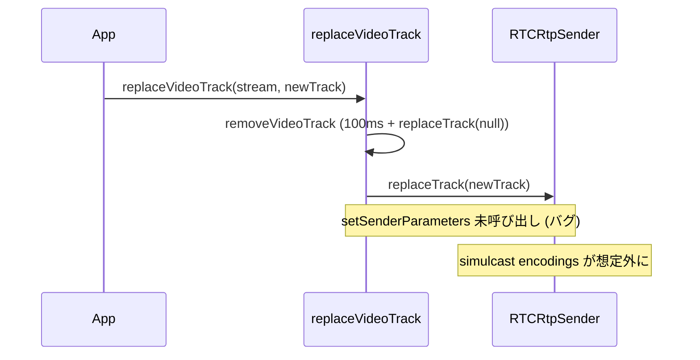

# `replaceVideoTrack` 後に simulcast の encodings を再適用していない

- Priority: Medium
- Created: 2026-05-21
- Model: Opus 4.7
- Branch: feature/fix-replace-track-encodings

## 目的

`replaceVideoTrack` (`src/base.ts:569-577`) は `removeVideoTrack` → `sender.replaceTrack(newTrack)` で video track を差し替える。WebRTC 仕様上 `replaceTrack` は encodings を保持するが、`removeVideoTrack` 内の `replaceTrack(null)` → 100ms 後 `replaceTrack(newTrack)` という連続操作は実装依存の挙動差を生みうる。`createAnswer` (`src/base.ts:1455, 1459`) では `setRemoteDescription` 前後で `setSenderParameters` を 2 回呼ぶ既知パターンがあり、track 差し替え後も SDK 側で encodings を再適用しないと simulcast 状態が想定外になる可能性がある。本 issue では `replaceVideoTrack` 末尾で `this.encodings` を defensive に再適用する。

## 優先度根拠

Medium。仕様準拠ブラウザでは `replaceTrack` 単体で encodings は保持されるため、単独では再現しにくい。ただし `removeVideoTrack` 経由の差し替えは想定外の連続操作であり、本番観測ログは未取得。再現条件確定後に Priority を再判断する。

## 現状

### 状態遷移



`src/base.ts:569-577` は `replaceTrack` 後に `setSenderParameters` を呼ばない。

```ts
async replaceVideoTrack(stream: MediaStream, videoTrack: MediaStreamTrack): Promise<void> {
  await this.removeVideoTrack(stream);
  const transceiver = this.getVideoTransceiver();
  if (transceiver === null) {
    throw new Error("Unable to set video track. Video track sender is undefined");
  }
  stream.addTrack(videoTrack);
  await transceiver.sender.replaceTrack(videoTrack);
}
```

関連:

- `this.encodings` は `signalingOnMessageTypeOffer` (`src/base.ts:1891-1893`) で設定。video transceiver 専用
- `getVideoTransceiver` (`src/base.ts:2361-2368`) は `this.mids.video` に一致する transceiver のみ返す
- `setSenderParameters` (`src/base.ts:2085-2094`) は現状 encodings を丸ごと代入（issue 0014 で修正）
- issue 0012 マージ後は切断中の `replaceVideoTrack` も reject される

## 設計方針

`replaceTrack(newTrack)` の直後に、次のガードを満たす場合のみ `setSenderParameters` を 1 回呼ぶ。

- `this.simulcast === true`
- `this.encodings.length > 0`

`createAnswer` 経路と異なり `setRemoteDescription` を挟まないため 1 回で足りる。`setSenderParameters` 本体の length 不変マージは issue 0014 に委ねる。

```ts
async replaceVideoTrack(stream: MediaStream, videoTrack: MediaStreamTrack): Promise<void> {
  await this.removeVideoTrack(stream);
  const transceiver = this.getVideoTransceiver();
  if (transceiver === null) {
    throw new Error("Unable to set video track. Video track sender is undefined");
  }
  stream.addTrack(videoTrack);
  await transceiver.sender.replaceTrack(videoTrack);
  if (this.simulcast && this.encodings.length > 0) {
    await this.setSenderParameters(transceiver, this.encodings);
  }
}
```

**変更対象:** `src/base.ts` の `replaceVideoTrack` のみ

**スコープ外:**

- `replaceAudioTrack` (`src/base.ts:538-546`) — audio simulcast 不存在
- `setSenderParameters` の堅牢化 — issue 0014
- `removeVideoTrack` / disconnect レース — issue 0012
- `createAnswer` の 2 回呼び出しロジック変更

## 完了条件

- `replaceVideoTrack` の `replaceTrack` 直後に、上記ガード付きで `await this.setSenderParameters(transceiver, this.encodings)` を呼ぶ
- E2E (`e2e-tests/simulcast_sendonly/`):
  - `SimulcastSendonlySoraClient` に `mediaStream` を保持し、`replaceVideoTrack()` と `#replace-video-track` ボタンを追加
  - replace 前後の `getParameters().encodings` の rid 配列を `#encodings-rids` (hidden DOM) に JSON 出力
  - 新規 `e2e-tests/tests/simulcast_replace_track.test.ts` で connect (デフォルト simulcast または 3 rid すべて active) → `#replace-video-track` クリック後に assert:
    - replace 前後の rid 配列が等しい
    - `#get-stats` 後 `#stats-report` dataset から `outbound-rtp` (kind=video, rid=r0/r1/r2) が 3 本存在
- 0014 実装後は上記 E2E が 0014 の間接検証にもなる
- ローカルで `pnpm test` および `pnpm e2e-test` が通ること
- CHANGES.md `## develop` に追記:

  ```
  - [FIX] replaceVideoTrack 後に simulcast の encodings が再適用されないのを修正する
    - @voluntas
  ```

**マージ順:**

```
0012 → 0014 → 0013
```

- **0014 未マージで 0013 単独マージ禁止** — `setSenderParameters` が丸ごと代入のまま `InvalidModificationError` になりうる
- **0012** は切断中 reject の前提（本 issue の正常系 E2E に影響）
