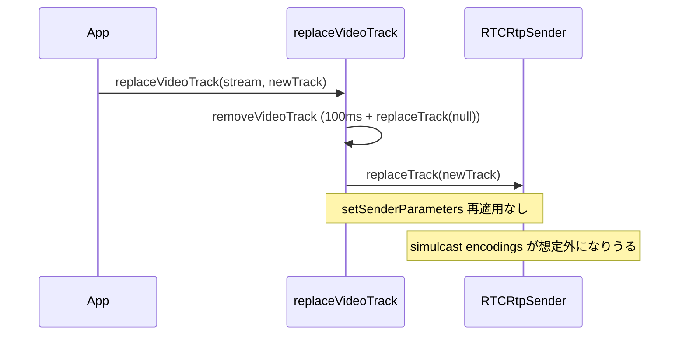

# `replaceVideoTrack` 後に simulcast の encodings を再適用していない

- Priority: Medium
- Created: 2026-05-21
- Polished: 2026-06-02
- Model: Opus 4.7
- Branch: feature/fix-replace-track-encodings

## 目的

`replaceVideoTrack` (`src/base.ts:569-577`) は `removeVideoTrack` → `sender.replaceTrack(newTrack)` で video track を差し替えるが、`replaceTrack` 後に `setSenderParameters` を呼ばない。WebRTC 仕様上 `replaceTrack` は sender の encodings を保持するため、仕様準拠ブラウザでは再適用なしでも simulcast の encodings は維持される。本 issue は「`removeVideoTrack` 内の `replaceTrack(null)` → 100ms 後 `replaceTrack(newTrack)` という連続操作で encodings が想定外になるブラウザ実装が存在する」という仮説に対する防御的修正で、`replaceVideoTrack` 末尾で `this.encodings` を defensive に再適用する。

本 issue は再現未確定の防御ギャップであり、実機で encodings 喪失を再現できることを着手前の必須ゲートとする (後述)。

## 優先度根拠

Medium。仕様準拠ブラウザでは `replaceTrack` 単体で encodings が保持されるため単独では再現しにくく、本番観測ログも未取得。再現が取れた時点で Priority を再判断する。

## 現状

### 状態遷移



`src/base.ts:569-577` は `replaceTrack(newTrack)` 後に `setSenderParameters` を呼ばない (現状コードは行番号参照のとおり。`removeVideoTrack` → `getVideoTransceiver` → `replaceTrack` で終わる)。

関連:

- `this.encodings` は `signalingOnMessageTypeOffer` (`src/base.ts:1891-1893`) で `message.encodings` から設定される (video transceiver 専用)。`this.simulcast` も同 offer 処理で設定。
- `getVideoTransceiver` (`src/base.ts:2361-2368`) は `this.mids.video` 一致 transceiver を返す。
- `createAnswer` (`src/base.ts:1455, 1459`) は `setRemoteDescription` を挟んで `setSenderParameters` を 2 回呼ぶ (offer の active 反映のため)。`replaceVideoTrack` は `setRemoteDescription` を挟まないため 1 回で足りる。
- `setSenderParameters` (`src/base.ts:2085-2094`) は現状 encodings を丸ごと代入する (length 不変マージ化は issue 0014)。

## 設計方針

`replaceTrack(newTrack)` の直後に、`this.simulcast === true` かつ `this.encodings.length > 0` の場合のみ `setSenderParameters` を 1 回呼ぶ。`setSenderParameters` 本体の length 不変マージは 0014 に委ねる。

```ts
async replaceVideoTrack(stream: MediaStream, videoTrack: MediaStreamTrack): Promise<void> {
  await this.removeVideoTrack(stream);
  const transceiver = this.getVideoTransceiver();
  if (transceiver === null) {
    throw new Error("Unable to set video track. Video track sender is undefined");
  }
  stream.addTrack(videoTrack);
  await transceiver.sender.replaceTrack(videoTrack);
  if (this.simulcast && this.encodings.length > 0) {
    await this.setSenderParameters(transceiver, this.encodings);
  }
}
```

**変更対象:** `src/base.ts` の `replaceVideoTrack`。E2E を行う場合は `e2e-tests/simulcast_sendonly/main.ts` / `index.html` / 新規 `e2e-tests/tests/simulcast_replace_track.test.ts`。

**スコープ外:** `replaceAudioTrack` (`src/base.ts:538-546`、audio simulcast 不存在) / `setSenderParameters` 堅牢化 (0014) / `removeVideoTrack` の disconnect レース (0012) / `createAnswer` の 2 回呼び出しロジック。

## 完了条件

**§着手前を満たさない限り §実装に進まない。**

### 着手前（必須）

`replaceVideoTrack` 経由 (`removeVideoTrack` の `replaceTrack(null)` → 100ms → `replaceTrack(newTrack)`) で、実機 simulcast の encodings (rid 構成や active) が実際に落ちるブラウザ・条件を探索する。観測手順: connect (3 rid simulcast) → `replaceVideoTrack` 前後で sender の `getParameters().encodings.map(e => e.rid)` と `active` を比較し、差異が出るか、`getStats` の `outbound-rtp` (rid=r0/r1/r2) が 3 本から減るかを見る。再現できなければ `issues/pending/` へ移動し、試した Sora バージョン・ブラウザ・観測値を issue 末尾に追記する (その場合 CHANGES 追記・Completed は付けない)。

### 実装 (再現確認後のみ)

- 上記設計方針どおり `replaceVideoTrack` 末尾にガード付きで `await this.setSenderParameters(transceiver, this.encodings)` を追加する
- ローカルで `pnpm test` および `pnpm e2e-test` が通ること

### E2E (再現が取れた場合)

`e2e-tests/simulcast_sendonly/`:

- `SimulcastSendonlySoraClient` に `mediaStream` フィールドを持たせ `connect(stream)` で代入。`#replace-video-track` ボタンと `#encodings-rids` (hidden) を `index.html` に追加。ボタンハンドラで新規 `getUserMedia` から 2 本目 video track を取り `this.connection.replaceVideoTrack(this.mediaStream, newTrack)` を呼ぶ
- replace 前後の `this.connection.pc` から video sender の `getParameters().encodings.map(e => e.rid)` を取得し、`#encodings-rids` の `dataset.before` / `dataset.after` に JSON 格納
- 新規 `simulcast_replace_track.test.ts`: connect (3 rid simulcast) → `#replace-video-track` クリック → `dataset.before` と `dataset.after` の rid 配列が等しい、かつ `#get-stats` 後 `#stats-report` dataset に `outbound-rtp` (kind=video, rid=r0/r1/r2) が 3 本、を assert。`randomUUID()` で channelId 衝突回避
- **回帰検出力の限界:** 仕様準拠ブラウザでは修正前から rid 配列は等しくなるため、この E2E は「再適用が回帰で壊れていないこと」のガードであって「修正が効いたこと」の弁別にはならない (再現ブラウザでのみ Red→Green が成立する)。この限界を PR 説明に明記する
- CHANGES.md `## develop` に追記 (再現確認後):
  ```
  - [FIX] replaceVideoTrack 後に simulcast の encodings が再適用されないのを修正する
    - @voluntas
  ```

**マージ順:** 着手前ゲートを通って実装する場合に限り `0014 → 0013` が必須依存 (0014 未マージだと `setSenderParameters` が丸ごと代入のまま length 不一致で `InvalidModificationError` になりうる)。0012 (切断中 reject) は本 issue の正常系 E2E が影響を受ける任意前提。pending 行きになった場合はこの依存は適用されない。
