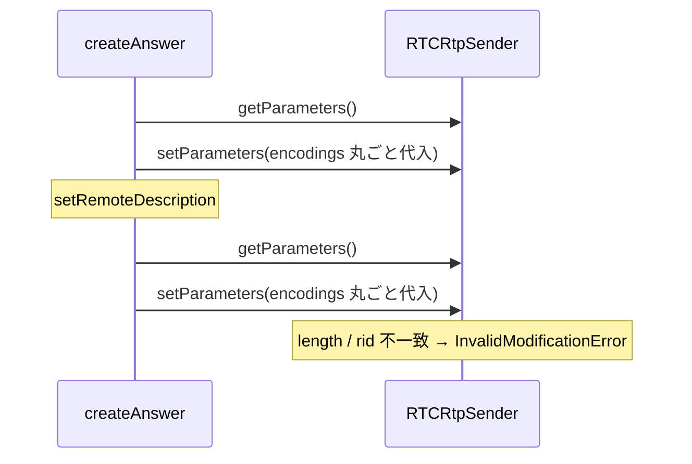

# `setSenderParameters` で encodings 配列の length / rid 不一致による `InvalidModificationError` を防ぐ

- Priority: Medium
- Created: 2026-05-21
- Model: Opus 4.7
- Branch: feature/fix-set-sender-parameters-encodings

## 目的

`setSenderParameters` (`src/base.ts:2085-2094`) は `originalParameters.encodings = encodings` で丸ごと代入する。W3C WebRTC 1.0 §5.2 の `setParameters` algorithm は `encodings` 配列の length / 順序 / 各 `rid` を `getParameters` から変更すると `InvalidModificationError` で reject する。`createAnswer` (`src/base.ts:1455, 1459`) では `setRemoteDescription` 前後で 2 回呼ばれ、間に sender 状態が変わると reject し接続が落ちる。本 issue では length 不変マージに書き換える。

## 優先度根拠

Medium。Sora 現行仕様で rid 集合が動的に変わるケースは確認できていないが、`createAnswer` の 2 回呼び出しはブラウザ状態遷移に依存する。defensive な堅牢化として対応する。

## 現状

### 状態遷移



```ts
private async setSenderParameters(
  transceiver: RTCRtpTransceiver,
  encodings: RTCRtpEncodingParameters[],
): Promise<void> {
  const originalParameters = transceiver.sender.getParameters();
  originalParameters.encodings = encodings;
  await transceiver.sender.setParameters(originalParameters);
  this.trace("TRANSCEIVER SENDER SET_PARAMETERS", originalParameters);
  this.writePeerConnectionTimelineLog("transceiver-sender-set-parameters", originalParameters);
}
```

呼び出し元:

- `createAnswer` (`src/base.ts:1455, 1459`) — `setRemoteDescription` 前後 2 回
- `replaceVideoTrack` (issue 0013 で追加) — `replaceTrack` 直後 1 回

## 設計方針

- `getParameters().encodings` を骨格とし、引数 `encodings` で `rid` が一致するエントリのプロパティのみ `{ ...existing, ...update }` で上書き (length / 順序 / rid 集合は不変)
- 引数にしかない rid (新規 rid) は無視 — rid 集合変更は再ネゴが必要 (別 issue 未登録)
- 引数から消えた rid は `getParameters` 側の値を保持
- `encodings.length === 0` の早期 return は入れない (呼び出し側ガードに委ねる)
- `setParameters` が reject した場合はログを残して rethrow (retry しない)

```ts
private async setSenderParameters(
  transceiver: RTCRtpTransceiver,
  encodings: RTCRtpEncodingParameters[],
): Promise<void> {
  const originalParameters = transceiver.sender.getParameters();
  // W3C WebRTC 1.0 §5.2: encodings 配列の length / 順序 / rid は変更不可。
  // getParameters の rid 配列を骨格に、引数 encodings の一致 rid のプロパティのみ上書きする。
  const mergedEncodings = originalParameters.encodings.map((existing) => {
    const update = encodings.find((e) => e.rid === existing.rid);
    return update ? { ...existing, ...update } : existing;
  });
  originalParameters.encodings = mergedEncodings;
  try {
    await transceiver.sender.setParameters(originalParameters);
  } catch (e) {
    this.trace("SET_SENDER_PARAMETERS_FAILED", String(e));
    this.writePeerConnectionTimelineLog("set-sender-parameters-failed", {
      reason: String(e),
    });
    throw e;
  }
  this.trace("TRANSCEIVER SENDER SET_PARAMETERS", originalParameters);
  this.writePeerConnectionTimelineLog("transceiver-sender-set-parameters", originalParameters);
}
```

**変更対象:** `src/base.ts` の `setSenderParameters` のみ

**スコープ外:**

- rid 集合の動的変更 (再ネゴ要件)
- `InvalidModificationError` の retry
- `replaceVideoTrack` への呼び出し追加 — issue 0013
- 呼び出し側の空配列ガード — issue 0013 (`this.simulcast && this.encodings.length > 0`)

## 完了条件

- `setSenderParameters` を length 不変マージに書き換える
- reject 時に `SET_SENDER_PARAMETERS_FAILED` trace と `set-sender-parameters-failed` timeline log を残し、上位へ throw
- E2E: `private` メソッドのため直接テスト不可。issue 0013 の `simulcast_replace_track` E2E (connect → replace → stats で r0/r1/r2 維持) が間接検証となる。0013 と同一 PR にまとめてよい
- ローカルで `pnpm test` および `pnpm e2e-test` が通ること
- CHANGES.md `## develop` に追記:

  ```
  - [FIX] setSenderParameters で encodings の length / rid 不一致が起きた際に length 不変マージで InvalidModificationError を回避する
    - @voluntas
  ```

**マージ順:**

```
0012 → 0014 → 0013
```

- **0014 は 0013 より先にマージ必須**
