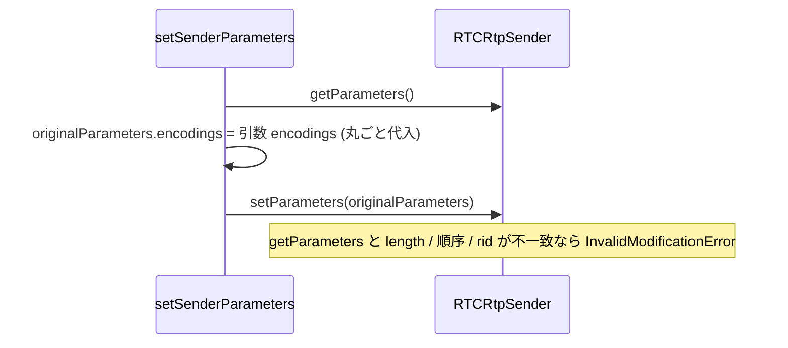

# `setSenderParameters` で encodings 配列の length / rid 不一致による `InvalidModificationError` を防ぐ

- Priority: Medium
- Created: 2026-05-21
- Polished: 2026-06-02
- Model: Opus 4.7
- Branch: feature/fix-set-sender-parameters-encodings

## 目的

`setSenderParameters` (`src/base.ts:2085-2094`) は `originalParameters.encodings = encodings` で `getParameters()` の結果を捨てて引数で丸ごと置き換える。W3C WebRTC の `RTCRtpSender.setParameters` アルゴリズムは、`encodings` 配列の length / 順序 / 各 `rid` を `getParameters` の値から変更すると `InvalidModificationError` で reject する。`getParameters().encodings`（ブラウザが返す骨格）と引数 `this.encodings`（Sora の offer 由来）の length / rid が食い違うと、この丸ごと代入は reject しうる。本 issue では「`getParameters` の骨格を保ったまま、一致する rid のプロパティのみ上書きする」length 不変マージに書き換えて防御する。

## 優先度根拠

Medium。Sora 現行仕様で `getParameters` と `this.encodings` の rid 集合が食い違うケースは確認できておらず本番観測ログも未取得だが、`createAnswer` (`src/base.ts:1455, 1459`) が `setRemoteDescription` を挟んで `setSenderParameters` を 2 回呼ぶ経路はブラウザ状態遷移に依存し、`getParameters` 側の構成が変わりうる。`InvalidModificationError` は仕様上保証された実在の挙動であり、丸ごと代入は構造的にこれを誘発しうるため defensive な堅牢化として対応する。

## 現状

### 状態遷移



`setSenderParameters` (`src/base.ts:2085-2094`) は現状、行番号参照のとおり `getParameters()` → `originalParameters.encodings = encodings`（2090）→ `setParameters()` で、length / rid の一致を確認しない。

呼び出し元は `createAnswer` (`src/base.ts:1455, 1459`)。1455 と 1459 はいずれも同一の `this.encodings` を渡すため、引数自体は 2 回とも不変。`setRemoteDescription`（1456）を挟むことで `getParameters().encodings` 側の構成（active 等）が変わりうる点が、丸ごと代入と組み合わさったときのリスク要因である。

`this.encodings` は `signalingOnMessageTypeOffer` (`src/base.ts:1891-1893`) で `message.encodings`（Sora 由来）から一度だけ代入され、`createAnswer` 内で再代入・mutate されない。型は `RTCRtpEncodingParameters[]` で `rid` は optional。

## 設計方針

`getParameters().encodings` を骨格とし、引数 `encodings` で一致するエントリのプロパティのみ上書きする（length / 順序 / rid 集合は不変）。マージは純粋関数として切り出し、ユニットテスト可能にする（後述）。

- rid が存在する骨格エントリは、引数から同一 rid のエントリを探して `{ ...existing, ...update }` で上書きする（`update.rid === existing.rid` なので rid は変わらない）。
- **rid が undefined の骨格エントリ（非 simulcast や rid 無し構成）は、同じ index の引数エントリで上書きする。** `find((e) => e.rid === existing.rid)` だけだと `undefined === undefined` で全エントリが引数先頭にマッチし破壊するため、rid undefined のときは index 対応にフォールバックする。
- 引数にしかない rid（新規 rid）は無視する（rid 集合変更は再ネゴが必要。別 issue 未登録）。
- 引数から消えた rid は骨格側の値を保持する（length 不変のため。Sora が rid を減らして active=false を伝える運用があると古い active を保持しうるが、rid 集合変更はスコープ外）。
- `encodings.length === 0` の早期 return は入れない（呼び出し側ガードに委ねる）。
- `setParameters` が reject した場合はログを残して rethrow する（retry しない）。

`mergeEncodings` は `ConnectionBase` のメソッドにせず、`src/utils.ts` に `export function` として置く (private メソッドは `tests/` から呼べず、`ConnectionBase` の `new` は `RTCPeerConnection` 実体依存でユニットテスト困難なため)。`base.ts` は `import { mergeEncodings } from "./utils"` で使う。

```ts
// src/utils.ts に export function として切り出す (tests/ でユニットテスト)
export function mergeEncodings(
  original: RTCRtpEncodingParameters[],
  update: RTCRtpEncodingParameters[],
): RTCRtpEncodingParameters[] {
  return original.map((existing, index) => {
    // 引数を後勝ちで展開し active 等を反映する (順序を { ...u, ...existing } にしない)
    const u =
      existing.rid !== undefined
        ? update.find((e) => e.rid === existing.rid)
        : update[index];
    // update が original より短い場合 update[index] は undefined になり existing を保持する
    return u ? { ...existing, ...u } : existing;
  });
}

// base.ts
private async setSenderParameters(
  transceiver: RTCRtpTransceiver,
  encodings: RTCRtpEncodingParameters[],
): Promise<void> {
  const originalParameters = transceiver.sender.getParameters();
  originalParameters.encodings = mergeEncodings(originalParameters.encodings, encodings);
  try {
    await transceiver.sender.setParameters(originalParameters);
  } catch (e) {
    this.trace("TRANSCEIVER SENDER SET_PARAMETERS_FAILED", String(e));
    this.writePeerConnectionTimelineLog("set-sender-parameters-failed", { reason: String(e) });
    throw e;
  }
  this.trace("TRANSCEIVER SENDER SET_PARAMETERS", originalParameters);
  this.writePeerConnectionTimelineLog("transceiver-sender-set-parameters", originalParameters);
}
```

**前提確認:** Sora の `message.encodings` が rid を含むか（simulcast 時）を実機 / Sora 仕様で確認する。含む場合は rid マッチ経路、含まない単一 encoding は index フォールバック経路で動く。両経路をユニットテストでカバーする。

**変更対象:** `src/utils.ts` に `mergeEncodings` を追加、`src/base.ts` の `setSenderParameters` で import して使用、`tests/` にマージ関数のユニットテスト。

**スコープ外:** rid 集合の動的変更（再ネゴ要件）/ `InvalidModificationError` の retry。

## 完了条件

- `setSenderParameters` を length 不変マージ（`mergeEncodings`）に書き換える。rid undefined は index フォールバックで誤マッチを防ぐ
- reject 時に `TRANSCEIVER SENDER SET_PARAMETERS_FAILED` trace と `set-sender-parameters-failed` timeline log を残し上位へ throw
- `mergeEncodings` を `src/utils.ts` に `export function` として切り出し、`tests/` で次をユニットテストする（モック不要、CLAUDE.md 規約に適合）:
  - rid あり（r0/r1/r2）で骨格の length / 順序 / rid を保ったまま active 等が引数値で上書きされる（スプレッド順序が引数後勝ちであること）
  - rid undefined（単一 encoding、複数 encoding）で index 対応に上書きされ、誤マッチ・破壊が起きない
  - 引数にしかない rid は無視、骨格にしかない rid は保持
  - 引数 (`update`) が骨格 (`original`) より短い場合、範囲外 index で `existing` が保持される
- ローカルで `pnpm test` および `pnpm e2e-test` が通ること
- E2E は `setSenderParameters` が private のため間接的。0013 の `simulcast_replace_track` E2E（実装される場合）が回帰ガードになるが、仕様準拠ブラウザでは修正前後で結果が変わらないため弁別にはならない（核心の検証はユニットテストが担う）
- CHANGES.md `## develop` に追記（既存 FIX 群の後ろ、担当者行は 2 文字インデント）:
  ```
  - [FIX] setSenderParameters で encodings の length / rid 不一致が起きた際に length 不変マージで InvalidModificationError を回避する
    - @voluntas
  ```

**マージ順:** 依存方向は 0013 → 0014 の一方向で、**0014 は `createAnswer` 経路で独立に有効**（0013 に依存しない）。0013 をマージする場合は 0014 を先にマージする（0014 未マージだと 0013 の `setSenderParameters` が丸ごと代入のまま length 不一致で `InvalidModificationError` になりうる）。0012 は本 issue の前提ではない。
