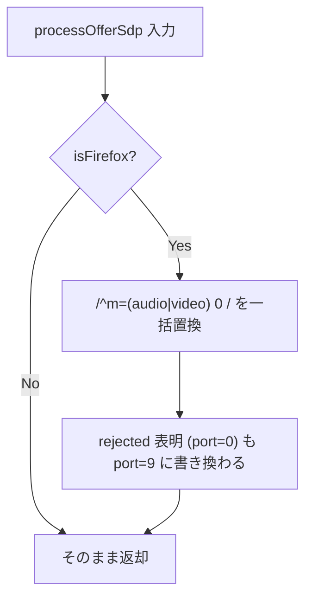

# `processOfferSdp` の Firefox 用 `m=... 0 ...` → `m=... 9 ...` 書き換えが粗く rejected 表明を破壊する

- Priority: Medium
- Created: 2026-05-21
- Polished: 2026-06-02
- Model: Opus 4.7
- Branch: feature/fix-process-offer-sdp-port-zero

## 目的

`processOfferSdp` (`src/base.ts:1489-1502`) は Firefox 向けに `^m=(audio|video) 0 ` を `m=$kind 9 ` に機械置換している。`m=<media> 0`（port=0）は RFC 3264 におけるメディアストリームの拒否 (rejected) 表明であり、現行の一括置換は Sora の transceiver 解放用途以外の port=0 も書き換えてしまう。書き換え対象を「同一 mid が前回 offer の port>0 から今回 port=0 に変わった audio/video m-section」に限定して rejected 表明を保護する。

本 issue は再現未確定の防御的修正で、Firefox での再現確認を着手前の必須ゲートとする (後述)。

## 優先度根拠

Medium。Sora 現行仕様では port=0 は transceiver 解放のみとされ (`src/base.ts:1493-1494` のコメント。Firefox 109.0 で確認のワークアラウンド)、port=0 が rejected 用途で来る経路は本番観測されていない。一括置換が実害を起こすのは将来 Sora が rejected 用途で port=0 を送る場合に限られるため、defensive な保護として対応する。なお README のサポート下限は Firefox 113+ で、ワークアラウンド確認時の 109.0 を上回っており、現行サポート対象で問題が残るかは第 1 段階で確認する。

## 現状

### 状態遷移



`processOfferSdp` (`src/base.ts:1489-1502`) は `isFirefox()` (`src/utils.ts:119`) のとき `sdp.replaceAll(/^m=(audio|video) 0 /gm, ...)` で前回 port を見ずに一括置換する。`setRemoteDescription` (`src/base.ts:1401`) から呼ばれる。`previousOfferMidPorts` は現状未存在。

**複数回呼び出しの注意:** simulcast の `createAnswer` (`src/base.ts:1454` の `if (transceiver)` ブロック内 `1456`) は内部で `setRemoteDescription` を呼ぶ。初回 offer は各サブクラスの connect 実装 (`src/publisher.ts:85` で `setRemoteDescription`、`92` で `createAnswer`) から、re-offer / update は `signalingOnMessageTypeReOffer` / `signalingOnMessageTypeUpdate` から `setRemoteDescription` / `createAnswer` が呼ばれる。これらにより **同一 offer の `message.sdp` に対し `processOfferSdp` が複数回呼ばれうる** (毎回オリジナルの `message.sdp` を受け取るため port=0 は各回とも残っている)。前回 port の記録更新を素朴に `processOfferSdp` 内で毎回行うと、2 回目に「前回 port = 今回の 0」と誤認し書き換えが効かなくなる。なお `signalingOnMessageTypeOffer` (`src/base.ts:1876-`) は SDP に触れず `setRemoteDescription` も呼ばないため、更新を offer ハンドラ層に置く方式は初回 offer 経路を通らず成立しない。`processOfferSdp` 内で「同一 offer か新規 offer か」を判定して完結させる。

## 設計方針

### 第 1 段階 (実装前必須): Firefox 再現確認

Firefox 最新安定版 (具体バージョンを記録) で、Sora transceiver 解放シナリオ (track remove → 再ネゴ → port=0 offer) において port=0 のまま `onremovetrack` 不発が再現するか手動確認する。結果を本 issue に追記する。**再現しなければ `issues/pending/` へ移動し、試した Firefox / Sora バージョンと観測値を末尾に追記する** (その場合 CHANGES 追記・Completed は付けない)。再現する場合のみ第 2 段階を実装する。

### 第 2 段階 (再現確認後): mid 限定書き換え

SDP の行単位パースと書き換えは副作用のない純粋関数として `src/utils.ts` に切り出し、`tests/` でユニットテストする (private メソッドの直接テストを避ける)。

```ts
// src/utils.ts
// previousMidPorts: 前回 offer の mid -> port。今回 port=0 かつ前回 port>0 の audio/video のみ 9 に書き換える。
// 戻り値の midPorts は今回 offer の mid -> port (呼び出し側が previousMidPorts の更新に使う)。
export function rewriteFirefoxRejectedPort(
  sdp: string,
  previousMidPorts: Record<string, number>,
): { sdp: string; midPorts: Record<string, number> } { ... }
```

ロジック:

- 行を分割 (元の改行コードを保持する。`\r\n` で join し直して `\n` のみの SDP を壊さないこと)。各 m-section の `m=<kind> <port>` と直後の `a=mid` を対応付ける。
- 書き換え条件をすべて満たす m-section の m 行のみ `9` にする: `port === 0` / `kind` が `audio` または `video` / `previousMidPorts[mid]` が存在し `> 0`。
- `a=mid` を持たない m-section は書き換えない (現行の一括置換は mid 無視で全置換していたため、ここは後方非互換の縮小。Sora の offer は各 m-section に `a=mid` を含む前提を第 1 段階で確認する)。
- `m=application` は書き換え対象外。m-section の対応付けに必要な範囲でのみ走査する。

`ConnectionBase` 側 (`processOfferSdp` 内で完結させ、複数回呼び出しと初回 offer を統一的に扱う):

- `private previousOfferMidPorts: Record<string, number>`（直前の **別** offer の mid→port）と `private currentOfferMidPorts: Record<string, number>`（現在処理中／直近 offer の mid→port）の 2 フィールドを宣言する。インライン初期化はせず、constructor と `initializeConnection` (`src/base.ts:820-848`) の両方で `{}` に初期化する（既存 private フィールドの規約に合わせる。`mids` のリセットと同位置）。
- `processOfferSdp` は次の手順:
  1. `rewriteFirefoxRejectedPort(sdp, this.previousOfferMidPorts)` を呼び `{ sdp, midPorts }` を得る（rewrite は `previousOfferMidPorts` を基準に行う。`midPorts` は今回 offer の生 port）。
  2. `midPorts` が `this.currentOfferMidPorts` と等しくなければ **新規 offer** とみなし、`this.previousOfferMidPorts = this.currentOfferMidPorts`、`this.currentOfferMidPorts = midPorts` に昇格する（昇格は rewrite に使った `previousOfferMidPorts` の値には影響しない順序で行う。次回呼び出し以降に効く）。
  3. 等しければ **同一 offer の再呼び出し** とみなし昇格しない（`previousOfferMidPorts` が保たれ rewrite 結果が一貫する）。
  4. `sdp` を返す。
- これにより、初回 offer は `previousOfferMidPorts === {}` で書き換えなし（rejected 表明を保護）、2 回目以降の offer は直前 offer の port と照合、同一 offer の複数回呼び出しは一貫した結果になる。`midPorts` の等価判定は mid→port の浅い比較で足りる。
- `initializeConnection` でのリセットにより `signalingTerminate` / `abend` / `shutdown` / `disconnect` 経由の再接続でも前回セッションの mid→port を持ち越さない。

**変更対象:** `src/utils.ts` (`rewriteFirefoxRejectedPort`)、`src/base.ts` (`processOfferSdp` / offer ハンドラ / `initializeConnection` / フィールド宣言)、`tests/` (純粋関数のユニットテスト)。

**スコープ外:** `m=application` の port=0 書き換え / 初回 offer で port=0 (previous なし) の書き換え / Sora 側 port=0 仕様変更 / Playwright Firefox 自動 E2E (Firefox runner 未整備)。

## 完了条件

**§着手前を満たさない限り §実装に進まない。**

- 第 1 段階の Firefox 再現確認結果を issue に追記済み。再現しなければ pending へ移動
- (再現時) `rewriteFirefoxRejectedPort` を `src/utils.ts` に純粋関数として実装し、`tests/` で次をユニットテストする (モック不要):
  - 前回 port>0 → 今回 port=0 の audio/video m 行のみ 9 に書き換わる
  - rejected 表明 (前回も port=0、または previous なし) は書き換えない
  - `a=mid` 無し m-section・`m=application` は書き換えない
  - 元の改行コード (`\n` のみ / `\r\n`) が保持される
- (再現時) `processOfferSdp` がこの関数を使い、`previousOfferMidPorts` / `currentOfferMidPorts` の 2 マップで「新規 offer か同一 offer の再呼び出しか」を判定して昇格する（複数回呼び出しで書き換えが消えないこと、初回 offer は書き換えないことをテスト）。`initializeConnection` で両マップをリセット
- ローカルで `pnpm test` が通ること
- 手動検証手順 (track add/remove → 再ネゴ → port=0 offer → `processOfferSdp` 通過後の port 値 / `onremovetrack`) を PR 説明に記載する (新規 README は作らない)
- CHANGES.md `## develop` に追記 (再現確認後、既存 FIX 群の後ろ):
  ```
  - [FIX] Firefox 向けの processOfferSdp の port=0 書き換えを mid 再利用ケースに限定して RFC 3264 の rejected 表明を保護する
    - @voluntas
  ```

**マージ順:** 0013/0014 (simulcast encodings) とも 0016/0017 (signaling 検証) とも独立。単独マージ可。
