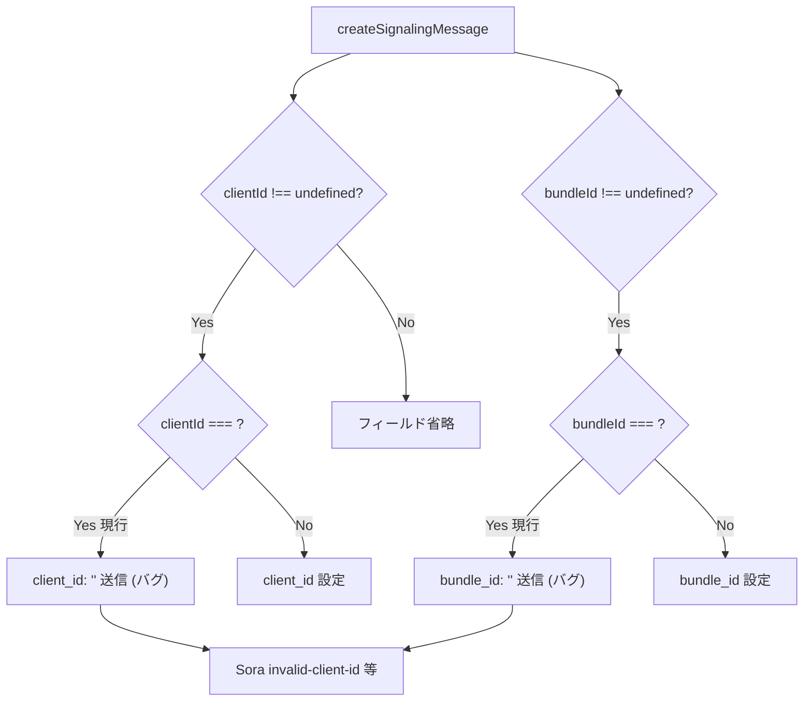

# `clientId: ""` / `bundleId: ""` を有効値として送信して Sora に拒否される

- Priority: High
- Created: 2026-05-21
- Model: Opus 4.7
- Branch: feature/fix-clientid-bundleid-empty-string

## 目的

`createSignalingMessage` (`src/utils.ts:196-201`) は `options.clientId` / `options.bundleId` の `undefined` チェックのみで、空文字 `""` が `client_id: ""` / `bundle_id: ""` として Sora に送信される。Sora は空文字を拒否する (`invalid-client-id` 等)。`createSignalingMessage` で空文字を検出して `Error` を throw する。

## 優先度根拠

High。React `useState("")` 初期値、trim 漏れ、未入力プレースホルダの誤伝搬で容易に踏みうる。エンドユーザーからは「接続失敗」のみ観測でき、原因特定に時間がかかる。issue 0016 と同じランタイム throw 方針。

## 現状

### 状態遷移



```ts
if (options.clientId !== undefined) {
  message.client_id = options.clientId;
}
if (options.bundleId !== undefined) {
  message.bundle_id = options.bundleId;
}
```

`tests/utils.test.ts:110-116` / `:621-628` は空文字を正常系として expect している (修正必須)。

## 設計方針

各 if ブロック内で空文字を検出して throw。`undefined` は従来通りフィールド省略。

```ts
if (options.clientId !== undefined) {
  if (options.clientId === "") {
    throw new Error("clientId must not be empty string");
  }
  message.client_id = options.clientId;
}
if (options.bundleId !== undefined) {
  if (options.bundleId === "") {
    throw new Error("bundleId must not be empty string");
  }
  message.bundle_id = options.bundleId;
}
```

issue 0016 の両方指定検証の直後に本検証を配置する (マージ順 0016 → 0017)。

**変更対象:** `src/utils.ts` の `createSignalingMessage`、`tests/utils.test.ts`

**スコープ外:**

- `metadata` / `signalingNotifyMetadata` 等の空文字検証
- 空文字を `undefined` 同等として黙認する挙動

## 完了条件

- `clientId: ""` / `bundleId: ""` 指定時に上記 `Error` を throw
- `undefined` / 非空文字列の正常系は変更なし
- `tests/utils.test.ts`:
  - 新規 throw テスト 2 件追加
  - 既存 `createSignalingMessage clientId: empty string` (`:110-116`) と `bundleId: empty string` (`:621-628`) を throw 期待に差し替え
- ローカルで `pnpm test` が通ること
- CHANGES.md `## develop` に追記:

  ```
  - [FIX] createSignalingMessage で clientId / bundleId に空文字が指定された場合に Error を投げるようにする
    - @voluntas
  ```

**マージ順:**

```
0016 → 0017
```

- **0016 未マージで 0017 単独マージすると** `createSignalingMessage` でコンフリクトしやすい
