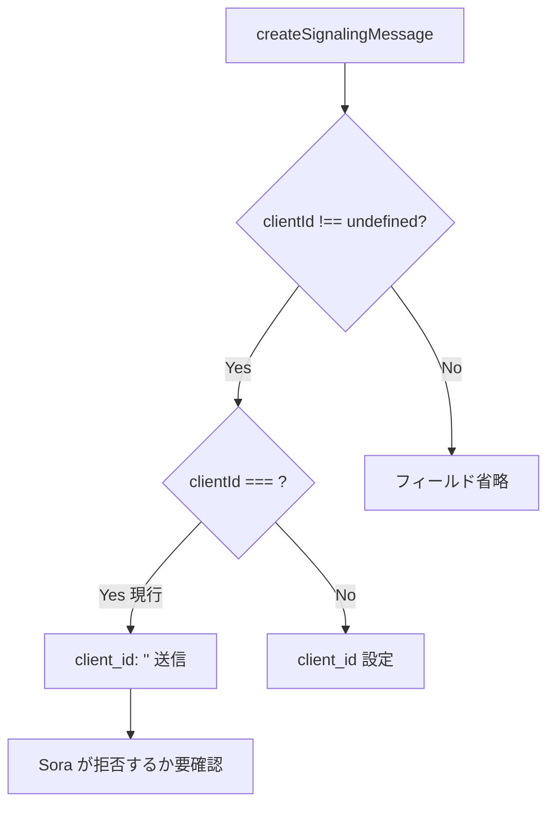

# `clientId: ""` / `bundleId: ""` を有効値として送信して Sora に拒否される

- Priority: High
- Created: 2026-05-21
- Polished: 2026-06-02
- Model: Opus 4.7
- Branch: feature/change-clientid-bundleid-empty-string

## 目的

`createSignalingMessage` (`src/utils.ts:196-201`) は `options.clientId` / `options.bundleId` の `undefined` チェックのみで、空文字 `""` が `client_id: ""` / `bundle_id: ""` として Sora に送信される。空文字が Sora に拒否されるなら、`createSignalingMessage` で空文字を検出して `Error` を throw し connect 前に早期通知する。

**重大な前提注意:** `clientId` の空文字許容は **過去に意図的に導入された仕様**である。CHANGES.md (2020.5.0) に `[UPDATE] clientId option に空文字列を渡せるように修正する` (@yuitowest) があり、既存テスト `tests/utils.test.ts:110-116` も空文字を正常系として `toEqual` で期待している。したがって本 issue は「Sora が空文字を拒否する」という前提が現在も正しい場合に限り、その 2020.5.0 の決定を revert する **後方互換のない変更 (`[CHANGE]`)** になる。前提が誤り (Sora が現在も空文字 clientId を受理する) なら本 issue は無効で close すべき。`bundleId` には 2020.5.0 相当の空文字許容エントリは無く (`bundle_id` オプション追加は 2022.1.0: CHANGES.md:476)、clientId とは経緯が異なる。

## 優先度根拠

High (前提が正しい場合)。React `useState("")` 初期値、trim 漏れ、未入力プレースホルダの誤伝搬で容易に踏みうり、エンドユーザーからは「接続失敗」のみ観測でき原因特定に時間がかかる。ただし上記のとおり 2020.5.0 で意図的に空文字を許容した経緯があるため、Sora が現在空文字を拒否することを着手前に確認する (後述)。

## 現状

### 状態遷移



`src/utils.ts:196-201` は `clientId` / `bundleId` とも `undefined` チェックのみで、空文字をそのまま `client_id` / `bundle_id` に積む (`bundleId` も同型)。

## 設計方針 (Sora が空文字を拒否すると確認できた場合)

`clientId` / `bundleId` の各 if ブロック内で空文字を検出して throw する。`undefined` は従来通りフィールド省略。空白のみ (`"   "`) は本 issue では対象外とし `=== ""` の厳密一致で判定する (Sora が空白のみをどう扱うかは未確認のため、対象を空文字に限定する旨を明記)。

```ts
// 既存の clientId / bundleId の if ブロック (196-201) の中にそれぞれ追加
if (options.clientId !== undefined) {
  if (options.clientId === "") {
    throw new Error("clientId must not be empty string");
  }
  message.client_id = options.clientId;
}
if (options.bundleId !== undefined) {
  if (options.bundleId === "") {
    throw new Error("bundleId must not be empty string");
  }
  message.bundle_id = options.bundleId;
}
```

エラーメッセージは既存検証 (132/135/324) と同じ 1 文・句点なしスタイル。0016 (forwardingFilter 排他検証) は 190 行の別ブロックを編集するため本 issue とは編集箇所が隣接しないが、同一関数のためマージ順 `0016 → 0017` でコンフリクトを避ける。

**変更対象:** `src/utils.ts` の `createSignalingMessage`、`tests/utils.test.ts`、CHANGES.md (2020.5.0 の clientId 空文字許容を revert する旨)。

**スコープ外:** `metadata` / `signalingNotifyMetadata` 等の空文字検証 / 空白のみ文字列の検証 / 空文字を `undefined` 同等として黙認する挙動。

## 完了条件

**§着手前を満たさない限り §実装に進まない。**

### 着手前（必須）

実機または Sora 仕様で、`client_id: ""` / `bundle_id: ""` を送ったときに Sora が拒否する (`invalid-` 系エラー等) ことを確認し、結果を issue に追記する。2020.5.0 で空文字を許容した経緯があるため、現在も受理されるなら本 issue は無効として `issues/pending/` へ移動するか close する (その場合 CHANGES 追記・Completed は付けない)。

### 実装 (拒否を確認後のみ)

- `clientId: ""` / `bundleId: ""` 指定時に上記 `Error` を throw する
- `undefined` / 非空文字列の正常系は変更なし
- `tests/utils.test.ts`:
  - 既存の `createSignalingMessage clientId: empty string` (`:110-116`) と `bundleId: empty string` (`:621-628`) を **throw 期待に書き換える** (これが throw 検証を兼ねる。新規テストは別途追加しない)。書き換え時にテスト名を日本語にする (CLAUDE.md「テストメッセージは日本語」)。例:
    ```ts
    test("createSignalingMessage clientId が空文字の場合は例外を投げる", () => {
      expect(() =>
        createSignalingMessage(sdp, "sendonly", channelId, undefined, { clientId: "" }, false),
      ).toThrow(new Error("clientId must not be empty string"));
    });
    test("createSignalingMessage bundleId が空文字の場合は例外を投げる", () => {
      expect(() =>
        createSignalingMessage(sdp, "sendonly", channelId, undefined, { bundleId: "" }, false),
      ).toThrow(new Error("bundleId must not be empty string"));
    });
    ```
- ローカルで `pnpm test` が通ること (型チェック含む)
- CHANGES.md `## develop` に追記 (既存 `[CHANGE]` 群の並びに、担当者行は 2 文字インデント。2020.5.0 の clientId 空文字許容を revert する後方互換のない変更):
  ```
  - [CHANGE] createSignalingMessage で clientId / bundleId に空文字が指定された場合に Error を投げるように変更する
    - @voluntas
  ```

**マージ順:** `0016 → 0017` (同一関数 `createSignalingMessage` を編集するためコンフリクト回避に 0016 を先にマージ)。
