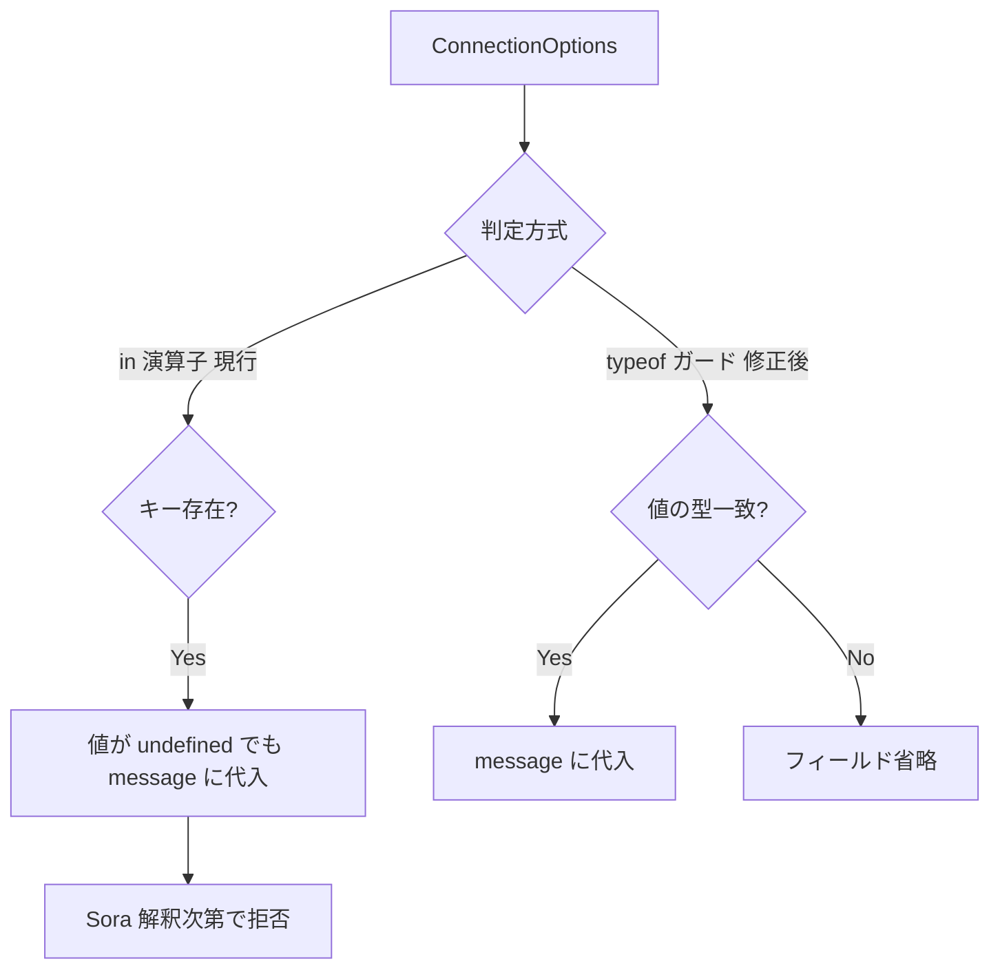

# `in` 演算子で `undefined` 値のプロパティを拾い message に不正値を積む

- Priority: High
- Created: 2026-05-21
- Polished: 2026-06-02
- Model: Opus 4.7
- Branch: feature/fix-in-operator-undefined-values

## 目的

`createSignalingMessage` (`src/utils.ts:123-336`) の一部判定が `"X" in options` / `"X" in copyOptions` と `copyOptions[key] !== null` に依存しており、値が `undefined` でもキーが存在すれば積まれる。実害は経路で異なる:

- **spotlightNumber (168-170):** `message.spotlight_number = undefined` が代入される。`JSON.stringify` で省略されるため送信内容上は無害だが、ロジック上不正。
- **audio / video パラメータ (238-319):** `audioBitRate: undefined` 等があると delete ループ (`!== null`) で undefined キーが残り、`hasAudioProperty` (`src/utils.ts:253`、`Object.keys(copyOptions).some(...)`) が `true` になって `message.audio = {}` に置換される (`src/utils.ts:254-255`)。本来 `audio: true` (boolean) で送るべきところが空オブジェクト `{}` に化け、**送信内容が実際に変わる**。これが主たる実害。

`undefined` を message に載せず `message.audio`/`message.video` の boolean デフォルトを保つよう型ガード / delete 条件を直す。

## 優先度根拠

High。React `useState` や `{ ...base, key: maybeUndefined }` で `undefined` キーが混ざるパターンは一般的で頻発する。`src/utils.ts:168-170`, `:238-247`, `:256-319` に未修正の `in` / `!== null` パターンが残存。`tests/utils.test.ts:799-806` の `spotlightNumber: undefined` テストは `toEqual` が `undefined` プロパティを無視するため pass し回帰検知できない。

## 現状

### 状態遷移



| 箇所                   | 問題                                                                    |
| ---------------------- | ----------------------------------------------------------------------- |
| `src/utils.ts:168-170` | `"spotlightNumber" in options` → `undefined` も拾う                     |
| `src/utils.ts:238-247` | delete 条件が `!== null` のみ → `undefined` キーが `copyOptions` に残る |
| `src/utils.ts:256-319` | `"X" in copyOptions` → 残った `undefined` を message に代入             |

他オプション (`simulcast`, `clientId`, `metadata` 等) は既に `typeof` / `!== undefined` ガード済み。本 issue の対象外。

## 設計方針

3 つの修正は独立した経路を直す。(1) は delete ループの外、(2) が audio/video の主たる修正、(3) は (2) を前提とした二次防御という関係を踏まえること。

### 1. `spotlightNumber` (`:168-170`) — delete ループの外、唯一ここでのみ修正が効く

`spotlightNumber` は `options` を直接見ており `copyOptions` の delete ループを経由しないため、型ガードが本質的修正:

```ts
if (typeof options.spotlightNumber === "number") {
  message.spotlight_number = options.spotlightNumber;
}
```

### 2. `copyOptions` delete ループ (`:238-247`) — audio/video の主たる修正

各 `continue` 条件 `copyOptions[key] !== null` を `copyOptions[key] != null` に変える (`continue` は「キーを残す」、`delete` は「キーを消す」動作。現行は `undefined !== null` が真でキーを残してしまう)。これにより `undefined` キーが削除され、`hasAudioProperty` / `hasAudioOpusParamsProperty` / `hasVideoProperty` (`:253`, `:263`, `:300` 付近の `Object.keys(copyOptions).some(...)`) が `false` になり、`message.audio` / `message.video` が boolean デフォルトのまま保たれる。**audio/video の `{}` 化はこの (2) で解消する。** なお `null` 値は現行 `!== null` でも既に削除されており、`!= null` で新たに除外されるのは `undefined` のみ。

### 3. audio / video パラメータ (`:256-319`) — 二次防御 / 型安全化

(2) により `undefined` キーは削除されるため 256-319 の `in` 判定は `undefined` を見なくなる。それでも `"X" in copyOptions` を `ConnectionOptions` (`src/types.ts:379-427`) に合わせた型ガードに置き換えるのは、`in` が値の型を絞れない (TS 上 `undefined` 代入になりうる) のを解消する型安全化と、(2) が将来 `!== null` に戻された場合の多層防御のため。

| プロパティ                                                                                                                                     | ガード                                                                     |
| ---------------------------------------------------------------------------------------------------------------------------------------------- | -------------------------------------------------------------------------- |
| `audioCodecType`, `videoCodecType`                                                                                                             | `typeof ... === "string"`                                                  |
| `audioBitRate`, `videoBitRate`, `audioOpusParamsChannels`, `audioOpusParamsMaxplaybackrate`, `audioOpusParamsMinptime`, `audioOpusParamsPtime` | `typeof ... === "number"`                                                  |
| `audioOpusParamsStereo`, `audioOpusParamsSpropStereo`, `audioOpusParamsUseinbandfec`, `audioOpusParamsUsedtx`                                  | `typeof ... === "boolean"`                                                 |
| `videoVP9Params`, `videoH264Params`, `videoH265Params`, `videoAV1Params`                                                                       | `... != null && typeof ... === "object"` (`typeof null === "object"` 対策) |

例:

```ts
if (typeof copyOptions.audioCodecType === "string") {
  message.audio.codec_type = copyOptions.audioCodecType;
}
```

### 4. テスト (`tests/utils.test.ts`)

`message.audio` / `message.video` が boolean デフォルト `true` を保つことを assert する (この成立は (2) の delete ループ修正に依存する。`toEqual` は `undefined` プロパティを無視するため `"X" in message` または `toStrictEqual` で検査する):

```ts
test("undefined 値のオプションは message に含めない", () => {
  const message = createSignalingMessage(
    "sdp",
    "sendrecv",
    "channel",
    null,
    {
      spotlightNumber: undefined,
      audioBitRate: undefined,
      audioCodecType: undefined,
      videoBitRate: undefined,
      videoCodecType: undefined,
    },
    false,
  );
  expect("spotlight_number" in message).toBe(false);
  expect(message.audio).toBe(true); // (2) 適用後、audio 系 undefined が除外され boolean デフォルトが残る
  expect(message.video).toBe(true);
});
```

既存 `spotlightNumber: undefined` テスト (`:799-806`) は `toEqual` のままだと `undefined` を見逃すため、`expect("spotlight_number" in message).toBe(false)` を加えるか `toStrictEqual` に変える。同型の偽陰性 (`toEqual` のみ) を持つ他の `undefined` テストがあれば併せて見直す。

### 5. CHANGES.md

```
- [FIX] createSignalingMessage の各オプション判定で in 演算子が undefined 値を拾っていたのを型ガードに置き換える
  - @voluntas
```

## スコープ外

- issue 0016 (`forwardingFilter` / `forwardingFilters` 排他) / 0017 (`clientId` / `bundleId` 空文字) — 同一関数だが別 issue
- `null` 値の Sora 側意味論 — 型ガードで message へ載らないようにするのみ
- `createSignalingMessage` 以外の `in` 演算子

## マージ順

```
0016 → 0017 → 0018
```

同一関数 `createSignalingMessage` を編集するため **0016 / 0017 を先にマージ**する。0004 チェーン (`0004 → 0006 → 0021 → 0009 → 0007`) とは独立。

## 完了条件

- 上記 3 箇所すべてを型ガード / `!= null` に置き換える
- `tests/utils.test.ts` に undefined オプションの回帰テストを追加し、既存 `toEqual` のみの assert を修正する
- ローカルで `pnpm test` が通ること
- CHANGES.md `## develop` に `[FIX]` エントリを追記する
