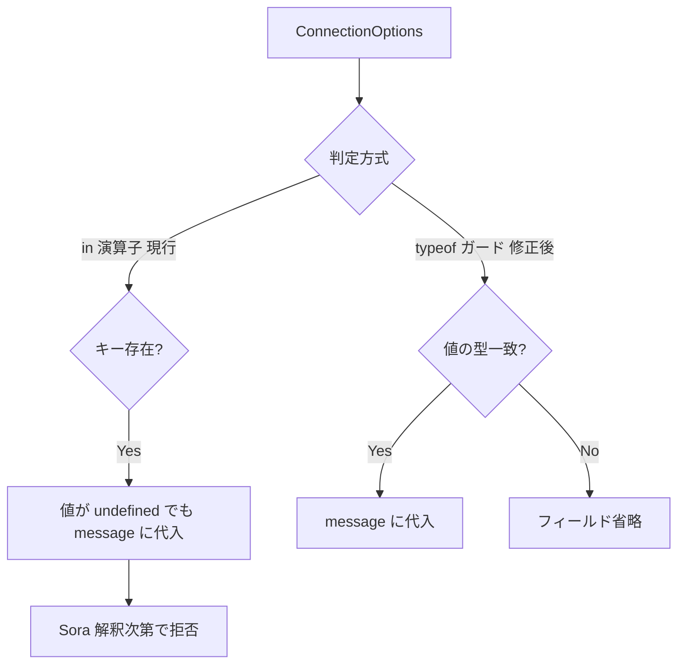

# `in` 演算子で `undefined` 値のプロパティを拾い message に不正値を積む

- Priority: High
- Created: 2026-05-21
- Model: Opus 4.7
- Branch: feature/fix-in-operator-undefined-values

## 目的

`createSignalingMessage` (`src/utils.ts:123-336`) の一部判定が `"X" in options` / `"X" in copyOptions` と `copyOptions[key] !== null` に依存しており、値が `undefined` でもキーが存在すれば message へ積まれる。`{ spotlightNumber: undefined }` 等は `JSON.stringify` 時に省略されるが、ロジック上は不正で、Sora 側の解釈次第では接続拒否 (`invalid-spotlight-number` 等) につながる。SDK 側で `undefined` を message に載せないよう型ガードに置き換える。

## 必要性

**必要** (確信度: 高)。`src/utils.ts:168-170`, `:238-247`, `:256-319` に未修正の `in` / `!== null` パターンが残存。`tests/utils.test.ts:799-806` の `spotlightNumber: undefined` テストは `toEqual` だけでは `{ spotlight_number: undefined }` が `{}` と等価扱いされ pass しており、回帰検知不能。

## 優先度根拠

High。React `useState` や `{ ...base, key: maybeUndefined }` で `undefined` キーが混ざるパターンは一般的で、本問題は頻発する。

## 現状

### 状態遷移



| 箇所                   | 問題                                                                    |
| ---------------------- | ----------------------------------------------------------------------- |
| `src/utils.ts:168-170` | `"spotlightNumber" in options` → `undefined` も拾う                     |
| `src/utils.ts:238-247` | delete 条件が `!== null` のみ → `undefined` キーが `copyOptions` に残る |
| `src/utils.ts:256-319` | `"X" in copyOptions` → 残った `undefined` を message に代入             |

他オプション (`simulcast`, `clientId`, `metadata` 等) は既に `typeof` / `!== undefined` ガード済み。本 issue の対象外。

## 設計方針

### 1. `spotlightNumber`

```ts
if (typeof options.spotlightNumber === "number") {
  message.spotlight_number = options.spotlightNumber;
}
```

### 2. `copyOptions` delete ループ (`:238-247`)

`!== null` を `!= null` に変更し、`undefined` と `null` を両方除外する。

### 3. audio / video パラメータ (`:256-319`)

`"X" in copyOptions` を `ConnectionOptions` (`src/types.ts:379-427`) に合わせた型ガードに置き換える。

| プロパティ                                                                                                                                     | ガード                                                                     |
| ---------------------------------------------------------------------------------------------------------------------------------------------- | -------------------------------------------------------------------------- |
| `audioCodecType`, `videoCodecType`                                                                                                             | `typeof ... === "string"`                                                  |
| `audioBitRate`, `videoBitRate`, `audioOpusParamsChannels`, `audioOpusParamsMaxplaybackrate`, `audioOpusParamsMinptime`, `audioOpusParamsPtime` | `typeof ... === "number"`                                                  |
| `audioOpusParamsStereo`, `audioOpusParamsSpropStereo`, `audioOpusParamsUseinbandfec`, `audioOpusParamsUsedtx`                                  | `typeof ... === "boolean"`                                                 |
| `videoVP9Params`, `videoH264Params`, `videoH265Params`, `videoAV1Params`                                                                       | `... != null && typeof ... === "object"` (`typeof null === "object"` 対策) |

例:

```ts
if (typeof copyOptions.audioCodecType === "string") {
  message.audio.codec_type = copyOptions.audioCodecType;
}
```

### 4. テスト (`tests/utils.test.ts`)

```ts
test("undefined 値のオプションは message に含めない", () => {
  const message = createSignalingMessage(
    "sdp",
    "sendrecv",
    "channel",
    null,
    {
      spotlightNumber: undefined,
      audioBitRate: undefined,
      audioCodecType: undefined,
      videoBitRate: undefined,
      videoCodecType: undefined,
    },
    false,
  );
  expect("spotlight_number" in message).toBe(false);
  expect(message.audio).toBe(true); // デフォルト値
  expect(typeof message.audio).toBe("boolean");
  expect(message.video).toBe(true);
});
```

既存 `spotlightNumber: undefined` テスト (`:799-806`) は上記と同様、`in` / 型ベース assert に差し替える。

### 5. CHANGES.md

```
- [FIX] createSignalingMessage の各オプション判定で in 演算子が undefined 値を拾っていたのを型ガードに置き換える
  - @voluntas
```

## スコープ外

- issue 0016 (`forwardingFilter` / `forwardingFilters` 排他) / 0017 (`clientId` / `bundleId` 空文字) — 同一関数だが別 issue
- `null` 値の Sora 側意味論 — 型ガードで message へ載らないようにするのみ
- `createSignalingMessage` 以外の `in` 演算子

## マージ順

```
0016 → 0017 → 0018
```

同一関数 `createSignalingMessage` を編集するため **0016 / 0017 を先にマージ**する。0004 チェーン (`0004 → 0006 → 0021 → 0009 → 0007`) とは独立。

## 完了条件

- 上記 3 箇所すべてを型ガード / `!= null` に置き換える
- `tests/utils.test.ts` に undefined オプションの回帰テストを追加し、既存 `toEqual` のみの assert を修正する
- ローカルで `pnpm test` が通ること
- CHANGES.md `## develop` に `[FIX]` エントリを追記する
