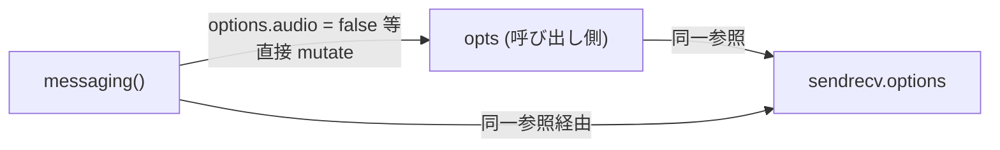

# `messaging()` が呼び出し側の `options` を破壊し他 Connection の `this.options` まで壊す

- Priority: High
- Created: 2026-05-21
- Polished: 2026-06-02
- Model: Opus 4.7
- Branch: feature/fix-messaging-mutates-shared-options

## 目的

`Sora.connection().messaging()` (`src/sora.ts:210-227`) が引数 `options` をその場で mutate し、`ConnectionBase` constructor (`src/base.ts:266`) が浅い参照のまま `this.options = options` と保持するため、同一 `opts` を `sendrecv()` と `messaging()` に渡すと後者が前者の `this.options` まで書き換える。spread copy と constructor 側 shallow copy で外部参照を切り離す。

## 必要性

**必要** (確信度: 高)。`src/sora.ts:215-217` の直接代入と `src/base.ts:266` の参照保持が現行コードに残存。`sendrecv` / `sendonly` / `recvonly` は options を mutate しないが、`ConnectionBase` の参照保持だけでも内部 mutate (`this.options.skipIceCandidateEvent ??= false`、`src/base.ts:271`。`this.options` を書き換えるのはこの 1 箇所のみ。timeout 等は read のみ) が呼び出し側 opts へ漏れる。

## 優先度根拠

High。同一 `opts` で `sendrecv()` と `messaging()` を生成する公式パターンで再現する。利用者は不変オブジェクトを渡したつもりが壊され、原因特定が困難。

## 現状

### 状態遷移



```ts
// src/sora.ts:210-227
messaging(..., options: ConnectionOptions = { audio: false, video: false }) {
  options.audio = false;
  options.video = false;
  options.dataChannelSignaling = true;
  return new ConnectionMessaging(..., options, ...);
}

// src/base.ts:266
this.options = options;
```

再現:

```ts
const opts = { audio: true, video: true };
const sendrecv = connection.sendrecv("ch", null, opts);
connection.messaging("ch2", null, opts);
// opts と sendrecv.options の両方が { audio: false, video: false, dataChannelSignaling: true }
```

## 設計方針

### 1. `messaging()` (`src/sora.ts:210-227`)

```ts
const merged: ConnectionOptions = {
  ...options,
  audio: false,
  video: false,
  dataChannelSignaling: true,
};
return new ConnectionMessaging(..., merged, ...);
```

### 2. `ConnectionBase` constructor (`src/base.ts:266`)

```ts
this.options = { ...options };
```

以降の `this.options.skipIceCandidateEvent ??= false` はコピー側のみ変更する。ネストオブジェクト (`forwardingFilters`, `dataChannels` 等) は共有参照のまま — constructor 以降の SDK 内部処理はトップレベルプロパティ (`skipIceCandidateEvent`) しか mutate せずネストは書き換えないため deep clone は不要。

**後方互換:** 修正後は `connection.sendrecv(...).options` が呼び出し側に渡した `opts` と別参照になる。参照同一性に依存したコード (接続後に元の `opts` を mutate して内部反映を期待する等) は影響を受けるが、それは元々この破壊バグに依存した使い方であり `[FIX]` として妥当。

### 3. テスト (`tests/sora.test.ts` 新規)

```ts
import Sora from "../src/sora";
import type { ConnectionOptions } from "../src/types";

test("messaging() が呼び出し側の options を破壊しない", () => {
  const opts: ConnectionOptions = { audio: true, video: true };
  const connection = Sora.connection("ws://example.invalid/signaling");
  connection.messaging("ch", null, opts);
  expect(opts.audio).toBe(true);
  expect(opts.video).toBe(true);
  expect(opts.dataChannelSignaling).toBeUndefined();
});

test("ConnectionBase が内部 mutate (skipIceCandidateEvent) を呼び出し側 options に漏らさない", () => {
  // constructor の shallow copy を弁別するテスト。
  // messaging 修正だけでは opts が mutate されないため、この検証が無いと
  // base.ts の shallow copy 修正の有無をテストで区別できない。
  const opts: ConnectionOptions = { audio: true, video: true };
  const connection = Sora.connection("ws://example.invalid/signaling");
  connection.sendrecv("ch", null, opts);
  // constructor が this.options.skipIceCandidateEvent ??= false するが、
  // shallow copy していれば呼び出し側 opts には漏れない。
  expect(opts.skipIceCandidateEvent).toBeUndefined();
});
```

`ConnectionBase.options` は public フィールド (`src/base.ts:124`)。なお `sendrecv` 後の `sendrecv.options` 破壊伝播は messaging 修正で opts が mutate されなくなることで防げるが、上記 3 本目は base.ts の shallow copy 修正のみが防げる経路 (内部 `??=` 漏れ) を弁別する。

### 4. CHANGES.md

```
- [FIX] messaging() が呼び出し側の options を破壊しないように修正する
  - @voluntas
- [FIX] ConnectionBase で options を shallow copy して外部参照を切り離す
  - @voluntas
```

## スコープ外

- `sendrecv` / `sendonly` / `recvonly` の変更 (mutate していない)
- `options` の deep clone
- ネストプロパティの防御的コピー

## マージ順

他 issue との依存なし。単独マージ可。

## 完了条件

- `src/sora.ts:215-217` を spread copy パターンに置き換える
- `src/base.ts:266` を `this.options = { ...options };` に変更する
- `tests/sora.test.ts` (新規) で上記 2 テストを追加する
- ローカルで `pnpm test` が通ること
- CHANGES.md `## develop` に `[FIX]` エントリ 2 件を追記する
