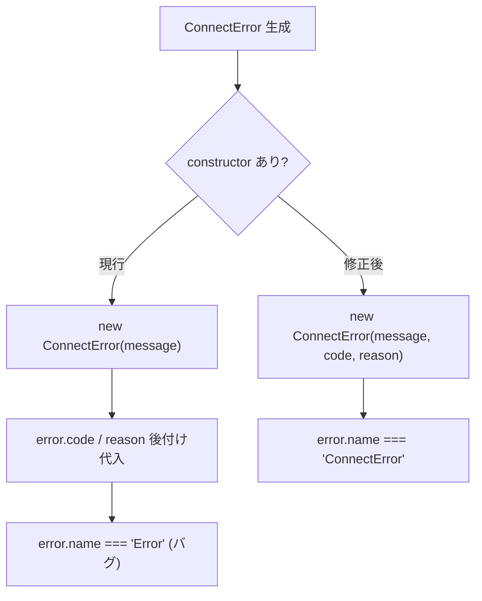

# `ConnectError.code` / `reason` が後付け代入に依存し `name` も未設定

- Priority: High
- Created: 2026-05-21
- Model: Opus 4.7
- Branch: feature/fix-connect-error-constructor

## 目的

`ConnectError` (`src/utils.ts:414-417`) はフィールド宣言のみで constructor が無く、`error.name` は `"Error"` のまま。`src/base.ts` では CloseEvent 付き経路で `new ConnectError(...)` 後に `error.code` / `error.reason` を後付け代入している (`:1139-1140`, `:1264-1265`, `:1603-1604`)。constructor で `code` / `reason` / `name` を初期化し、後付け代入を廃止する。

## 必要性

**必要** (確信度: 高)。現行 `ConnectError` に constructor なし。issue 0007 / 0008 / 0012 が `reason` 分類を導入する前提となり、0004 チェーンでも **0021 を 0007 より先にマージ**する合意 (`issues/0004-bug-fix-abend-compress-failure-skips-cleanup.md`)。

## 優先度根拠

High。`if (error instanceof ConnectError) { switch (error.code) { ... } }` で分類できない。モニタリングでも `error.name === "Error"` のまま集約される。

## 現状

### 状態遷移



```ts
// src/utils.ts:414-417
export class ConnectError extends Error {
  code?: number;
  reason?: string;
}
```

| 箇所                                          | パターン                                                  |
| --------------------------------------------- | --------------------------------------------------------- |
| `src/base.ts:1136-1140`                       | 後付け `code` / `reason`                                  |
| `src/base.ts:1261-1265`                       | 同上                                                      |
| `src/base.ts:1600-1604`                       | 同上                                                      |
| `src/base.ts:1123`, `:1233`, `:1236`, `:1610` | `new ConnectError(message)` のみ (`code` / `reason` 不要) |

## 設計方針

### 1. `ConnectError` (`src/utils.ts:414-417`)

```ts
export class ConnectError extends Error {
  code?: number;
  reason?: string;

  constructor(message: string, code?: number, reason?: string) {
    super(message);
    this.name = "ConnectError";
    this.code = code;
    this.reason = reason;
    Object.setPrototypeOf(this, ConnectError.prototype);
  }
}
```

`ConnectError` の配置 (`utils.ts`) は変更しない (issue 0022 と合意)。

### 2. `src/base.ts` 後付け代入 3 箇所

```ts
const error = new ConnectError(
  `Signaling failed. CloseEventCode:${event.code} CloseEventReason:'${event.reason}'`,
  event.code,
  event.reason,
);
```

`error.code = ...` / `error.reason = ...` 行は削除する。

### 3. テスト (`tests/utils.test.ts`)

```ts
import { ConnectError } from "../src/utils";

test("ConnectError は constructor で code / reason / name を設定する", () => {
  const e1 = new ConnectError("msg");
  expect(e1.name).toBe("ConnectError");
  expect(e1.code).toBeUndefined();
  expect(e1.reason).toBeUndefined();
  expect(e1 instanceof ConnectError).toBe(true);
  expect(e1 instanceof Error).toBe(true);

  const e2 = new ConnectError("msg", 1006, "abnormal");
  expect(e2.code).toBe(1006);
  expect(e2.reason).toBe("abnormal");
});
```

### 4. CHANGES.md

```
- [CHANGE] ConnectError に constructor(message, code?, reason?) を追加し name プロパティを設定するようにする
  - @voluntas
```

## スコープ外

- issue 0007 / 0008 / 0012 の `new ConnectError(..., undefined, "REASON")` への書き換え — 各 issue 側で 0021 マージ後に対応
- `ConnectError` を `errors.ts` へ移動するリファクタ
- `DisconnectWaitTimeoutError` 等 (`errors.ts`) — issue 0022

## マージ順

0004 関連チェーン (`issues/0004-bug-fix-abend-compress-failure-skips-cleanup.md`):

```
0004 → 0006 → (0011) → 0021 → 0009 → 0007 → …
```

**0021 は 0006 の後・0009 / 0007 の前**にマージする。0007 / 0008 / 0012 は 0021 完了後に `ConnectError` constructor 形式へ移行する。

## 完了条件

- `ConnectError` に constructor を追加する
- `src/base.ts` の後付け代入 3 箇所を constructor 引数に置き換える
- `tests/utils.test.ts` に ConnectError テストを追加する
- ローカルで `pnpm test` が通ること
- CHANGES.md `## develop` に `[CHANGE]` エントリを追記する (`error.name` が `"Error"` → `"ConnectError"`)
