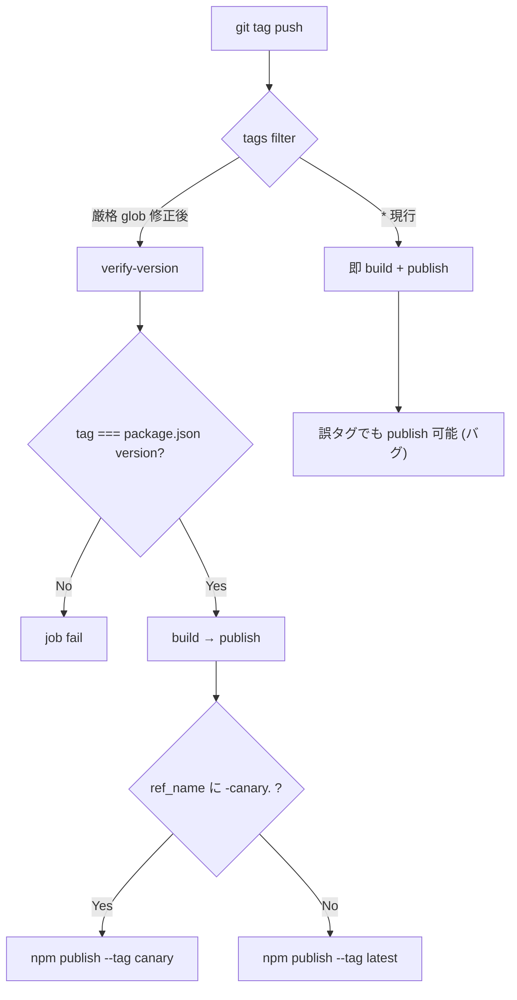

# `npm-publish.yml` のタグトリガが緩くタグと package.json の不整合で誤 publish される

- Priority: High
- Created: 2026-05-21
- Polished: 2026-06-02
- Model: Opus 4.7
- Branch: feature/fix-npm-publish-tag-validation

## 必要性

**必要。** 現行 workflow は任意タグ (`tags: "*"`) で publish が走り、`package.json` の `version` とタグ名の照合もない。canary 判定も `contains(github.ref, 'canary')` という部分文字列マッチのため、`feature-canary-foo` のような誤タグで canary 経路に入る可能性がある。npm publish は取り消しが困難（同名 version の再 push 不可、72 時間以降の unpublish 不可）なため、構造的ガードが必須。

## 目的

`.github/workflows/npm-publish.yml` の publish トリガと canary 分岐を本リポジトリのリリース命名規約に合わせて厳格化し、タグ名と `package.json` の `version` 不一致時は publish 前に fail させる。

## 優先度根拠

High。npm publish は外部依存を持つ全ユーザーに即座に影響する。リリース担当者の誤タグ操作で意図しない version が npm に載る、または canary / latest の経路を誤る事故が起きうる。

## 現状

### 状態遷移



`.github/workflows/npm-publish.yml:3-6`

```yaml
on:
  push:
    tags:
      - "*"
```

canary 分岐 (`.github/workflows/npm-publish.yml:37`, `:63`):

```yaml
if: ${{ contains(github.ref, 'canary') }}
if: ${{ !contains(github.ref, 'canary') }}
```

- `github.ref` は `refs/tags/<tag-name>` 形式。タグ名に `canary` が含まれれば canary 扱いになる
- `package.json` の `version` とタグ名 (`github.ref_name`) の照合は無い
- 既存タグは `v` プレフィックス無し (`2025.2.0`, `2025.2.0-canary.0`, `2026.1.0-canary.0` 等。`git tag -l` 参照)
- GitHub Actions の `on.push.tags` filter は glob のみ (POSIX BRE の繰り返し量子化は不可)。厳密な形式検証は workflow filter だけでは不十分で、別ジョブでのスクリプト検証が必要

## 設計方針

1. `on.push.tags` を本リポジトリの命名規約に近い glob 2 つに列挙する
2. `build` の前に `verify-version` ジョブを新設し、`package.json` の `version` と `github.ref_name` を完全一致比較する
3. canary 判定を `contains(github.ref_name, '-canary.')` に統一する
4. Slack 通知は issue 0023 (closed) のとおり `status: ${{ job.status }}` のまま変更不要
5. トップレベル `permissions` は本 issue では触らない (0026 で `contents: read` のみへ縮小)

**glob の位置づけ:** 上記 2 glob は `on.push.tags` の **トリガ用の粗いフィルタ** で、OR 結合。GitHub Actions の tag glob では `*` が `-` や `.` も飲むため、非 canary glob `[0-9][0-9][0-9][0-9].[0-9]*.[0-9]*` は `2025.2.0-canary.0` にも match する (canary タグは両 glob に match)。canary / non-canary の振り分けは glob では行わず job の `if`、タグ名と version の厳密照合は `verify-version` が担う。glob は「4 桁年で始まる CalVer 形式以外 (`feature-canary-foo` 等) を発火させない」粗ガードに過ぎない。

`.github/workflows/npm-publish.yml` の変更点 (変更部のみ。`build` / `npm-publish-canary` / `npm-publish` / `slack_notify` の各ステップ本体は既存のまま):

1. `on.push.tags` を `"*"` から次の 2 glob に変更する。

```yaml
on:
  push:
    tags:
      - "[0-9][0-9][0-9][0-9].[0-9]*.[0-9]*"
      - "[0-9][0-9][0-9][0-9].[0-9]*.[0-9]*-canary.[0-9]*"
```

2. `verify-version` ジョブを新設する。`ubuntu-slim` には node が前提でないため `setup-node` を置く (既存 `build` ジョブも node 使用前に必ず setup-node を置いている)。トップレベル `permissions: id-token: write` を継承しないよう `contents: read` のみを明示する (このジョブは publish しないため id-token 不要)。

```yaml
verify-version:
  name: Verify tag matches package.json version
  runs-on: ubuntu-slim
  permissions:
    contents: read
  steps:
    - uses: actions/checkout@de0fac2e4500dabe0009e67214ff5f5447ce83dd # v6.0.2
    - uses: actions/setup-node@48b55a011bda9f5d6aeb4c2d9c7362e8dae4041e # v6.4.0
      with:
        node-version: 22
    - name: Verify tag matches package.json version
      run: |
        PKG_VERSION=$(node -p "require('./package.json').version")
        TAG_NAME="${{ github.ref_name }}"
        if [ "$PKG_VERSION" != "$TAG_NAME" ]; then
          echo "Tag (${TAG_NAME}) does not match package.json version (${PKG_VERSION})"
          exit 1
        fi
```

3. `build` ジョブに `needs: [verify-version]` を追加する (`verify-version` 失敗時は build 以降が skip)。
4. `npm-publish-canary` / `npm-publish` の `if` を `contains(github.ref, 'canary')` / `!contains(github.ref, 'canary')` から `contains(github.ref_name, '-canary.')` / `!contains(github.ref_name, '-canary.')` に変更する。

canary タグ (`2025.2.0-canary.0` 等) は `verify-version` 通過後 `npm-publish-canary` のみ、non-canary は `npm-publish` のみ走る。トップレベル `permissions` の縮小は 0026 で扱う (本 issue は新設 `verify-version` の権限のみ最小化)。

## 完了条件

### コード変更

- [ ] `on.push.tags` を `"*"` から上記 glob 2 つへ変更する
- [ ] `verify-version` ジョブを追加し、`node -p "require('./package.json').version"` と `${{ github.ref_name }}` を比較、不一致なら exit 1 する
- [ ] `build` に `needs: [verify-version]` を追加する
- [ ] canary 判定を `contains(github.ref_name, '-canary.')` / `!contains(github.ref_name, '-canary.')` に変更する (`github.ref` 参照をやめる)
- [ ] 既存の publish ステップ (`npm publish --no-git-checks` / `--tag canary`) は変更しない

### 検証

- [ ] `pnpm run lint` / `pnpm run typecheck` が通る (workflow 内 `build` ジョブと同等)
- [ ] 本 issue は workflow のみの変更のため `pnpm test` の追加実行は不要 (SDK ソース無変更)
- [ ] 実機 publish は影響が大きいため PR 上での tag push テストは行わない。レビューで以下を確認する
  - glob が既存タグ形式 (`2025.2.0`, `2025.2.0-canary.0`) にマッチすること (GitHub の tag glob はローカル shell glob と挙動が異なるため、確認は実際のタグ push か GitHub のドキュメント仕様で行う)
  - `verify-version` スクリプトが tag / version 不一致で exit 1 すること。ローカル dry-run は比較ロジックごと実行する: `PKG_VERSION=$(node -p "require('./package.json').version"); TAG_NAME=2025.2.0; [ "$PKG_VERSION" != "$TAG_NAME" ] && echo NG || echo OK` (`TAG_NAME=... node -p ...` だけでは node が TAG_NAME を見ず比較にならない)
- [ ] CI: PR マージ後、次回の canary tag push で workflow が意図通り動くこと (本 issue 単体では tag push トリガは発火しない)

### 変更履歴

- [ ] `CHANGES.md` `## develop` の `### misc` に追記する

  ```
  - [FIX] npm-publish workflow のタグトリガを厳格化し package.json の version とタグ名の一致を verify-version ジョブで検証する
    - @voluntas
  ```

## スコープ外

- `shiguredo/github-actions` の SHA 固定 (issue 0025 で対応不要と判定済み)
- workflow `permissions` の最小権限化 (issue 0026)
- `npm publish --provenance` 追加 (issue 0033)
- Slack notify の `status: ${{ job.status }}` 変更 (issue 0023 で対応不要と判定済み)
- タグ命名規約そのものの変更 (`canary.py` 等)

## マージ順

**0024 を最初にマージする。** 0026 が同じ `npm-publish.yml` を編集するため、0024 → 0026 の順を推奨する。
