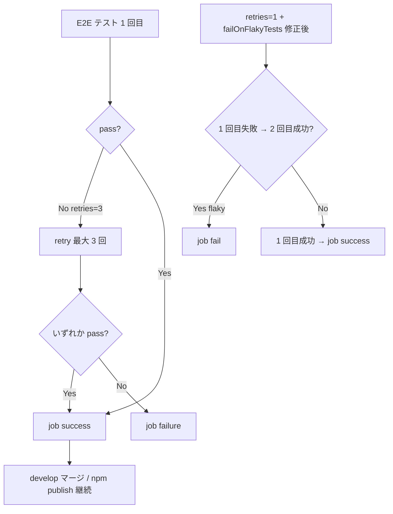

# Playwright の `retries: 3` で flaky テストが CI 上で隠蔽される

- Priority: High
- Created: 2026-05-21
- Polished: 2026-06-02
- Model: Opus 4.7
- Branch: feature/fix-flaky-detection

## 必要性

**必要。** `playwright.config.ts:8` の `retries: 3` により E2E が最大 4 回実行され、1 回でも通れば job が success になる。flaky が CI 上で表面化せず develop が更新され、タグ push → npm publish で壊れた SDK が npm に出る経路が成立する。job が green なら Slack も通知されず (`notify_mode: failure_and_fixed`)、flaky が誰にも気付かれない。

## 目的

CI 環境のみ `retries` を `1` に下げ、Playwright の `failOnFlakyTests` で flaky 検出時に job を fail させる。

## 優先度根拠

High。リリース判定の根拠そのものが崩れうる。flaky 吸収は develop マージと npm publish の信頼性を直接損なう。

## 現状

### 状態遷移



`playwright.config.ts:5-12`

```ts
export default defineConfig({
  testDir: "e2e-tests/tests",
  // 本来は flaky テストをなくすべきだが、一時的に対応
  retries: 3,
  workers: 1,
  // fullyParallel: true,
  reporter: "list",
```

- CI でも `retries: 3` が有効で、flaky が retry に吸収され job が success になる

## 設計方針

`playwright.config.ts` の変更のみで完結する。`@playwright/test@1.59.1` は `failOnFlakyTests` オプションを提供しており (`node_modules/.pnpm/playwright@1.59.1/.../types/test.d.ts:1259`、推奨用法は `failOnFlakyTests: !!process.env.CI`)、flaky テストが 1 件でもあれば `playwright test` がそのまま非ゼロ終了する (`lib/runner/failureTracker.js:57` で `failOnFlakyTests && hasFlakyTests()` のとき run を `failed` にする)。これにより E2E workflow への step 追加や JSON reporter の解析は一切不要になる。

```ts
export default defineConfig({
  testDir: "e2e-tests/tests",
  retries: process.env.CI ? 1 : 0,
  workers: 1,
  // fullyParallel: true,
  failOnFlakyTests: !!process.env.CI,
  reporter: "list",
```

- ローカル: `retries: 0`、`failOnFlakyTests` 無効 (通常開発の挙動を維持)
- CI: `retries: 1` (最大 2 回実行) + `failOnFlakyTests` 有効
- `retries: 1` が必須。`retries: 0` だと失敗テストは retry されず `failOnFlakyTests` の対象 (flaky = 1 回目失敗 → 2 回目成功) にならない。`retries: 1` で初めて flaky が分類され、`failOnFlakyTests` が run を fail にする
- `reporter` は `list` のまま変更しない。`failOnFlakyTests` は reporter に依存せず runner レベルで終了コードを決めるため、JSON reporter は不要

flaky で `playwright test` が非ゼロ終了すると E2E 本体ジョブの test step が failure になり、job が failure になる。slack-notify (`status: ${{ job.status }}` + action 内 `gh api` による failure 自動検出) でそのまま Slack 通知される。**E2E workflow 5 本 (`e2e-test.yml` / `e2e-test-canary.yml` / `e2e-test-h265.yml` / `e2e-test-webkit.yml` / `npm-pkg-e2e-test.yml`) のいずれも変更不要。**

## 完了条件

### コード変更

- [ ] `playwright.config.ts` に `retries: process.env.CI ? 1 : 0` と `failOnFlakyTests: !!process.env.CI` を設定する
- [ ] `// 本来は flaky テストをなくすべきだが、一時的に対応` コメントを削除する (CI で flaky を fail させる方針に変わるため)

### 検証

- [ ] `pnpm test` が通る (SDK 単体テスト。playwright.config 変更の影響なし)
- [ ] ローカル: `pnpm exec playwright test --project="Chromium" e2e-tests/tests/stereo_audio.test.ts` が `retries: 0` で動作すること
- [ ] flaky 検出の動作確認 (必須): 1 回目だけ失敗するテストを一時追加し、`CI=true pnpm exec playwright test --project="Chromium" <一時ファイル>` で単独実行すると 2 回目で pass しつつ `playwright test` が非ゼロ終了することを確認した後、テストを revert する。検出が本 issue の唯一の成果物のため、目視レビューだけで済ませず実行で実証する。既存テストの偶発 flaky と切り分けるため単一ファイル + 単一 project で実行する。最小例:

  ```ts
  import { test, expect } from "@playwright/test";

  test("flaky 検出の動作確認用 (revert すること)", () => {
    expect(test.info().retry).toBeGreaterThan(0);
  });
  ```

  `retry === 0` の 1 回目は失敗し、`retry === 1` の 2 回目で成功するため flaky に分類され、`failOnFlakyTests` で run が fail する。

- [ ] CI: PR マージ後、e2e 系 workflow が green であること

### 変更履歴

- [ ] `CHANGES.md` `## develop` の `### misc` に追記する

  ```
  - [FIX] CI で Playwright の retries を 1 に下げ failOnFlakyTests で flaky テストを fail させるようにする
    - @voluntas
  ```

## スコープ外

- `waitForTimeout(...)` → 決定的待機への置き換え (issue 0032)
- slack-notify の `status` 変更 (issue 0023 で不要)
- workflow `permissions` (issue 0026)
- flaky 根本原因の個別テスト修正 (0032 以降)

## マージ順

**0029 の前を推奨。** 0029 は本 issue (flaky 検出) を前提とする (0029 側も「0027 の後を推奨」と記載)。0028 とは独立だが、flaky が surface 化してから cleanup を直す方が regression を検知しやすいため 0027 → 0028 → 0029 の順を推奨する。本 issue は `playwright.config.ts` のみ変更し E2E workflow を触らないため、workflow を変更する 0026 とはコンフリクトせず順序の制約もない。
