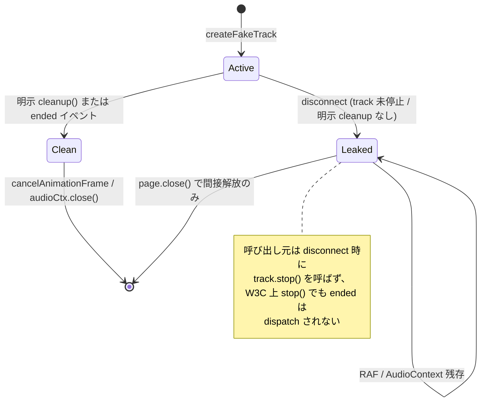

# `e2e-tests/src/fake.ts` の RAF / AudioContext が `track.stop()` で cleanup されない

- Priority: Medium
- Created: 2026-05-21
- Polished: 2026-06-02
- Model: Opus 4.7
- Branch: feature/fix-fake-track-cleanup

## 必要性

**必要。** `createFakeVideoTrack` / `createFakeAudioTrack` は track の `ended` イベントでのみ RAF / AudioContext を cleanup する。しかし呼び出し元 5 ファイルは disconnect 時に fake track を停止しない。`src/base.ts` の disconnect は `this.stream = null` するだけで `track.stop()` を呼ばず (`:305`, `:830`)、`track.stop()` は deprecated な `stopAudioTrack` / `stopVideoTrack` (`:422`, `:498`) 経由でしか呼ばれないが 5 ファイルは未使用。さらに W3C Media Capture and Streams 仕様では `MediaStreamTrack.stop()` は `ended` を dispatch しないため、仮に停止しても `ended` ハンドラは走らない。結果として `ended` ベースの cleanup は呼び出し元で一度も実行されず、同一 page 内で connect / disconnect を繰り返すと RAF / AudioContext が蓄積する。現状の E2E は各テスト末尾で `page.close()` するため CI では顕在化しないが、cleanup 経路の欠落は事実であり、同一 page 反復や long-running E2E で顕在化する。

## 目的

`getFakeMedia` の戻り値に明示的 `cleanup()` を追加し、disconnect 時にリソースを解放する。`cleanup()` は idempotent にし、既存 `ended` ハンドラからも同じ cleanup を呼ぶ。

## 優先度根拠

Medium。現状の E2E は `page.close()` でページごと破棄するため CI では再現しない。同一 page 内で connect / disconnect を繰り返すテストや long-running E2E で顕在化する。

## 現状

### 状態遷移



`e2e-tests/src/fake.ts`:

- `:128-131` — video: `ended` ハンドラのみで `cancelAnimationFrame`
- `:198-204` — stereo audio: `ended` ハンドラのみで oscillator stop + `audioCtx.close()`
- `:232-237` — mono audio: 同上
- `createFakeVideoTrack` (`:34`) / `createFakeAudioTrack` (`:136`) はいずれも非 export。戻り値型は `MediaStreamTrack`
- `getFakeMedia` (`:265`) は `export` され戻り値型は `MediaStream`

`getFakeMedia` 呼び出し元 (5 ファイル / 6 箇所):

| ファイル                                       | `getFakeMedia` 箇所 | 用途                            |
| ---------------------------------------------- | ------------------- | ------------------------------- |
| `e2e-tests/fake_stereo_audio/main.ts`          | `:168`              | stereo / mono audio E2E         |
| `e2e-tests/fake_stereo_audio_sendrecv/main.ts` | `:162`, `:199`      | sendrecv stereo E2E (2 接続)    |
| `e2e-tests/fake_sendonly/main.ts`              | `:34`               | sendonly E2E (audio/video 動的) |
| `e2e-tests/sendrecv_webkit/main.ts`            | `:28`               | WebKit sendrecv E2E             |
| `e2e-tests/simulcast_sendonly_webkit/main.ts`  | `:49`               | simulcast WebKit E2E            |

5 ファイルすべてで `stream` は `#connect` クリックハンドラ内の `const` であり、`#disconnect` ハンドラ (別クロージャ) からは参照できない。cleanup を `#disconnect` で呼ぶには保持変数の巻き上げが必須。

## 設計方針

### fake.ts

`createFakeVideoTrack` / `createFakeAudioTrack` は `{ track, cleanup }` を返す。`cleanup` は実行済みフラグでガードし idempotent にする。`ended` ハンドラからも同じ `cleanup` を呼ぶ (ended 経路でも解放され、明示 cleanup と二重に走っても安全)。

video:

```ts
const createFakeVideoTrack = (...): { track: MediaStreamTrack; cleanup: () => void } => {
  // animationFrameId はクロージャ変数。cleanup 呼び出し (disconnect 時) には必ず確定済み
  let cleaned = false;
  const cleanup = (): void => {
    if (cleaned) return;
    cleaned = true;
    cancelAnimationFrame(animationFrameId);
  };
  videoTrack.addEventListener("ended", cleanup);
  return { track: videoTrack, cleanup };
};
```

audio (stereo / mono とも同型):

```ts
let cleaned = false;
const cleanup = (): void => {
  if (cleaned) return;
  cleaned = true;
  oscillator.stop(); // stereo は oscillatorLeft / oscillatorRight の両方
  void audioCtx.close().catch(() => {
    // 既に closed の場合の InvalidStateError を無視する
  });
};
audioTrack.addEventListener("ended", cleanup);
return { track: audioTrack, cleanup };
```

- `cleaned` フラグにより 2 回目の `cleanup()` は no-op になり、`oscillator.stop()` も `audioCtx.close()` も 1 回しか実行されない。`cleaned` フラグが二重実行に対する唯一の防御線
- それでも保険として `audioCtx.close()` には `.catch` を付ける。既に closed な context への再 `close()` は `InvalidStateError` で reject するため (ended ハンドラと明示 cleanup が将来両方走る経路への二重防御)

`getFakeMedia` は `{ stream, cleanup }` を返し、生成した全 track の cleanup を集約する。

```ts
export const getFakeMedia = (
  constraints: FakeMediaStreamConstraints,
): { stream: MediaStream; cleanup: () => void } => {
  const tracks: MediaStreamTrack[] = [];
  const cleanups: Array<() => void> = [];
  if (constraints.video) {
    const { track, cleanup } = createFakeVideoTrack(...);
    tracks.push(track);
    cleanups.push(cleanup);
  }
  if (constraints.audio) {
    const { track, cleanup } = createFakeAudioTrack(...);
    tracks.push(track);
    cleanups.push(cleanup);
  }
  if (tracks.length === 0) {
    console.warn("getFakeMedia called with no tracks requested.");
  }
  return {
    stream: new MediaStream(tracks),
    cleanup: () => {
      for (const fn of cleanups) fn();
    },
  };
};
```

空 constraints は現状どおり `console.warn` + 空 stream を維持する (throw 化は別関心であり本 issue スコープ外。下記スコープ外参照)。

### 呼び出し側 (5 ファイル / 6 箇所)

各 fixture の `client` / `analyzer` を宣言している `DOMContentLoaded` コールバックスコープに cleanup 保持変数を `let` で追加し、`#connect` で代入、`#disconnect` の末尾で呼んで null 化する。`#connect` 冒頭でも既存 cleanup を呼んでから新しい stream を生成し、再接続時のリークを防ぐ。

- analyzer を持つ fixture (`fake_stereo_audio` / `fake_stereo_audio_sendrecv`): `RealtimeAudioAnalyzer` は fake とは別の独立した AudioContext + RAF を生成するが、これは既存の `analyzer.stop()` で解放済み (本 issue のスコープ外)。fake 側 cleanup は `#disconnect` で `analyzer.stop()` を呼んだ後に実行すれば衝突しない
- 代表例の `#connect` パターン (getFakeMedia の直前で既存 cleanup を呼ぶ) は 5 ファイル共通。差異が出るのは `#disconnect` 末尾の位置だけ
- analyzer を持たない fixture (`fake_sendonly` / `sendrecv_webkit` / `simulcast_sendonly_webkit`): `#disconnect` ハンドラ末尾 (ハンドラ内の最後の文として) に `if (fakeCleanup) { fakeCleanup(); fakeCleanup = null; }` を置く。fake cleanup は client の有無と独立させるため、`fake_sendonly` では `if (client) { ... }` ブロックの**外側** (`:42-46` のハンドラ末尾) に置くこと (`fakeCleanup` 自体が null ガード済みなので一度も connect していない場合も安全)
- `fake_sendonly` の `#connect` 冒頭は既に `if (client) await client.disconnect()` を持つ。その後・getFakeMedia の直前に `if (fakeCleanup) { fakeCleanup(); fakeCleanup = null; }` を置く

代表例 (`fake_stereo_audio/main.ts`):

```ts
// DOMContentLoaded スコープ (let sendClient ... の近く) に追加
let fakeCleanup: (() => void) | null = null;

// #connect 内
if (fakeCleanup) {
  fakeCleanup();
  fakeCleanup = null;
}
const { stream, cleanup } = getFakeMedia({
  audio: { frequency: 440, stereo: useStereo, volume: 0.1 },
});
fakeCleanup = cleanup;
// 以降は従来どおり stream を analyzer / connect に渡す

// #disconnect 末尾 (analyzer.stop / client.disconnect の後)
if (fakeCleanup) {
  fakeCleanup();
  fakeCleanup = null;
}
```

ファイル別の保持変数:

| ファイル                             | 保持変数                        | `#connect` 代入 | `#disconnect` 呼び出し |
| ------------------------------------ | ------------------------------- | --------------- | ---------------------- |
| `fake_stereo_audio/main.ts`          | `fakeCleanup` 1 本              | `:168` 付近     | `:186-201` 末尾        |
| `fake_stereo_audio_sendrecv/main.ts` | `fakeCleanup1` / `fakeCleanup2` | `:162` / `:199` | `:227-252` 末尾        |
| `fake_sendonly/main.ts`              | `fakeCleanup` 1 本              | `:34` 付近      | `:42-46` 末尾          |
| `sendrecv_webkit/main.ts`            | `fakeCleanup` 1 本              | `:28` 付近      | `:34-36` 末尾          |
| `simulcast_sendonly_webkit/main.ts`  | `fakeCleanup` 1 本              | `:49` 付近      | `:56-58` 末尾          |

## 完了条件

### コード変更

- [ ] `e2e-tests/src/fake.ts` の `createFakeVideoTrack` / `createFakeAudioTrack` を `{ track, cleanup }` 返却に変更し、`cleanup` を `cleaned` フラグでガードする
- [ ] `audioCtx.close()` に `.catch` を付け、二重 close の `InvalidStateError` を握る
- [ ] `ended` ハンドラから同じ `cleanup` を呼ぶよう共通化する。既存の `console.log("... because track ended.")` (`:130`, `:202`, `:235`) は明示 cleanup 経路 (ended していない) でも出るため、中立な文言に変えるか削除する
- [ ] `getFakeMedia` を `{ stream, cleanup }` 返却に変更し全 track の cleanup を集約する
- [ ] 呼び出し元 5 ファイル / 6 箇所を上表のとおり cleanup 保持変数 + `#connect` 代入 + `#disconnect` 呼び出しに更新する

### 検証

- [ ] `pnpm run lint` / `pnpm run typecheck` が通る (e2e-tests TS 変更)
- [ ] `pnpm test` が通る (SDK 単体テストに影響なし)
- [ ] ローカル: `pnpm exec playwright test --project="Chromium" e2e-tests/tests/stereo_audio.test.ts` が通る (回帰なし)
- [ ] CI: e2e-test workflow が green であること
- [ ] リーク解消の手動確認 (best-effort): fake.ts の AudioContext 生成・close 箇所に一時的な計数ログを仕込み、`fake_stereo_audio` を DevTools で開いて同一 page で connect → disconnect を 10 回以上繰り返し、fake 由来の AudioContext の生成数と close 数が一致することを確認する (analyzer 側の AudioContext は別物で `analyzer.stop()` が既に close 済み)。RAF は計数する標準 API が無いため `cleaned` フラグと `cancelAnimationFrame` 呼び出しのコードレビューで担保する
- [ ] idempotent の確認: `cleanup()` を 2 回呼んでも例外が出ないこと (`cleaned` フラグと `.catch` による。コードレビューで担保)

### 変更履歴

- [ ] `CHANGES.md` `## develop` の `### misc` の末尾 (既存 `[CHANGE]` 群の後。種別順 CHANGE → ADD → UPDATE → FIX を守る) に追記する (e2e-tests 内部限定の変更で SDK 利用者への影響はないため `[FIX]`)

  ```
  - [FIX] e2e-tests の fake media 生成で track.stop() 後も RAF / AudioContext が残らないよう cleanup() を追加する
    - @voluntas
  ```

## スコープ外

- SDK 本体 (`src/`) の変更
- `getFakeMedia({})` を throw に変える入力検証 (資源 cleanup と別関心。`fake_sendonly` は audio / video をチェックボックスで動的に決めるため、両 false で throw すると挙動が変わる。別 issue で扱う)
- stereo ネゴ検証 (issue 0029)
- Playwright flaky 検出 (issue 0027)
- `MediaStreamTrack.stop()` 仕様変更の議論

## マージ順

**0029 の前を推奨。** 0028 と 0029 は `fake_stereo_audio` 系 fixture の同じ `getFakeMedia` 呼び出しと `#disconnect` ハンドラを共有する。`getFakeMedia` の戻り値型を変える本 issue を先にマージする方が 0029 とのコンフリクトが少なく、regression も検知しやすい (0029 側も「0028 → 0029」を推奨)。ただし 0028 は 0029 の必須前提ではなく両者は独立で、順序のみ 0028 → 0029 を推奨する。0027 (`playwright.config.ts` のみ変更) とも独立。
