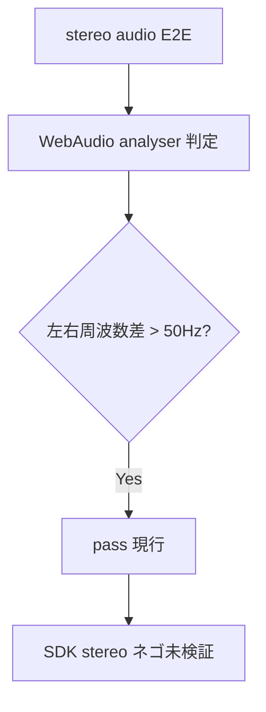

# stereo audio E2E が WebAudio analyser だけで判定し SDK の `stereo=1` ネゴ回帰を検知できない

- Priority: High
- Created: 2026-05-21
- Polished: 2026-06-02
- Model: Opus 4.7
- Branch: feature/fix-stereo-audio-test-regression

## 必要性

**必要。** `e2e-tests/fake_stereo_audio/main.ts` の `isStereo` 判定は WebAudio analyser の周波数差のみ。送信側フェイクが左右別波形 (440 Hz / 660 Hz) を生成するため、SDK の stereo ネゴ (`audioOpusParamsStereo` / SDP `stereo=1`) が壊れても analyser ベース E2E は通りうる。stereo 機能の E2E が SDK ネゴを検証していない。

## 目的

SDK stereo ネゴの回帰を 2 層で検知できるようにする。

- **SDK 単体 (決定的)**: `addStereoToFmtp` と `createSignalingMessage` のユニットテストを追加する。ブラウザ / Sora に依存せず、SDK ロジックの回帰を確実に拾う
- **E2E (結合)**: SDP の opus fmtp に `stereo=1` が含まれることを assert する。SDK + ブラウザ + Sora を通した結合動作を検証する (ブラウザ / Sora 依存のため best-effort)

## 優先度根拠

High。`src/base.ts:1475-1477` の Chrome / Edge 向け `addStereoToFmtp` ハックや Sora SDP 変更で容易に壊れる。現行テストでは検知不能。

## 現状

### 状態遷移



### analyser 判定の限界

`e2e-tests/fake_stereo_audio/main.ts:36` の `this.channelCount = this.source.channelCount` は WebAudio ノードのデフォルト (通常 `2`) で、受信ストリームの channel 数を反映しない。`isStereo` (`:84-88`) は次のとおりで、`channelCount` が常に `2` のためフェイクが左右別波形を出す限り SDP / codec が mono でも true になりうる。analyser は SDK ネゴの状態を見ていない。

```ts
const isStereo =
  this.channelCount >= 2 && leftFreq > 0 && rightFreq > 0 && Math.abs(leftFreq - rightFreq) > 50;
```

### テスト

`e2e-tests/tests/stereo_audio.test.ts` — stereo テスト (`:35-129`) / mono テスト (`:131-211`) とも `analysisData.*.isStereo` と RTP bytes のみ assert。SDP / codec channels 未検証。SDP は `main.ts:308` で `console.log` するだけ。

`e2e-tests/fake_stereo_audio/index.html:37` — `#force-stereo-output` は default checked。

### SDK 側 (検証対象の 2 経路)

1. 送信側 (publisher): `audioOpusParamsStereo` (`src/types.ts:385`) が signaling message の `audio.opus_params.stereo` に渡る (`src/utils.ts:277-278`)。Sora が answer SDP の opus fmtp に `stereo=1` を載せる。browser 側 publisher PC の `remoteDescription` (answer) に現れる。

2. 受信側 (subscriber, `forceStereoOutput`): `src/base.ts:1475-1477` が `addStereoToFmtp` (`src/utils.ts:512-561`) で **自身が生成する answer** の opus fmtp に `stereo=1` を追加する。browser 側 subscriber PC の `localDescription` (answer) に現れる。

```ts
// src/base.ts:1475-1477
if (this.options.forceStereoOutput && sessionDescription.sdp) {
  sessionDescription.sdp = addStereoToFmtp(sessionDescription.sdp);
}
```

**`addStereoToFmtp` の付与条件 (重要):** `addStereoToFmtp` (`:512-561`) は各 media description に対し `isAudio` → `isSetupActive` (`a=setup:active`) → `isRecvOnly` (`a=recvonly`) → `isOpus` → `isFmtp` の 5 ゲートを通過した場合のみ `appendStereo` (`:583-587`) を呼ぶ。`appendStereo` の regex は `minptime=\d+` を含む fmtp 行にのみ `stereo=1` を追加し、`minptime` が無ければ何もしない。`sprop-stereo=1` は追加しない。したがって recvonly answer の opus fmtp に `minptime` が含まれることがこの経路の assert 成立の前提になる。

## 設計方針

### 判定の優先順位

- **決定的: ユニットテスト** (`addStereoToFmtp` / `createSignalingMessage`、§0)。ブラウザ / Sora 非依存で SDK ロジックの回帰を確実に拾う
- **結合 (best-effort): E2E の SDP `stereo=1`** (下記 2 経路)。SDK + ブラウザ + Sora の結合動作を検証する。ブラウザ / Sora 依存のため確定保証はない
- **補助: WebAudio analyser** (`isStereo`)。削除せず残すが主判定にしない
- **参考のみ: codec stats `channels`**。`RTCCodecStats.channels` は W3C 上 optional で、Chrome は opus で mono ネゴでも `2` を返すことがある。信頼できないため assert には使わず dataset にログ出力するに留める

### 0. SDK 単体ユニットテスト (`tests/utils.test.ts`、決定的回帰ガード)

`addStereoToFmtp` (`src/utils.ts:512` で export 済み) の現行ユニットテストは皆無 (`grep` で 0 件)。`tests/utils.test.ts` に `createSignalingMessage` と同様 `import { addStereoToFmtp } from "../src/utils"` で直接 import し、固定 SDP 文字列で以下を検証する。優先度根拠で名指しした `addStereoToFmtp` ハックの回帰はここで確実に検知する。

- recvonly + `a=setup:active` + opus + fmtp に `minptime=10` を含む入力 → opus fmtp に `;stereo=1` が付与される
- 同入力で `minptime` を含まない場合 → `stereo=1` が付与されない (`appendStereo` の minptime 依存を仕様として固定する)
- `a=recvonly` でない (sendrecv / sendonly) 入力 → `stereo=1` が付与されない (`isRecvOnly` ゲート)
- `a=setup:active` でない (`a=setup:actpass` 等) 入力 → `stereo=1` が付与されない (`isSetupActive` ゲート)

送信側の signaling マッピング (`audioOpusParamsStereo` → `audio.opus_params.stereo`) は **既存テスト `tests/utils.test.ts:221` (`createSignalingMessage audioOpusParamsStereo`) でカバー済み** のため新規追加は不要 (存在を確認する)。

これにより SDK 単体のロジック回帰はブラウザ / Sora に依存せず決定的に検知できる。E2E (§1-§5) は結合動作の確認に位置づける。

### 1. fixture 変更 (`e2e-tests/fake_stereo_audio/main.ts`)

#### connect options

sendonly (`SoraSendClient`) の `options` に `audioOpusParamsStereo: true` を明示する。未設定だと Sora answer SDP の `stereo=1` が環境依存になりうる。

```ts
private options: object = {
  connectionTimeout: 15_000,
  audioOpusParamsStereo: true,
};
```

recvonly (`SoraRecvClient`) の `options` に `audioOpusParamsMinptime` (例: `10`) を明示する (`src/types.ts:387` / `src/utils.ts:283-284`)。これは signaling message の `opus_params.minptime` に乗り、Sora offer 経由で recvonly answer の opus fmtp に minptime を出やすくする狙い。ただし answer fmtp は最終的にブラウザの `createAnswer` が生成するため minptime 出力はブラウザ依存で確定保証はない。`addStereoToFmtp` ハックの決定的な回帰検知は §0 のユニットテストが担い、E2E の recvLocalSdp assert は結合確認 (best-effort) と位置づける。

```ts
private options: object = {
  connectionTimeout: 15_000,
  audioOpusParamsMinptime: 10,
};
```

#### get-stats 時の SDP / codec を dataset に出力 (PC の window 露出はしない)

既存の `#get-stats` ハンドラ (`main.ts:203-283`) 内で、既存の `#audio-analysis` div と同様 (`main.ts:265-281`) に `document.createElement` で `<div id="stereo-negotiation">` を生成し `statsDiv.append` して dataset に JSON 保存する。SDP は `this.connection.pc.remoteDescription` / `localDescription` から取得する (`pc` は `src/base.ts:164` で public だが `null` 許容のため、既存 get-stats と同様に null ガードする)。この div は get-stats クリック後にのみ現れるため、テストは get-stats をクリックしてから `page.locator("#stereo-negotiation").getAttribute("data-negotiation")` を読む。`window` へ生の PC を露出するグローバル可変状態は作らない。

JSON スキーマ (fake_stereo_audio):

```ts
{
  sendRemoteSdp: string,  // sendClient (sendonly) publisher PC の remoteDescription.sdp (Sora answer)
  recvLocalSdp: string,   // recvClient (recvonly + forceStereoOutput) subscriber PC の localDescription.sdp (SDK 書き換え後 answer)
  sendOpusCodec: object | null,  // 参考: sendClient.getStats() の type==="codec" かつ mimeType に opus を含む report
}
```

### 2. SDP assert (ロール別)

| ロール                                      | 検証する SDP                                 | 期待                                        |
| ------------------------------------------- | -------------------------------------------- | ------------------------------------------- |
| sendonly (publisher)                        | publisher PC の `remoteDescription` (answer) | opus fmtp に `stereo=1` (送信ネゴ)          |
| recvonly + `forceStereoOutput` (subscriber) | subscriber PC の `localDescription` (answer) | opus fmtp に `stereo=1` (`addStereoToFmtp`) |

publisher PC の `localDescription` は **offer** のため見ない。recvLocalSdp の `stereo=1` E2E assert は結合確認 (best-effort) とする。`addStereoToFmtp` ハックの決定的な回帰検知は §0 のユニットテストが担うため、E2E が minptime 不在等で `stereo=1` を出さない場合も SDK 回帰は §0 で捕捉される。E2E 側で出ない場合は silent skip せず、ブラウザ / Sora の minptime 挙動を調査する。

**各 assert が検知するもの:**

- sendRemoteSdp の `stereo=1` (送信ネゴ): SDK の signaling マッピング (`src/utils.ts:277-278`) と Sora の stereo 受理の **複合** を検証する結合テスト。SDK 単体のネゴ回帰だけを切り分けるものではない
- recvLocalSdp の `stereo=1` (受信ネゴ): SDK の `addStereoToFmtp` ハック (`src/base.ts:1475-1477`、優先度根拠で名指しした回帰対象) を **SDK 単体で** 検証する

#### SDP の `stereo=1` 判定方法

`sdp.includes("stereo=1")` は `sprop-stereo=1` に部分一致するため使わない。opus の `a=fmtp:<pt> ...` 行を抽出し、`;` で分割したパラメータ列に `stereo=1` トークンが含まれるかで判定する (`sprop-stereo=1` トークンとは区別する)。

### 3. テスト変更 (`e2e-tests/tests/stereo_audio.test.ts`)

- stereo テスト (`:35-129`): `#force-stereo-output` を明示的に check した上で、sendRemoteSdp と recvLocalSdp の opus fmtp に `stereo=1` が含まれることを E2E assert として追加する
- mono テスト (`:131-211`): sendRemoteSdp の opus fmtp に `stereo=1` トークンが **含まれない** ことを assert する (上記の token 判定で `sprop-stereo=1` と誤一致させない)
- `analysisData.*.isStereo` の既存 assert (`:113`, `:121`, `:194`, `:202`) と RTP bytes assert はそのまま維持する (緩めない)。SDP assert を追加する形にする
- codec `channels` は assert しない (参考ログのみ)

### 4. regression 確認 (必須)

本 issue の存在意義は回帰検知のため、検知が機能することの確認を必須とする。`audioOpusParamsStereo: true` を一時的に外す、または `src/base.ts:1475-1477` の `addStereoToFmtp` 呼び出しをコメントアウトし、stereo テストが fail することを確認してから revert する。

### 5. sendrecv fixture (`fake_stereo_audio_sendrecv` / `stereo_audio_sendrecv.test.ts`)

sendrecv は接続が 2 本 (`soraClient1` / `soraClient2`) で、`#use-stereo-1` / `#use-stereo-2` 等の接続別セレクタを持つ。fake_stereo_audio とは構造が異なるため、以下を明記する。

- **方向差**: sendrecv 接続の audio m セクションは `sendrecv` 方向で `a=recvonly` ではない。`addStereoToFmtp` は `isRecvOnly` ゲートで弾かれ **効かない**。したがって sendrecv では recvonly localDescription 経路の assert は対象外。**送信ネゴ (各接続の `remoteDescription` answer の opus fmtp に `stereo=1`) のみを主判定**とする
- **dataset**: `#stereo-negotiation` に接続別キー `{ conn1RemoteSdp, conn2RemoteSdp }` で保存する
- stereo テスト (`:35-`): conn1 / conn2 とも remoteDescription に `stereo=1` を assert
- mono テスト (`:159-`): conn1 / conn2 とも remoteDescription に `stereo=1` トークンが含まれないことを assert
- mixed テスト (`:253-`): conn1 (stereo) は `stereo=1` を含み、conn2 (mono) は含まれないことを接続別に assert。現行 mixed テストは `#stats-report-1` のみ待つ (`:282`)。`#stats-report-2` は静的 DOM のため出現待ち (`waitForSelector`) は効かない。get-stats クリック後に `#stats-report-2:not(:empty)` 等で内容書き込みを待つか、conn2 の `#stereo-negotiation` dataset 書き込みを待つこと
- sendrecv の各接続 options にも stereo 時は `audioOpusParamsStereo: true` を明示する

## 完了条件

### コード変更

- [ ] `tests/utils.test.ts` に `addStereoToFmtp` の固定 SDP ユニットテスト 4 ケース (minptime 有 → 付与 / minptime 無 → 非付与 / 非 recvonly → 非付与 / 非 setup:active → 非付与) を追加する (§0、決定的回帰ガード)。送信側 `audioOpusParamsStereo` マッピングは既存テスト (`tests/utils.test.ts:221`) で担保済みのため追加不要
- [ ] `fake_stereo_audio/main.ts` に sendClient `audioOpusParamsStereo: true` / recvClient `audioOpusParamsMinptime: 10`、`#stereo-negotiation` dataset 出力 (上記スキーマ) を実装する (0028 マージ後は `getFakeMedia` が `{ stream, cleanup }` を返すため分解代入で受ける。0028 未マージ時は現行どおり `const stream = getFakeMedia(...)` のまま)
- [ ] `stereo_audio.test.ts` の stereo / mono テストに SDP `stereo=1` token assert を追加する (analyser assert は補助として維持、codec channels は assert しない)
- [ ] `fake_stereo_audio_sendrecv/main.ts` / `stereo_audio_sendrecv.test.ts` を §5 のとおり接続別 dataset + 送信ネゴ assert で更新する (stereo / mono / mixed の 3 テスト)
- [ ] mono テストで `stereo=1` トークンが含まれないことを (`sprop-stereo=1` と区別して) assert する

### 検証

- [ ] `pnpm test` が通る
- [ ] `pnpm run lint` / `pnpm run typecheck` が通る
- [ ] ローカル: `pnpm exec playwright test --project="Chromium" e2e-tests/tests/stereo_audio.test.ts e2e-tests/tests/stereo_audio_sendrecv.test.ts` が通る
- [ ] regression 確認 (必須): §4 のとおり stereo ネゴを一時的に壊して stereo テストが fail することを確認し revert する
- [ ] recvonly 経路の確認: recvClient に `audioOpusParamsMinptime` を設定した状態で、正常実装の recvLocalSdp に `stereo=1` が出ることを確認する (出ない場合は silent skip せず SDK / Sora の問題として調査する)
- [ ] CI: e2e-test workflow が green であること (0027 マージ後なら flaky 検出も有効)

### 変更履歴

- [ ] `CHANGES.md` `## develop` の `### misc` の末尾 (既存 `[CHANGE]` 群の後。種別順 CHANGE → ADD → UPDATE → FIX を守る) に追記する

  ```
  - [FIX] stereo audio E2E で SDP の opus stereo=1 を assert し SDK ネゴ回帰を検知できるようにする
    - @voluntas
  ```

## スコープ外

- SDK 本体 (`src/base.ts`, `src/utils.ts`) の stereo ロジック変更
- codec stats `channels` の assert (RTCCodecStats.channels が信頼できないため参考ログのみ)
- `audioOpusParamsSpropStereo` / SDP `sprop-stereo=1` の個別 assert (Sora answer 依存が強く、本 issue では `stereo=1` を必須とする)
- analyser の `channelCount` 取得方法の変更 (`getSettings().channelCount` は WebAudio / RTC track で undefined を返しうるため改善にならない。analyser は補助に降格するため現状維持)
- fake media cleanup (issue 0028)
- `waitForTimeout` 置換 (issue 0032)
- npm pkg e2e (`npm-pkg-e2e-test.yml`) — 公開済み SDK version 固定のため対象外

## マージ順

**0027 の後を推奨。** 0024–0026 (CI) → 0027 (flaky 検出) → 0028 → **0029**。0028 とは独立だが、0028 の `getFakeMedia` 戻り値型変更 (`{ stream, cleanup }`) と同一 fixture を触るため、0028 → 0029 の順がコンフリクトが少ない。
