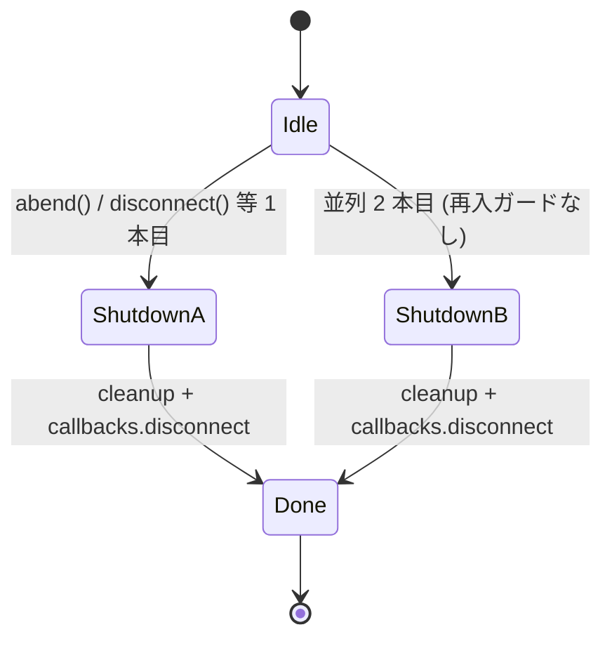
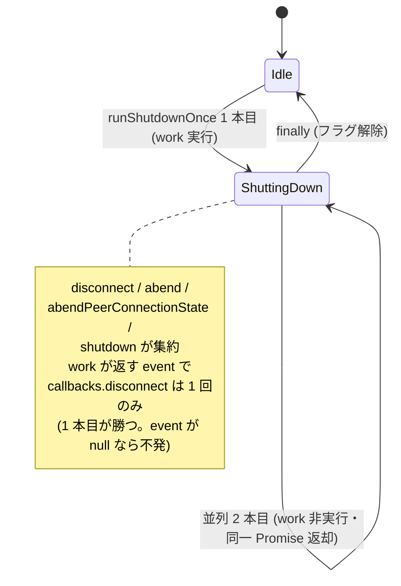

# `abend()` / `abendPeerConnectionState()` / `shutdown()` の冪等化と 4 系統統一リファクタ

- Priority: Medium
- Created: 2026-05-25
- Polished: 2026-06-02
- Model: Composer 2.5
- Branch: feature/refactor-abend-shutdown-idempotency

## 目的

issue 0002 で `disconnect()` の再入ガードを入れるが、`abend()` (`src/base.ts:716-815`)、`abendPeerConnectionState()` (`src/base.ts:605-659`)、`shutdown()` (`src/base.ts:668-708`) も DataChannel `onerror` / ICE 状態変化 / `type: close` 等から並列に呼ばれ、`callbacks.disconnect()` が多重発火する同型問題を持つ。4 系統 (`disconnect` / `abend` / `abendPeerConnectionState` / `shutdown`) を **`runShutdownOnce` 1 本** に集約して冪等化する。

## 優先度根拠

Medium。SDK 内部状態の二重 `initializeConnection` やアプリ側の多重 `disconnect` callback は再接続事故に直結する。0002 単体では `disconnect()` 経路のみが改善され、残り 3 系統の race が残る。

## 現状

### 状態遷移



各系統の `callbacks.disconnect()` 発火箇所 (着手時):

| メソッド                   | 行                      | 呼び出し元 (例)                                    |
| -------------------------- | ----------------------- | -------------------------------------------------- |
| `abendPeerConnectionState` | `src/base.ts:656-658`   | ICE 状態異常 (`:1676`, `:1682`, `:1699`)           |
| `shutdown`                 | `src/base.ts:703-707`   | `type: close` (`:1972`)、ws.onclose 1000 (`:1637`) |
| `abend`                    | `src/base.ts:807-814`   | DC `onerror` (`:2155`)、ws 異常 close 等           |
| `disconnect`               | `src/base.ts:1096-1102` | DC `onclose` (`:2144-2149`) — 0002 で冪等化予定    |

既知のバグ (本 issue で同時修正):

- `abend()` 814 行: `callbacks.disconnect(this.soraCloseEvent("abend", title, params))` が 812 行の `event` と別インスタンスを生成している (timeline は 812 の `event`、callback は 814 の別インスタンス。`soraCloseEvent` は毎回 `new` するため不一致)。他 3 系統 (657 / 707 / 1102) は同一 `event` 変数を渡しており健全で、この二重生成は `abend()` 814 行のみ
- 4 系統とも handler 剥がし + cleanup + `initializeConnection` + callback 発火が重複しており、再入ガードなし

### 再現条件 (コードパス)

- **ICE failed 二重発火**: 0006 適用後、`iceConnectionState === "failed"` (`:1676`) と `connectionState === "failed"` (`:1699`) が短時間に両方走る → `callbacks.disconnect` 2 回
- **abend 並列**: ws `onclose` + ws `onerror`、または複数 DC `onerror` がほぼ同時 → `abend()` 2 本目が cleanup を再実行
- **shutdown + abend 競合**: `type: close` と ws 異常 close が競合

### スコープ外

- `disconnect()` 1078-1082 行の event 上書き → issue 0031 (0002 より先にマージ可)
- 0004 の `abend()` compress try/catch 自体 → issue 0004。**0030 マージ時に 0004 修正を `runShutdownOnce` 内へ移植すること** (後述)
- ユーザーが意図的に 1 回目完了後に再度 `disconnect()` を呼ぶ契約 → issue 0005

## 設計方針

### 状態遷移 (修正後)



### 共通ヘルパー `runShutdownOnce`

0002 マージ後の `private disconnectingPromise` を **削除** し、次に置換する (`src/base.ts:212` 付近、`disconnectWaitTimeout` と同セクション):

```ts
private shuttingDownPromise: Promise<void> | null = null;
```

```ts
// work() は cleanup (handler 剥がし、DC/ws/pc cleanup、initializeConnection) を行い、
// 発火すべき SoraCloseEvent を返す。発火不要なら null を返す。
private runShutdownOnce(
  work: () => Promise<SoraCloseEvent | null> | SoraCloseEvent | null,
): Promise<void>
```

挙動:

1. `if (this.shuttingDownPromise) return this.shuttingDownPromise;` — **再入ガードはこの同期チェックが本体**。後述のとおり `shuttingDownPromise` への代入を最初の `await` より前に同期完了させることで、並列 2 本目は必ず非 null を観測する。フラグ用の boolean は導入しない (読み手がいない dead field になるため)
2. `this.shuttingDownPromise = (async () => { ... })()` を同期的に代入する。IIFE 内で `try { const event = await work(); if (event !== null) { writeSoraTimelineLog(event.type に応じ disconnect-abend / disconnect-normal, event); this.callbacks.disconnect(event); } } finally { this.shuttingDownPromise = null; }`
3. `work()` が throw しても `finally` でフラグ解除する。`void` 入口 (sync) の unhandled rejection を避けるため、IIFE 内で例外をログして握る (cleanup 到達は各 `work()` 内の局所 try/catch が担保。下記 0004 移植参照)
4. 戻り値: sync 入口 (`abendPeerConnectionState` / `shutdown`) は `void this.runShutdownOnce(...)`、async 入口 (`abend` / `disconnect`) は `return this.runShutdownOnce(...)`

`shutdown` / `abendPeerConnectionState` の `work()` は同期で await を含まないが、`await work()` を挟むため callback 発火は 1 マイクロタスク遅延する。この遅延中に 2 本目が来ても、2 本目は `shuttingDownPromise` を**同期 read** して非 null を観測し弾かれるため、二重発火は起きない (再入ガードは同期チェックで成立する)。

**`event` は `work()` が返す:** `disconnect()` の event は `disconnectDataChannel()` の結果 (`code === 4999` 等、`await` 後に確定) に依存し、`abend()` の event は `title` / `code` に依存する。いずれも `work()` 実行中にしか確定しないため、event は `work()` の戻り値として受け取る (事前計算する `decideEvent` 形式は採らない)。並列 2 本目は `work()` を実行しないため event の競合 (マージ・上書き) は発生せず、**1 本目の event が採用される**。

**0002 機構 2 (late 呼び出し吸収) の維持:** `finally` 後に late 再入経路を持つのは `disconnect()` のみ。0002 は「1 回目完了後の late な DC `onclose` で再度 `disconnect()` が走っても、`initializeConnection()` 済みのため `disconnect()` 内で `event` が null のまま (現 `src/base.ts:1075` / `1091-1093`) callback 不発で吸収される」性質を持つ (`issues/0002`)。**`disconnect()` の `work()` はこの null 返却を維持する** (報告すべき event が無ければ null を返す)。

他 3 系統 (`abend` / `abendPeerConnectionState` / `shutdown`) は cleanup で自身の発火元ハンドラを剥がす / 置換するため late 再入経路を持たない (abend は ws.onclose をログ専用に差し替え + DC ハンドラ剥がし、abendPeerConnectionState は ICE 状態ハンドラを null 化、shutdown 後は ws が閉じ signaling message が来ない)。よってこれら 3 系統の `work()` は常に非 null の event を返してよい。防御として torn-down 状態 (`this.pc === null && this.ws === null`) で null を返す early-return を入れてもよいが必須ではない。

### event 種別の決定 (mode 引数は持たない)

timeline ラベル (`disconnect-abend` / `disconnect-normal`) は `work()` が返す `event` の種別から導出する。エントリ種別 (どのメソッドが呼んだか) と event 種別は一致しないため、`runShutdownOnce` に `mode` 引数は持たせない。具体的には:

- `abend()` の `work()`: `title === "WEBSOCKET-ONCLOSE"` かつ `code` が 1000 / 1005 のときは `soraCloseEvent("normal", ...)` を返し、それ以外は `soraCloseEvent("abend", ...)` を返す。この normal 分岐 (現 `src/base.ts:806-810`) は削除しない**生きたロジック**。ただし ws.onclose は `code === 1000` を `shutdown()` に振り分ける (`:1636-1637`) ため、abend に WEBSOCKET-ONCLOSE で到達する live ケースは **code 1005**。`code === 1000` は abend には来ないが現行どおり防御的に残す。`abend` 814 行の event 二重生成はこの戻り値方式で自然に解消する
- `abendPeerConnectionState()` / `disconnect()` / `shutdown()` の `work()`: 各々が現行どおりの種別の event を返す

### 4 系統への適用

| メソッド                   | `work()` に移す本体 (cleanup + event 決定)                    |
| -------------------------- | ------------------------------------------------------------- |
| `disconnect`               | 0002 IIFE 内の既存 disconnect 本体。event を return           |
| `shutdown`                 | 668-701 行相当。event を return                               |
| `abendPeerConnectionState` | 606-655 行相当。event を return                               |
| `abend`                    | 717-805 行相当 (814 二重生成は廃し、決定した event を return) |

**handler 剥がしは安易に共通化しない:** 4 系統で剥がし内容が異なる (例: `shutdown` は ws ハンドラを剥がさず pc / DC のみ。`disconnect` は DC を `disconnectDataChannel` 側で処理)。完全に同一の手順のみを private helper に括り出し、系統差 (ws を触る / 触らない、DC close のタイミング) は各 `work()` に残す。共通化で `shutdown` が本来触らない ws を触る等の挙動変化を起こさないこと。

### 0004 compress try/catch 移植要件 (必須)

issue 0004 で `abend()` の `compress === true` 分岐 (`src/base.ts:755-775` 付近) に入る局所 try/catch を、0030 で `abend` の `work()` へ **そのまま移植** する。移植元コードは 0004 の最終実装を正とし (本 issue にはコードを転記しない。差分が出たら 0004 を参照)、移植後も **compress 失敗時に cleanup (DC close / ws・pc cleanup / `initializeConnection`) へ必ず到達** すること。非圧縮 fallback は行わない (0004 と同じ)。0030 リファクタで 0004 の修正が消えないよう完了条件で grep / コードレビュー両方で確認する。

### 0002 との実装関係

マージ順 (後述) は `0002 → 0030` で隣接し、同一リリース周期で実装される可能性が高い。0002 が先にマージされる場合は本 issue が `disconnectingPromise` を削除して `shuttingDownPromise` へ置換する。0002 と同一 PR で実装する場合は、`disconnect()` を最初から `runShutdownOnce` 化し `disconnectingPromise` を作らない。いずれの場合も 0002 の機構 2 (late 吸収) を `work()` の null 返却で維持する。

### 変更対象ファイル

| ファイル                                               | 内容                                                                 |
| ------------------------------------------------------ | -------------------------------------------------------------------- |
| `src/base.ts`                                          | `runShutdownOnce` 追加、4 系統 refactor、`disconnectingPromise` 削除 |
| `e2e-tests/data_channel_signaling_only/index.html`     | 0002 の `#disconnect-count` と統合 (0031 の DOM も同一 fixture)      |
| `e2e-tests/data_channel_signaling_only/main.ts`        | 0002 / 0031 と handler 統合                                          |
| `e2e-tests/tests/disconnect_abend_idempotency.test.ts` | 新規 (または 0002 test を拡張)                                       |
| `CHANGES.md`                                           | misc 追記                                                            |

### テスト方針

モック / スタブ禁止 (CLAUDE.md 規約)。0002 の `disconnect_reentrancy.test.ts` パターンを拡張し、以下 2 系統を E2E / timeline で検証する (1 シナリオでは event 種別決定ロジックを担保できない):

1. **並列 abend**: ICE failed 二重発火 (または DC `onerror` 並列) → `callbacks.disconnect` が 1 回、timeline の `disconnect-abend` が 1 件
2. **normal 中の abend 割り込み**: `disconnect()` (normal) 実行中に abend 経路が走る → 1 本目 (normal) の event が採用され callback 1 回 (1 本目が勝つ契約の確認)

assert: `#disconnect-count === "1"`、callback に渡る event インスタンスと timeline の event が**同一参照** (814 二重生成バグの回帰防止)。0006 手動検証 (`e2e-tests/ice_disconnected/README.md`) と併用。

加えて、`abend("WEBSOCKET-ONCLOSE", { code: 1005 })` 経路で `work()` が **normal** event (`disconnect-normal`) を返す分岐 (event 種別決定の最も誤りやすい箇所) を検証する。E2E で code 1005 の ws close を確定的に再現できない場合は、コードレビューで分岐ロジックを担保する旨を明記する。

## マージ順

リポジトリ全体の正本チェーンは issue 0004 を参照。該当チェーンは:

```
0004 → 0006 → (0011) → 0021 → 0009 → 0001 → 0008 → 0007 → 0034 → 0031 → 0002 → 0005 → 0030
```

**0030 はチェーン最終段。** 着手前条件:

- issue 0002 (`disconnect()` 冪等化) がマージ済み、または 0030 と同一 PR で実装されること
- issue 0004 (`abend()` compress try/catch) がマージ済み、または 0030 と同一 PR で先に適用されること
- issue 0006 は同一リリース周期でのマージを**推奨**する (必須ではない)。0006 単独では二重発火しない (`abendPeerConnectionState` は同期メソッドで、`callbacks.disconnect` より前に同期的にハンドラを剥がすため後続イベントが発火しない。`issues/0006`)。ただし 0030 が `abendPeerConnectionState` を `runShutdownOnce` 化しハンドラ剥がしと callback の間に `await` が入ると二重発火が再発しうるため、0030 の冪等化が予防になる

issue 0031 は 0002 より先に単独 PR 可 (0030 とは独立)。

## 完了条件

- `abend()` / `abendPeerConnectionState()` / `shutdown()` / `disconnect()` がすべて `runShutdownOnce` 経由になる
- `private disconnectingPromise` が削除され `shuttingDownPromise` に統一される (dead field となる boolean フラグは導入しない)
- `callbacks.disconnect()` が 4 系統合計で **1 回だけ** 発火する (並列 2 本目は同一 Promise を返し `work()` を実行しない)
- `work()` が返す `event` で callback / timeline が同一 `SoraCloseEvent` インスタンスを使い、`abend()` 814 行の event 二重生成が解消される
- `abend` の `work()` で `title === "WEBSOCKET-ONCLOSE"` かつ code 1000/1005 のとき normal event を返す分岐が維持される (削除しない)
- **0002 の機構 2 (late 呼び出しを `work()` の null 返却で吸収) が維持される**
- **0004 の compress try/catch が `runShutdownOnce` 内 `abend` work に存在し、compress 失敗後も cleanup に到達する** (0004 完了条件と同等。grep / コードレビューで確認)
- handler 剥がしの共通化で `shutdown` が本来触らない ws を触る等の挙動変化が起きない
- 0006 修正後、ICE `failed` 二重発火シナリオで timeline の `disconnect-abend` が 1 回のみ記録される
- normal disconnect 中の abend 割り込みで 1 本目 (normal) の event が採用される
- 0002 マージ後の `disconnect_reentrancy.test.ts` が引き続き pass する
- ローカルで `pnpm test` および既存 `pnpm e2e-test` が通ること
- CHANGES.md `## develop` の `### misc` の末尾 (既存 `[CHANGE]` 群の後。種別順 CHANGE → ADD → UPDATE → FIX を守る) に追記する

  ```
  - [UPDATE] abend / abendPeerConnectionState / shutdown を冪等化し callbacks.disconnect の多重発火を防ぐ
    - @voluntas
  ```
