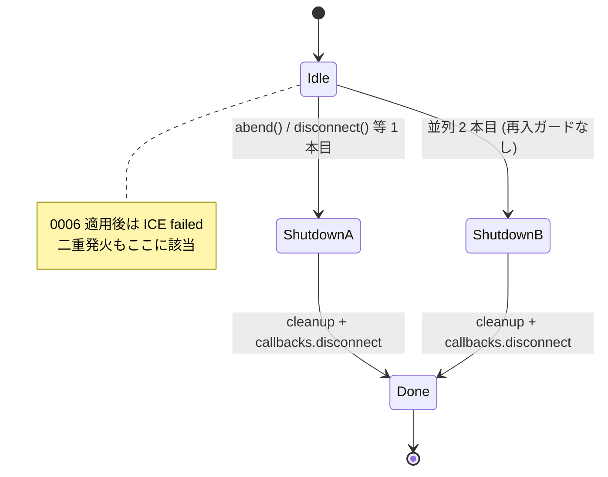
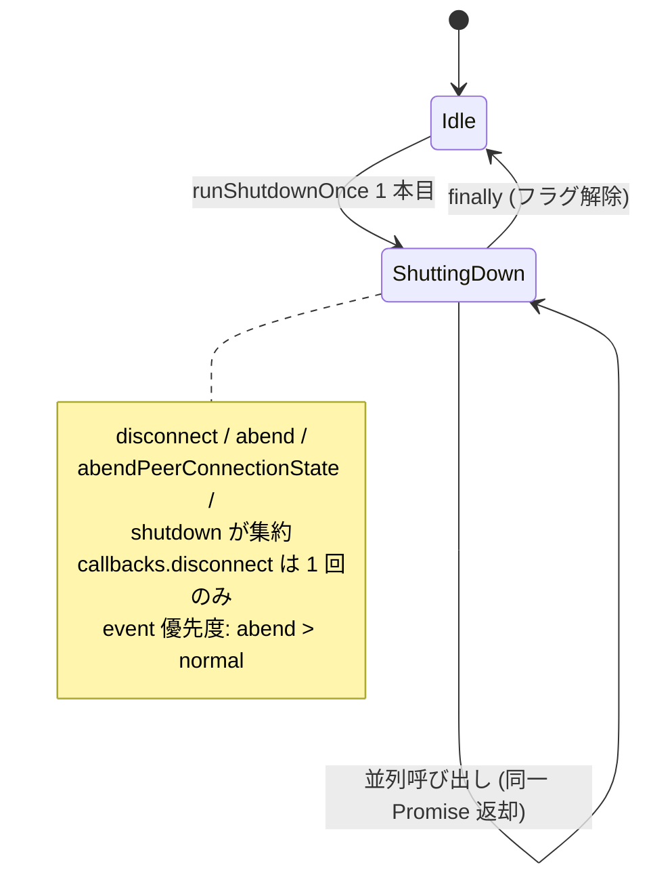

# `abend()` / `abendPeerConnectionState()` / `shutdown()` の冪等化と 4 系統統一リファクタ

- Priority: Medium
- Created: 2026-05-25
- Model: Composer 2.5
- Branch: feature/refactor-abend-shutdown-idempotency

## 目的

issue 0002 で `disconnect()` の再入ガードを入れるが、`abend()` (`src/base.ts:716-815`)、`abendPeerConnectionState()` (`src/base.ts:605-659`)、`shutdown()` (`src/base.ts:668-708`) も DataChannel `onerror` / ICE 状態変化 / `type: close` 等から並列に呼ばれ、`callbacks.disconnect()` が多重発火する同型問題を持つ。4 系統 (`disconnect` / `abend` / `abendPeerConnectionState` / `shutdown`) を **`runShutdownOnce` 1 本** に集約して冪等化する。

0006 修正後は ICE `failed` が `oniceconnectionstatechange` と `onconnectionstatechange` の両方からほぼ同時に `abendPeerConnectionState` を呼びうる。**0006 と同一リリース周期でマージ必須** (0006 単独マージ禁止)。

## 優先度根拠

Medium。0002 単体では `disconnect()` 経路のみ改善される。0006 適用後に ICE failed 二重発火、`abend` + `shutdown` 競合、`DC onerror` 並列等の race が顕在化しうる。SDK 内部状態の二重 `initializeConnection` やアプリ側の多重 `disconnect` callback は再接続事故に直結する。

## 現状

### 状態遷移



0002 完了条件で issue 0030 として切り出済み。0006 / 0008 / 0009 / 0011 が本 issue を参照している。

各系統の `callbacks.disconnect()` 発火箇所 (着手時):

| メソッド                   | 行                      | 呼び出し元 (例)                                    |
| -------------------------- | ----------------------- | -------------------------------------------------- |
| `abendPeerConnectionState` | `src/base.ts:656-658`   | ICE 状態異常 (`:1676`, `:1682`, `:1699`)           |
| `shutdown`                 | `src/base.ts:703-707`   | `type: close` (`:1972`)、ws.onclose 1000 (`:1637`) |
| `abend`                    | `src/base.ts:807-814`   | DC `onerror` (`:2155`)、ws 異常 close 等           |
| `disconnect`               | `src/base.ts:1096-1102` | DC `onclose` (`:2144-2149`) — 0002 で冪等化予定    |

既知のバグ (本 issue で同時修正):

- `abend()` 814 行: `callbacks.disconnect(this.soraCloseEvent(...))` が 812 行の `event` と別インスタンスを生成している (timeline と callback で event が不一致)
- 4 系統とも handler 剥がし + cleanup + `initializeConnection` + callback 発火が重複しており、再入ガードなし

0002 の `disconnectingPromise` パターンは `disconnect()` のみ。`abend()` は async で `await compressMessage` / `disconnectWebSocket` を含むため、0004 / 0034 / 0002 と同ファイル競合に注意。

### 再現条件 (コードパス)

- **ICE failed 二重発火**: 0006 適用後、`iceConnectionState === "failed"` (`:1676`) と `connectionState === "failed"` (`:1699`) が短時間に両方走る → `callbacks.disconnect` 2 回
- **abend 並列**: ws `onclose` + ws `onerror`、または複数 DC `onerror` がほぼ同時 → `abend()` 2 本目が cleanup を再実行
- **shutdown + abend 競合**: `type: close` と ws 異常 close が競合

### スコープ外

- `disconnect()` 1078-1082 行の event 上書き → issue 0031 (0002 より先にマージ可)
- 0004 の `abend()` compress try/catch 自体 → issue 0004。**0030 マージ時に 0004 修正を `runShutdownOnce` 内へ移植すること** (後述)
- ユーザーが意図的に 1 回目完了後に再度 `disconnect()` を呼ぶ契約 → issue 0005

## 設計方針

### 状態遷移 (修正後)



### 共通ヘルパー `runShutdownOnce`

0002 マージ後の `private disconnectingPromise` を **削除** し、次に置換する (`src/base.ts:212` 付近、`disconnectWaitTimeout` と同セクション):

```ts
private shuttingDownPromise: Promise<void> | null = null;
private isShuttingDown = false;
private disconnectEvent: SoraCloseEvent | null = null;
```

```ts
private runShutdownOnce(
  mode: "normal" | "abend",
  work: () => Promise<void> | void,
  decideEvent: () => SoraCloseEvent | null,
): Promise<void>
```

挙動:

1. `if (this.shuttingDownPromise) return this.shuttingDownPromise;`
2. `this.isShuttingDown = true` を **最初の `await` より前** (IIFE 冒頭 sync 部分) にセット
3. `work()` 実行 (handler 剥がし、cleanup、`initializeConnection` 等)
4. `decideEvent()` の結果を `this.disconnectEvent` にマージ
   - **優先度: `abend` > `normal`** (後から来た abend で normal を上書き可)
   - 既存 `abend()` 806-810 行の `WEBSOCKET-ONCLOSE` + code 1000/1005 → normal 分岐は `decideEvent` に統合。grep で dead code なら削除
5. `work()` 完了後、`this.disconnectEvent` が非 null なら **1 回だけ** `callbacks.disconnect(event)` + timeline (`disconnect-abend` / `disconnect-normal`)
6. `finally` で `shuttingDownPromise = null` / `isShuttingDown = false` / `disconnectEvent = null`。**フラグ解除はこの 1 箇所のみ**

sync 入口 (`abendPeerConnectionState` / `shutdown`) は `void this.runShutdownOnce(...)`。async 入口 (`abend` / `disconnect`) は `return this.runShutdownOnce(...)`。

### 4 系統への適用

| メソッド                   | mode     | `work()` に移す本体                                      |
| -------------------------- | -------- | -------------------------------------------------------- |
| `disconnect`               | `normal` | 0002 IIFE 内の既存 disconnect 本体 (callback 発火除く)   |
| `shutdown`                 | `normal` | 668-701 行相当                                           |
| `abendPeerConnectionState` | `abend`  | 606-655 行相当 (callback / timeline 除く)                |
| `abend`                    | `abend`  | 717-805 行相当 (callback / timeline / 814 二重生成 除く) |

各メソッド冒頭の `clearMonitorIceConnectionStateChange()` + handler 剥がしは `work()` 先頭に集約し、重複を削る。

### 0004 compress try/catch 移植要件 (必須)

issue 0004 で `abend()` の `compress === true` 分岐 (`src/base.ts:755-775` 付近) に入る局所 try/catch は、0030 で `abend` の `work()` へ **そのまま移植** すること。0030 リファクタで 0004 の修正が消えないよう、完了条件で grep / コードレビュー両方で確認する。

0004 完了後の期待パターン (移植元):

```ts
if (this.signalingOfferMessageDataChannels.signaling?.compress === true) {
  try {
    const binaryMessage = new TextEncoder().encode(JSON.stringify(message));
    const compressedMessage = await compressMessage(binaryMessage);
    if (this.soraDataChannels.signaling.readyState === "open") {
      try {
        this.soraDataChannels.signaling.send(compressedMessage);
        this.writeDataChannelSignalingLog(
          "send-disconnect",
          this.soraDataChannels.signaling,
          message,
        );
      } catch (error) {
        this.writeDataChannelSignalingLog(
          "failed-to-send-disconnect",
          this.soraDataChannels.signaling,
          (error as Error).message,
        );
      }
    }
  } catch (error) {
    this.writeDataChannelSignalingLog(
      "failed-to-compress-disconnect",
      this.soraDataChannels.signaling,
      (error as Error).message,
    );
  }
}
```

移植後も **compress 失敗時に cleanup (DC close / ws・pc cleanup / `initializeConnection`) へ必ず到達** すること。非圧縮 fallback は行わない (0004 と同じ)。

### 変更対象ファイル

| ファイル                                               | 内容                                                                 |
| ------------------------------------------------------ | -------------------------------------------------------------------- |
| `src/base.ts`                                          | `runShutdownOnce` 追加、4 系統 refactor、`disconnectingPromise` 削除 |
| `e2e-tests/data_channel_signaling_only/index.html`     | 0002 の `#disconnect-count` と統合 (0031 の DOM も同一 fixture)      |
| `e2e-tests/data_channel_signaling_only/main.ts`        | 0002 / 0031 と handler 統合                                          |
| `e2e-tests/tests/disconnect_abend_idempotency.test.ts` | 新規 (または 0002 test を拡張)                                       |
| `CHANGES.md`                                           | misc 追記                                                            |

### テスト方針

モック / スタブ禁止 (CLAUDE.md 規約)。

- 0002 の `disconnect_reentrancy.test.ts` パターンを拡張
- ICE failed 二重発火、または DC `onerror` 並列の **いずれか 1 シナリオ** を E2E / timeline で検証
- assert: `#disconnect-count === "1"`、timeline の `disconnect-abend` が 1 件
- 0006 手動検証 (`e2e-tests/ice_disconnected/README.md`) と併用

### マージ順

```
0004 → 0006 → (0011) → 0021 → 0009 → 0007 → 0001 → 0008 → 0034 → 0031 → 0002 → 0030
```

**着手前条件:**

- issue 0002 (`disconnect()` 冪等化) がマージ済みであること
- issue 0004 (`abend()` compress try/catch) がマージ済みであること
- issue 0006 が **同一 PR または同一リリース周期** でマージされること

issue 0031 は 0002 より先に単独 PR 可 (0030 とは独立)。

## 完了条件

- `abend()` / `abendPeerConnectionState()` / `shutdown()` / `disconnect()` がすべて `runShutdownOnce` 経由になる
- `private disconnectingPromise` が削除され、`shuttingDownPromise` + `isShuttingDown` + `disconnectEvent` に統一される
- `callbacks.disconnect()` が 4 系統合計で **1 回だけ** 発火する
- `abend()` 814 行の event 二重生成が解消され、timeline と callback が同一 `SoraCloseEvent` インスタンスを使う
- **0004 の compress try/catch が `runShutdownOnce` 内 `abend` work に存在し、compress 失敗後も cleanup に到達する** (0004 完了条件と同等)
- 0006 修正後、ICE `failed` 二重発火シナリオで timeline の `disconnect-abend` が 1 回のみ記録される (E2E または手動 + timeline)
- 0002 マージ後の `disconnect_reentrancy.test.ts` が引き続き pass する
- ローカルで `pnpm test` および既存 `pnpm e2e-test` が通ること
- CHANGES.md `## develop` の `### misc` に次のエントリを追記する

  ```
  ### misc

  - [UPDATE] abend / abendPeerConnectionState / shutdown を冪等化し callbacks.disconnect の多重発火を防ぐ
    - @voluntas
  ```
