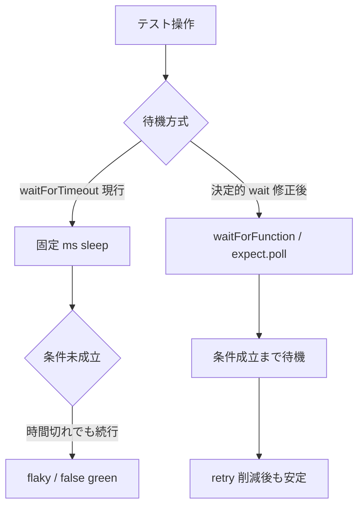

# E2E の `waitForTimeout(...)` を決定的待機に置き換える

- Priority: Medium
- Created: 2026-05-25
- Polished: 2026-06-02
- Model: Composer 2.5
- Branch: feature/refactor-e2e-waitfortimeout

## 目的

`e2e-tests/tests/` 配下の固定 `waitForTimeout(...)` を `waitForFunction` / `waitForSelector` / `expect.poll` 等の決定的待機に置き換え、flaky の根本原因を減らす。issue 0027 の retries 削減と併せて CI 信頼性を上げる。

## 優先度根拠

Medium。0027 は flaky **検出** インフラ (CI で `retries: 1` + `failOnFlakyTests`)。本 issue は flaky **原因** の削減。0027 適用後、固定 sleep 依存テストは retry 1 回でも落ちやすくなるため、本対応が実質必須になる。

## 現状

### 状態遷移



着手時に次で対象を網羅する:

```bash
grep -rn "waitForTimeout" e2e-tests/tests/
```

2026-06-02 時点の grep 結果: **13 ファイル、計 24 箇所** (`e2e-tests/tests/` 外に `waitForTimeout` は無い)。

**置換の根本原則:** 各 `waitForTimeout` は、その**直後でテストが assert する条件がすべて成立するまで待つ**条件に置き換える。固定 sleep は「テストが見たいデータが揃うまで」の代用なので、置換条件は後続 assert に**方向 (outbound/inbound)・ページ (sendrecv は 2 ページ)・閾値**を合わせる。outbound 片方向・単一ページ・`> 0` に単純化しない。実装時は各 `waitForTimeout` の前後コードと対応 fixture (`e2e-tests/<fixture>/index.html` / `main.ts`) を必ず読み、後続 assert を確認してから置換する。

下表の「待機条件」は後続 assert を確認した上での方針 (selector / stats 種別はすべて実在を確認済み)。

| ファイル                            | 行           | 待機条件 (後続 assert に合わせる)                                                                                                                                                                                                                                                                                                                                                                                                           |
| ----------------------------------- | ------------ | ------------------------------------------------------------------------------------------------------------------------------------------------------------------------------------------------------------------------------------------------------------------------------------------------------------------------------------------------------------------------------------------------------------------------------------------- |
| `authz_simulcast_encodings.test.ts` | 44           | sendonly。直後 (`:47-62`) に `#pc-state` の `connected` 待ち `waitForFunction` が既にあるため 44 は削除可。ただし後続 assert は r0 の `bytesSent > 0` かつ `packetsSent > 2` (`:88-89`)、r1/r2 は `bytesSent === 0`。送出確認を待つなら `#stats-report` outbound-rtp の **r0 限定で `packetsSent > 2`** を poll                                                                                                                             |
| `stereo_audio.test.ts`              | 68           | stereo test。**双方向**。送信側 `#stats-report` outbound-rtp `bytesSent > 0` と、受信側 `[data-recv-stats-report-json]` inbound-rtp `bytesReceived > 0` (`:100`) の両方を待つ。**受信側 selector は get-stats クリック毎に新規 div を append する** (`fake_stereo_audio/main.ts:249-251`) ため、`querySelector` は最古を返す。fixture を「上書き」に直す、または最後の要素を読む対処が必須。0029 マージ後は 0029 の stats/SDP assert と統合 |
| `stereo_audio.test.ts`              | 164          | mono test。outbound-rtp `bytesSent > 0` のみ (受信側 assert なし)。68 とは別条件                                                                                                                                                                                                                                                                                                                                                            |
| `stereo_audio_sendrecv.test.ts`     | 65, 189, 278 | **双方向**。fixture は `#stats-report-1` / `#stats-report-2` の 2 要素 (plain `#stats-report` は無い)。各接続で outbound `bytesSent > 0` と inbound `bytesReceived > 0` (`:97`, `:112`) を待つ。`#stats-report-2` は静的 DOM で空のまま存在するため出現待ち (`waitForSelector`) は不可、内容書き込みを待つ (0029 と同じ罠。0029 参照)                                                                                                       |
| `sendrecv.test.ts`                  | 68, 69       | **双方向**。各 page (sendrecv1/2) で outbound `bytesSent > 0` と inbound `bytesReceived > 0` (`:122` ほか) を待つ                                                                                                                                                                                                                                                                                                                           |
| `webkit.test.ts`                    | 73, 74       | **双方向**。各 page (sendrecv1/2) で outbound `bytesSent > 0` と inbound `bytesReceived > 0` (`:120,127,164,171`) を待つ                                                                                                                                                                                                                                                                                                                    |
| `webkit.test.ts`                    | 221          | `test.fail` ブロック (`:184`) 内。後続 assert は r0/r1 `bytesSent > 500` かつ `packetsSent > 50`、r2 `bytesSent === 0` (`:242-243,260`)。`bytesSent >= 1` で抜けると閾値未達で `test.fail` の挙動が不安定化する。r0 `bytesSent >= 500` 相当を poll する                                                                                                                                                                                     |
| `simulcast_rid.test.ts`             | 41           | **両 page**。sendonly は r0/r1/r2 すべて outbound `bytesSent > 0` + `packetsSent > 0` + `scalabilityMode` (`:62-90`)、recvonly は `simulcast_recvonly` fixture の inbound `bytesReceived > 0` を待つ。さらに recvonly の `frameWidth` が sendonly r1 と一致 (`:100-105`) するまで安定が必要。3 rid 立ち上がり待ちのため両 page 条件を満たすまで poll                                                                                        |
| `simulcast.test.ts`                 | 14           | `:16-39` が `#local-video-connection-id` / `#remote-video-connection-id-r0/r1/r2` を `:not(:empty)` で待機済み。14 は **削除** する (`:41` の 8 秒待機とは別物)                                                                                                                                                                                                                                                                             |
| `sendonly_recvonly.test.ts`         | 48           | sendonly。`#stats-report` outbound-rtp `bytesSent > 0`                                                                                                                                                                                                                                                                                                                                                                                      |
| `sendonly_recvonly.test.ts`         | 49           | recvonly。`#stats-report` **inbound-rtp** `bytesReceived > 0`                                                                                                                                                                                                                                                                                                                                                                               |
| `sendonly_audio.test.ts`            | 47           | sendonly。`#stats-report` outbound-rtp `bytesSent > 0`                                                                                                                                                                                                                                                                                                                                                                                      |
| `rpc.test.ts`                       | 67           | 初期解像度取得前の安定待ち。`#video-resolution` の `data-width` が非ゼロになるまで `waitForFunction` (`data-width`/`data-height` は video の `resize` イベントでのみ更新される。`#rid-status` / `#rpc-result` は実在しない)                                                                                                                                                                                                                 |
| `rpc.test.ts`                       | 101          | r0 切替後の解像度反映待ち。`#current-rid === "r0"` 待ちは既存。`#video-resolution` の `data-width` が `initialResolution.width` (`:70`) より小さくなるまで `expect.poll`                                                                                                                                                                                                                                                                    |
| `rpc.test.ts`                       | 130          | r2 復帰後の解像度反映待ち。`#current-rid === "r2"` 待ちは既存。`#video-resolution` が r0 より大きく戻るまで `expect.poll`                                                                                                                                                                                                                                                                                                                   |
| `h265.test.ts`                      | 69, 70       | **双方向**。各 page で outbound `bytesSent > 0` と inbound video `bytesReceived > 0` (`:104,129`) を待つ                                                                                                                                                                                                                                                                                                                                    |
| `spotlight_sendrecv.test.ts`        | 34, 35       | テストは get-stats を使わず `#connection-id` のみ参照。`:30-31` で `#connection-id:not(:empty)` を待機済みのため 34-35 は **削除** する                                                                                                                                                                                                                                                                                                     |
| `reconnect.test.ts`                 | 35           | API 切断 (`#disconnect-api`) 前のメディア確立待ち。fixture は `#connection-id` (not `#local-video-connection-id`) + `#stats-report`。`:30` で接続待ち済みだが、再接続を意味あるものにするには切断前にメディアが流れている必要があるため `#stats-report` outbound-rtp `bytesSent > 0` を待つ                                                                                                                                                 |

### 共通ヘルパー (推奨)

stats 待ちを各 test に散在させないため、`e2e-tests/tests/helper.ts` (既存、`Page` を import 済み。`expect` は value import を追加する: `import { expect } from "@playwright/test"`) に次を追加する。**`#stats-report` の `dataset.statsReportJson` は `#get-stats` クリック時にのみ更新される**ため、poll ループの内側で毎回 `#get-stats` を再クリックして最新 stats を取得することが必須 (再クリックしないと初回スナップショットで固定され poll が無意味になる)。stats 種別・判定フィールド・閾値・対象 selector を引数化する:

```ts
export async function waitForRtpStat(
  page: Page,
  kind: "outbound-rtp" | "inbound-rtp",
  field: "bytesSent" | "bytesReceived" | "packetsSent" | "packetsReceived",
  minValue = 1,
  statsSelector = "#stats-report",
): Promise<void> {
  await expect
    .poll(async () => {
      await page.click("#get-stats");
      return page.evaluate(
        ({ statsSelector, kind, field, minValue }) => {
          const json =
            document.querySelector<HTMLElement>(statsSelector)?.dataset.statsReportJson ?? "[]";
          const stats = JSON.parse(json) as Array<Record<string, unknown>>;
          return stats.some((s) => s.type === kind && Number(s[field] ?? 0) >= minValue);
        },
        { statsSelector, kind, field, minValue },
      );
    })
    .toBe(true);
}
```

- **`minValue` は後続 assert の閾値以上にする** (例: `authz` r0 は `packetsSent` を `minValue: 3`、`webkit:221` r0 は `bytesSent` を `minValue: 500`)。`>= 1` で抜けると直後の `> 500` / `> 2` assert が flaky のまま残る
- sendonly / 送信側: `waitForRtpStat(page, "outbound-rtp", "bytesSent")`
- recvonly / 受信側: `waitForRtpStat(page, "inbound-rtp", "bytesReceived")`
- **双方向テスト** (sendrecv / webkit:73-74 / h265 / stereo_audio_sendrecv): 各 page で outbound と inbound の両方を待つ (helper を 2 回呼ぶ)
- `stereo_audio_sendrecv` は `statsSelector` に `#stats-report-1` / `#stats-report-2` を渡す
- **disconnect 後に stats を読むテスト** (`authz`、`webkit:221`) は、disconnect より前にこの poll を置く (PeerConnection 閉鎖後は `getStats` が失敗する)
- get-stats を使わないテスト (`spotlight_sendrecv`、`simulcast`) はこのヘルパーを使わず、既存の selector 待ちで代替・削除する

## 設計方針

- 固定 ms 待機に **戻さない**
- `waitForFunction` / `expect.poll` の timeout は Playwright デフォルト (30s) を基本。短縮が必要なら test 単位で明示
- 置換後も test の意図 (何を待っているか) がコード上で読めること
- 各 `waitForTimeout` は表の方針に従い、対応 fixture の DOM / stats を実際に確認してから置換する (推定で置換しない)
- PR はファイル単位分割可。共通ヘルパー (`helper.ts`) を追加する PR を先頭にし、他 PR がそれに依存する順序にする。1 PR あたり 1〜3 ファイル程度を推奨

### 0029 との関係

`stereo_audio.test.ts` / `stereo_audio_sendrecv.test.ts` は issue 0029 (stereo assert 強化) と同一ファイルを触る。

- **0029 マージ後** に本 issue を当てる、または 1 PR にまとめる
- 0029 で追加する stats / SDP assert と、本 issue の `expect.poll` 待機は矛盾しないよう統合する

### 0027 との関係

**着手前条件**: issue 0027 (flaky 検出) がマージ済みであること。0027 未マージのまま大量置換すると flaky 顕在化のタイミングが読みにくい。

## 完了条件

- `grep -rn "waitForTimeout" e2e-tests/tests/` が **0 件** になる
- 上表の全 24 箇所が決定的待機に置換 (または削除) されている
- 各置換は対応 fixture の DOM 状態 / stats / connection 状態が安定する条件を待つ (固定 sleep 禁止)。**待機条件はそのテストの後続 assert に方向・ページ・閾値を合わせる** (双方向テストは outbound と inbound の両方、閾値は assert の値以上)
- stats 待ちヘルパーは poll ループ内で `#get-stats` を再クリックする (初回スナップショット固定を避ける)。`stereo_audio:68` の受信側は append 増殖する `[data-recv-stats-report-json]` への対処を行う
- ローカルで `pnpm e2e-test` が通ること
- 0027 マージ後に CI の e2e 系 workflow が green であること (0027 は `failOnFlakyTests` 方式のため、flaky が 1 件でもあれば job が fail する。green であれば flaky が増えていないと確認できる)
- CHANGES.md `## develop` の `### misc` の末尾 (既存 `[CHANGE]` 群の後。種別順 CHANGE → ADD → UPDATE → FIX を守る) に追記する

  ```
  - [UPDATE] E2E テストの waitForTimeout を決定的待機に置き換え flaky の根本原因を減らす
    - @voluntas
  ```

### 置換例

sendonly の connect 後待機 (`#stats-report` を持つ fixture):

```ts
await waitForRtpStat(page, "outbound-rtp", "bytesSent");
```

双方向テスト (sendrecv 等) は各 page で 2 回呼ぶ:

```ts
await waitForRtpStat(sendrecv1, "outbound-rtp", "bytesSent");
await waitForRtpStat(sendrecv1, "inbound-rtp", "bytesReceived");
```

`rpc.test.ts:101` (r0 切替後の解像度反映待ち) — 直前の `#current-rid === "r0"` 待ちの後に:

```ts
await expect
  .poll(async () =>
    page.evaluate(() =>
      Number(document.querySelector<HTMLElement>("#video-resolution")?.dataset.width ?? 0),
    ),
  )
  .toBeLessThan(initialResolution.width);
```

`simulcast.test.ts:14` / `spotlight_sendrecv.test.ts:34-35` — 直前 / 周辺の `:not(:empty)` selector 待ちで連結を確認済みのため **行ごと削除** する。削除不可 (selector 待ちだけでは不足) と判断した場合は、不足理由を PR 説明に明記し、決定的条件を追加してから sleep を削除する。
