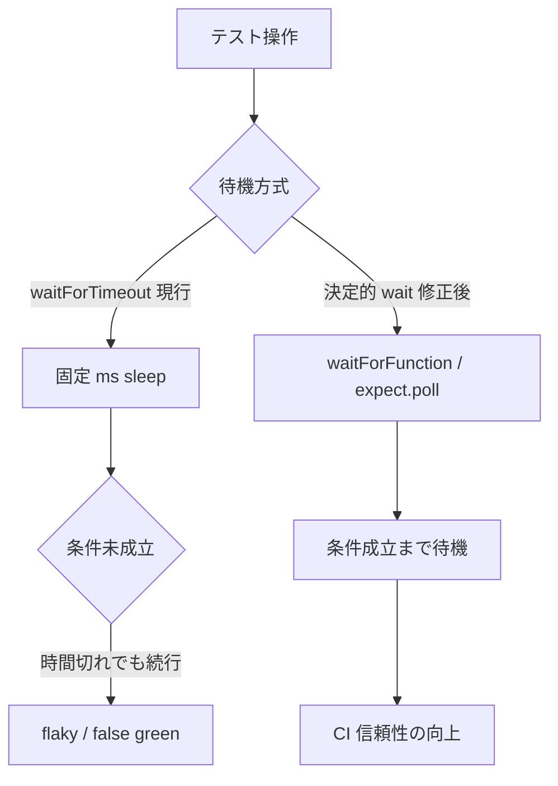

# E2E の `waitForTimeout(...)` を決定的待機に置き換える

- Priority: Medium
- Created: 2026-05-25
- Polished: 2026-09-15
- Model: Composer 2.5
- Branch: feature/refactor-e2e-waitfortimeout

## 目的

`e2e-tests/tests/` 配下の固定 `waitForTimeout(...)` を `waitForFunction` / `waitForSelector` / `expect.poll` 等の決定的待機に置き換え、flaky の根本原因を減らして CI 信頼性を上げる。issue 0027 (flaky 検出) は「対応不要」として closed になったため、本 issue が flaky の根本原因削減への唯一の対処として独立に実施する。

## 優先度根拠

Medium。0027 は「`retries: 3` は CI が不安定な環境下で flaky テストを許容するための意図的な設定であり、リリースブロッカーとなる不具合ではない」との判断で closed され、CI は引き続き flaky を retry で吸収して表面化しない (`playwright.config.ts` は `retries: 3` のまま)。そのため本 issue のような根本原因削減は CI が green を保ち続けるための継続的な品質作業であり、即時のブロッカーではないが価値は高い。0027 適用後のような「本対応が実質必須」の状態は発生しない。

## 現状

### 状態遷移


```mermaid
flowchart TD
    A[テスト操作] --> B{待機方式}
    B -->|waitForTimeout 現行| C[固定 ms sleep]
    C --> D{条件未成立}
    D -->|時間切れでも続行| E[flaky / false green]
    B -->|決定的 wait 修正後| F[waitForFunction / expect.poll]
    F --> G[条件成立まで待機]
    G --> H[CI 信頼性の向上]
```

着手時に次で対象を網羅する:

```bash
rg -n "waitForTimeout" e2e-tests/tests/
```

2026-09-15 時点の結果: **13 ファイル、計 24 箇所** (`e2e-tests/tests/` 外に `waitForTimeout` は無い。ただし後述のとおり stereo 2 ファイルの 5 箇所は issue 0029 の再開に合わせて置換する)。

**置換の根本原則:** 各 `waitForTimeout` は、その**直後でテストが assert する条件がすべて成立するまで待つ**条件に置き換える。固定 sleep は「テストが見たいデータが揃うまで」の代用なので、置換条件は後続 assert に**方向 (outbound/inbound)・ページ (sendrecv は 2 ページ)・閾値**を合わせる。outbound 片方向・単一ページ・`> 0` に単純化しない。実装時は各 `waitForTimeout` の前後コードと対応 fixture (`e2e-tests/<fixture>/index.html` / `main.ts`) を必ず読み、後続 assert を確認してから置換する。

下表の「待機条件」は 2026-09-15 時点の develop で後続 assert を確認した上での方針 (行番号は同日時点。selector / stats 種別はすべて実在を確認済み)。

| ファイル                            | 行           | 待機条件 (後続 assert に合わせる)                                                                                                                                                                                                                                                                                                                                                                                                           |
| ----------------------------------- | ------------ | ------------------------------------------------------------------------------------------------------------------------------------------------------------------------------------------------------------------------------------------------------------------------------------------------------------------------------------------------------------------------------------------------------------------------------------------- |
| `authz_simulcast_encodings.test.ts` | 45           | sendonly (fixture: `simulcast_sendonly`)。直後 (`:57-63`) に `#pc-state` の `connectionState === "connected"` 待ち `waitForFunction` があり、さらに `:66` の `#connection-id:not(:empty)` 待ちもあるため 45 は削除可。ただし後続 assert は r0 の `bytesSent > 0` かつ `packetsSent > 2` (`:86-87`、`:88` で `scalabilityMode === "L1T1"` も確認)、r1/r2 は `bytesSent === 0` (`:96`, `:105`)。送出確認を待つなら `#get-stats` クリック (`:70`) の後に `#stats-report` outbound-rtp の **r0 限定で `packetsSent > 2`** を poll する |
| `stereo_audio.test.ts`              | 66           | stereo test (fixture: `fake_stereo_audio`)。**双方向**。送信側 `#stats-report` outbound-rtp `bytesSent > 0` と、受信側 `[data-recv-stats-report-json]` inbound-rtp `bytesReceived > 0` (`:86`) の両方を待つ。受信側の対処は「共通ヘルパー」参照 |
| `stereo_audio.test.ts`              | 146          | mono test。outbound-rtp `bytesSent > 0` のみ (受信側 assert なし)。66 とは別条件                                                                                                                                                                                                                                                                                                                                                            |
| `stereo_audio_sendrecv.test.ts`     | 62           | stereo test (fixture: `fake_stereo_audio_sendrecv`)。**双方向**。fixture は `#stats-report-1` / `#stats-report-2` の 2 要素 (plain `#stats-report` は無い)。各接続で `#get-stats` クリック後に outbound `bytesSent > 0` と inbound `bytesReceived > 0` を待つ (assert: `:77-78`, `:82-83`, `:86-89`, `:92-94`) |
| `stereo_audio_sendrecv.test.ts`     | 166          | mono test。**RTP stats の assert は無い** (後続は `getAnalysisData` のみ `:175`)。`#get-stats` クリック (`:169`) 後に `#audio-analysis` の `dataset.analysis` 書き込みを待つ |
| `stereo_audio_sendrecv.test.ts`     | 252          | mixed test。同上で **RTP stats の assert は無い** (後続は `getAnalysisData` のみ `:259`)。`#get-stats` クリック (`:255`) 後に `#audio-analysis` の `dataset.analysis` 書き込みを待つ |
| `sendrecv.test.ts`                  | 74, 75       | **双方向** (fixture: `sendrecv`)。各 page (sendrecv1/2) で outbound `bytesSent > 0` と inbound `bytesReceived > 0` を待つ (assert: audio / video の両方が `:101-117`, `:132-148`。helper の判定は全 outbound-rtp / inbound-rtp を対象とするため audio の送出で十分だが、video も同時に流れる)                                                                                                                                                                     |
| `webkit.test.ts`                    | 78, 79       | **双方向** (fixture: `sendrecv_webkit`)。各 page (sendrecv1/2) で outbound `bytesSent > 0` と inbound `bytesReceived > 0` を待つ (assert: `:105-121`, `:136-152`)                                                                                                                                                                                                                                                                            |
| `webkit.test.ts`                    | 198          | `test.fail` ブロック (`:164`) 内 (fixture: `simulcast_sendonly_webkit`)。`#connection-id:not(:empty)` は `:194` で待機済み。後続 assert は r0/r1 `bytesSent > 500` かつ `packetsSent > 50`、r2 `bytesSent === 0` (`:216-217, :227-228, :238-239`)。`bytesSent >= 1` で抜けると閾値未達で `test.fail` の挙動が不安定化する。r0 `bytesSent >= 500` 相当を poll する                                                                                                                                                                                     |
| `simulcast_rid.test.ts`             | 47           | **両 page** (fixture: `simulcast_sendonly` / `simulcast_recvonly`)。sendonly は r0/r1/r2 すべて outbound `bytesSent > 0` + `packetsSent > 0` + `scalabilityMode` (`:69-91`)、recvonly は inbound `bytesReceived > 0` を待つ。さらに recvonly の `frameWidth` が sendonly r1 と一致 (`:101-106`) するまで安定が必要。3 rid 立ち上がり待ちのため両 page の条件を満たすまで poll する                                                                                                                                                        |
| `simulcast.test.ts`                 | 15           | `:17-40` が `#local-video-connection-id` / `#remote-video-connection-id-r0/r1/r2` を `:not(:empty)` で待機済み。15 は **削除** する (その後 `#get-stats` クリック `:43` で stats を取るが、selector 待ちで接続確立は担保済み)                                                                                                                                                                                                                     |
| `sendonly_recvonly.test.ts`         | 58, 59       | sendonly (fixture: `sendonly`)。`#stats-report` outbound-rtp `bytesSent > 0` (assert: `:84`)。recvonly (fixture: `recvonly`)。`#stats-report` **inbound-rtp** `bytesReceived > 0` (assert: `:104`)                                                                                                                                                                                                                                               |
| `sendonly_audio.test.ts`            | 48           | sendonly (fixture: `sendonly_audio`)。`#stats-report` outbound-rtp `bytesSent > 0` (assert: `:67`)                                                                                                                                                                                                                                                                                                                                           |
| `rpc.test.ts`                       | 67           | 初期解像度取得 (r2 で開始) 前の安定待ち。`#rpc-methods` (`:52`) / `#remote-videos video` (`:59`) / `#switched[data-switched="true"]` (`:62`) は既に待機済み。`#video-resolution` の `data-width` と `data-height` が非ゼロになるまで `waitForFunction` (`data-width` / `data-height` は video の `resize` イベントでのみ更新される (`rpc/main.ts` の `ontrack`)。`#rid-status` / `#rpc-result` は実在しない)                                                                                                                                          |
| `rpc.test.ts`                       | 95           | r0 切替後の解像度反映待ち。`#current-rid` の `dataset.currentRid === "r0"` 待ち (`:86-92`) は既存。以降 `#video-resolution` の `data-width` / `data-height` が `initialResolution` (`:70`) より小さくなるまで `expect.poll` (assert `:102-103` は width / height 両方)                                                                                                                                                                                |
| `rpc.test.ts`                       | 118          | r2 復帰後の解像度反映待ち。`#current-rid` の `dataset.currentRid === "r2"` 待ち (`:109-115`) は既存。以降 `#video-resolution` が r0 より大きく戻るまで `expect.poll` (assert `:125-126` は width / height 両方)                                                                                                                                                                                                                                     |
| `h265.test.ts`                      | 71, 72       | **双方向** (fixture: `h265`)。各 page で outbound `bytesSent > 0` と inbound video `bytesReceived > 0` を待つ (assert: `:92-93, :97-98, :107-108, :112-113`)                                                                                                                                                                                                                                                                                   |
| `spotlight_sendrecv.test.ts`        | 34, 35       | テストは get-stats を使わず `#connection-id` のみ参照 (fixture の `spotlight_sendrecv/main.ts` にも `#get-stats` ハンドラは無い)。`:30-31` で `#connection-id:not(:empty)` を待機済みのため 34-35 は **削除** する                                                                                                                                                                                                                                      |
| `reconnect.test.ts`                 | 35           | API 切断 (`#disconnect-api`) 前のメディア確立待ち (fixture: `sendonly_reconnect`)。fixture は `#connection-id` (not `#local-video-connection-id`) + `#stats-report`。`:30` で接続待ち済みだが、再接続を意味あるものにするには切断前にメディアが流れている必要があるため `#stats-report` outbound-rtp `bytesSent > 0` を待つ。`#stats-report` は `#get-stats` クリック時のみ書き込まれる (`sendonly_reconnect/main.ts` の `#get-stats` ハンドラ) ため、共通ヘルパー (poll 内で `#get-stats` を再クリック) を使うこと |
| `connected_callback.test.ts`        | -           | `waitForTimeout` 無し。対象外                                                                                                                                                                                                                                                                                                                                                                                                               |
| `spotlight_sendonly_recvonly.test.ts` | -         | `waitForTimeout` 無し。対象外                                                                                                                                                                                                                                                                                                                                                                                                               |

### 共通ヘルパー (推奨)

stats 待ちを各 test に散在させないため、`e2e-tests/tests/helper.ts` (既存、`Page` を import 済み。`expect` は value import を追加する: `import { expect } from "@playwright/test"`) に次を追加する。**`#stats-report` の `dataset.statsReportJson` は `#get-stats` クリック時にのみ更新される**ため、poll ループの内側で毎回 `#get-stats` を再クリックして最新 stats を取得することが必須 (再クリックしないと初回スナップショットで固定され poll が無意味になる)。stats 種別・判定フィールド・閾値・対象 selector・dataset キーを引数化する:

```ts
export async function waitForRtpStat(
  page: Page,
  kind: "outbound-rtp" | "inbound-rtp",
  field: "bytesSent" | "bytesReceived" | "packetsSent" | "packetsReceived",
  minValue = 1,
  statsSelector = "#stats-report",
  datasetKey = "statsReportJson",
): Promise<void> {
  await expect
    .poll(async () => {
      await page.click("#get-stats");
      return page.evaluate(
        ({ statsSelector, datasetKey, kind, field, minValue }) => {
          const json =
            document.querySelector<HTMLElement>(statsSelector)?.dataset[datasetKey] ?? "[]";
          const stats = JSON.parse(json) as Array<Record<string, unknown>>;
          return stats.some((s) => s.type === kind && Number(s[field] ?? 0) >= minValue);
        },
        { statsSelector, datasetKey, kind, field, minValue },
      );
    })
    .toBe(true);
}
```

- **`minValue` は後続 assert の閾値以上にする** (例: `authz` r0 は `packetsSent` を `minValue: 3`、`webkit:198` r0 は `bytesSent` を `minValue: 500`)。`>= 1` で抜けると直後の `> 500` / `> 2` assert が flaky のまま残る
- sendonly / 送信側: `waitForRtpStat(page, "outbound-rtp", "bytesSent")`
- recvonly / 受信側: `waitForRtpStat(page, "inbound-rtp", "bytesReceived")`
- **双方向テスト** (sendrecv / webkit:78-79 / h265 / stereo_audio_sendrecv:62): 各 page で outbound と inbound の両方を待つ (helper を 2 回呼ぶ)
- `stereo_audio_sendrecv` は `statsSelector` に `#stats-report-1` / `#stats-report-2` を渡す (どちらも静的 DOM の空 div で、既存の `waitForSelector` は内容書き込みによる可視化に依存している)
- **`stereo_audio.test.ts` の受信側 (`[data-recv-stats-report-json]`)**: `#get-stats` クリック毎に新規 div を **append** する (`fake_stereo_audio/main.ts:276-278`、dataset キーは `recvStatsReportJson`) ため、`querySelector` は最古の div を返してデータが更新されない。このままでは poll が機能しないため、fixture を「上書き」に直す、または helper 側で最後の要素 (`document.querySelectorAll(...)` の末尾) を読む対処が必須 (`datasetKey: "recvStatsReportJson"` を渡す)
- **disconnect 後に stats を読むテスト** (`authz`、`webkit:198`) は、disconnect より前にこの poll を置く (PeerConnection 閉鎖後は `getStats` が失敗する)
- get-stats を使わないテスト (`spotlight_sendrecv`) はこのヘルパーを使わず、既存の selector 待ちで代替・削除する (`simulcast` は get-stats を使うが、15 行目は selector 待ちで削除できるためヘルパー不要)

## 設計方針

- 固定 ms 待機に **戻さない**
- `waitForFunction` / `expect.poll` の timeout は Playwright デフォルト (30s) を基本。短縮が必要なら test 単位で明示
- 置換後も test の意図 (何を待っているか) がコード上で読めること
- 各 `waitForTimeout` は表の方針に従い、対応 fixture の DOM / stats を実際に確認してから置換する (推定で置換しない)
- PR はファイル単位分割可。共通ヘルパー (`helper.ts`) を追加する PR を先頭にし、他 PR がそれに依存する順序にする。1 PR あたり 1〜3 ファイル程度を推奨

### 0029 との関係

`stereo_audio.test.ts` / `stereo_audio_sendrecv.test.ts` は issue 0029 (stereo assert 強化) と同一ファイルを触る。

- 0029 は現在 **pending** (2026-06-15 に実装 PR #741 の CI で stereo audio 系 3 件が接続初期化段階で fail し、Sora の `audio.opus_params.minptime` 仕様確認などの設計判断待ち)
- **本 issue では stereo 2 ファイル (5 箇所: `stereo_audio:66,146` / `stereo_audio_sendrecv:62,166,252`) を実施せず、0029 再開時に 0029 と併せて置換する**。両者は同じテスト関数 / fixture を変更するため、先に本 issue を当てると 0029 再開時に衝突する
- 0029 で追加する stats / SDP assert と、本 issue の `expect.poll` 待機は矛盾しないよう統合する
- 0029 が pending のままである限り、本 issue の完了条件は stereo 2 ファイル以外 (19 箇所) の完了をもって満たす

### 0027 との関係

- issue 0027 (flaky 検出) は 2026-06 に「対応不要」として closed (`retries: 3` は意図的な設定として維持)
- 本 issue は 0027 のマージを前提としない。CI では flaky が表面化しにくいため、置換後の安定性はローカルでの複数回実行 (例: 対象ファイルを `--repeat-each=5` 等で実行) で確認すること

## 完了条件

- `rg -n "waitForTimeout" e2e-tests/tests/` が **stereo 2 ファイル (`stereo_audio.test.ts` / `stereo_audio_sendrecv.test.ts`) 以外で 0 件** になる (stereo 2 ファイルの 5 箇所は 0029 再開時に併せて置換する)
- 上表の 19 箇所 (0029 対象外) が決定的待機に置換 (または削除) されている
- 各置換は対応 fixture の DOM 状態 / stats / connection 状態が安定する条件を待つ (固定 sleep 禁止)。**待機条件はそのテストの後続 assert に方向・ページ・閾値を合わせる** (双方向テストは outbound と inbound の両方、閾値は assert の値以上)
- stats 待ちヘルパーは poll ループ内で `#get-stats` を再クリックする (初回スナップショット固定を避ける)。`stereo_audio:66` の受信側は append 増殖する `[data-recv-stats-report-json]` への対処を行う (0029 再開時に実施)
- ローカルで対象ファイルを `pnpm exec playwright test --project="Chromium" e2e-tests/tests/<対象ファイル>` で実行して通ること。`package.json` の `e2e-test` script は存在しない project 名 `chromium` を参照している (`package.json:31`) ため、現状の `pnpm run e2e-test` は動作しない (script の typo 修正は本 issue のスコープ外)
- CI: e2e 系 workflow が green であること (0027 未適用のため flaky の検出は無いが、置換によって新規 flaky を増やさないこと)
- CHANGES.md `## develop` の `### misc` の末尾 (既存 `[CHANGE]` 群の後。種別順 CHANGE → ADD → UPDATE → FIX を守る) に追記する

  ```
  - [UPDATE] E2E テストの waitForTimeout を決定的待機に置き換え flaky の根本原因を減らす
    - @voluntas
  ```

### 置換例

sendonly の connect 後待機 (`#stats-report` を持つ fixture):

```ts
await waitForRtpStat(page, "outbound-rtp", "bytesSent");
```

双方向テスト (sendrecv 等) は各 page で 2 回呼ぶ:

```ts
await waitForRtpStat(sendrecv1, "outbound-rtp", "bytesSent");
await waitForRtpStat(sendrecv1, "inbound-rtp", "bytesReceived");
```

`rpc.test.ts:95` (r0 切替後の解像度反映待ち) — 直前の `#current-rid === "r0"` 待ちの後に:

```ts
await expect
  .poll(async () =>
    page.evaluate(() =>
      Number(document.querySelector<HTMLElement>("#video-resolution")?.dataset.width ?? 0),
    ),
  )
  .toBeLessThan(initialResolution.width);
```

`simulcast.test.ts:15` / `spotlight_sendrecv.test.ts:34-35` — 直前 / 周辺の `:not(:empty)` selector 待ちで連結を確認済みのため **行ごと削除** する。削除不可 (selector 待ちだけでは不足) と判断した場合は、不足理由を PR 説明に明記し、決定的条件を追加してから sleep を削除する。
