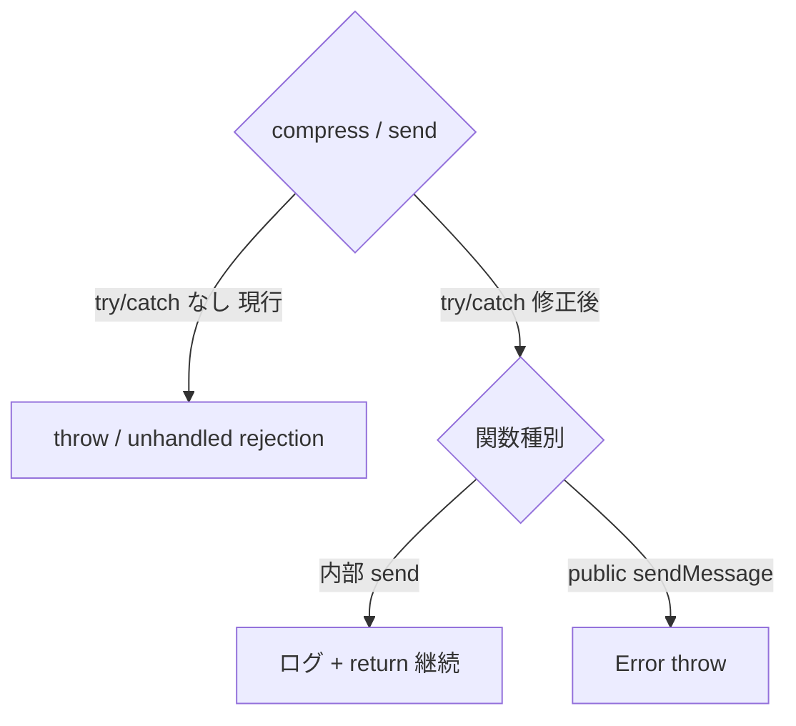

# `sendSignalingMessage` 等の `ws.send` / DataChannel.send / `compressMessage` 同期例外が未捕捉

- Priority: Medium
- Created: 2026-05-25
- Polished: 2026-06-08
- Model: Composer 2.5
- Branch: feature/fix-signaling-send-sync-exceptions

## 目的

issue 0004 は `abend()` 内の `compressMessage` のみを扱う。同型パターン (try/catch なしの `await compressMessage` / 同期 `ws.send` / `DataChannel.send`) が他にも残っており、unhandled rejection やサイレント失敗の原因になる。0004 の修正パターン (局所 try/catch + timeline / signaling ログ + 以降処理継続、ただし public API は throw) を以下 4 関数へ水平展開する。

対象 4 関数 (行は着手時参考値。実装時は `compressMessage` / `.send(` を grep で再特定する):

| 関数                    | 行           | 未捕捉箇所                                                |
| ----------------------- | ------------ | --------------------------------------------------------- |
| `disconnectDataChannel` | `:976-1017`  | `:978` `await compressMessage` (`send()` は try/catch 済) |
| `sendSignalingMessage`  | `:2301-2322` | `:2308` compress、`:2309`/`:2311` send、`:2319` ws.send   |
| `sendStatsMessage`      | `:2329-2343` | `:2337` compress、`:2338`/`:2340` send                    |
| public `sendMessage`    | `:2414-2433` | `:2428` compress、`:2429`/`:2431` send                    |

**スコープ外 (別 issue):** `sendAnswer` の `ws.send` (`:1512`) は issue 0007、`onicecandidate` 経路 (`:1553` の `sendSignalingMessage` 呼び出しを含むハンドラ) は issue 0009。0009 が `sendSignalingMessage` を呼ぶ経路の unhandled rejection 防止は本 issue の `sendSignalingMessage` 修正でカバーする (0009 は発火源停止、0034 は send 側捕捉で二重防御、相互代替不可)。

**スコープ外 (本 issue では触らない):** `sendRpcMessage` 系 (`:2545`, `:2605`) は compress が `.then().catch()`、send が try/catch 済で防御済み。`disconnectWebSocket` (`:891`)、`signalingOnMessageTypePing` (`:1992`)、`getSignalingWebSocket` 内 (`:1326`) は別問題として本 issue に含めない。

## 優先度根拠

Medium。0007 / 0009 が個別に表層を塞いでも、本 issue の 4 箇所から unhandled rejection / サイレント失敗が残る。

## 現状

### 状態遷移



現 `sendSignalingMessage` (`:2305-2321`) は DataChannel send (`:2309`/`:2311`) に readyState チェックが無く、ws 分岐 (`:2318`) も `this.ws !== null` のみで `readyState === WebSocket.OPEN` を見ない。compress (`:2308`) / send / ws.send のいずれも try/catch 外で、`compressMessage` の reject や send の同期例外が unhandled rejection になる。`sendStatsMessage` も同型で裸。`disconnectDataChannel` は send は try/catch 済だが compress (`:978`) のみ裸。public `sendMessage` は readyState チェック + throw を既に持つ (`:2417-2425`) が、compress (`:2428`) / send (`:2429`/`:2431`) は try/catch 外。

## 設計方針

### 共通方針

- **局所 try/catch で compress と send を囲む。** readyState が open のときだけ send し、**成功ログ (`send-${type}`) も send 成功時にのみ書く** (skip / 失敗時に成功ログを残さない。0004 の `abend` と同じ構造)
- **非圧縮 fallback は行わない** (0004 と同じ。圧縮設定のまま非圧縮 payload を送らない)
- error 文字列化は **`(error as Error).message` に統一** する (既存 `abend` / `disconnectDataChannel` の `failed-to-send-disconnect` ログが `(error as Error).message` を使うのに合わせる)。ログ呼び出しは既存形式に合わせ、DataChannel は `writeDataChannelSignalingLog(eventType, channel, message)`、ws は `writeWebSocketSignalingLog(eventType, data)` を使う
- compress 失敗ログは 0004 の `failed-to-compress-disconnect` に倣い `failed-to-compress-*`、send 失敗は `failed-to-send-*` を使う
- 共通ヘルパー化はしない (箇所ごとに最小の try/catch を入れる。YAGNI)

### 関数別方針

| 関数                    | compress 失敗時                          | send 失敗時                                              |
| ----------------------- | ---------------------------------------- | -------------------------------------------------------- |
| `sendSignalingMessage`  | ログして return (throw しない)           | readyState open 時のみ send、try/catch でログして return |
| `sendStatsMessage`      | ログして return                          | 同上                                                     |
| `disconnectDataChannel` | 0004 同型 — ログして **disconnect 継続** | 既存 send try/catch 維持                                 |
| `sendMessage` (public)  | `Error` throw (現状維持・変更不要)       | `Error` throw (現状維持・変更不要)                       |

### `sendSignalingMessage` 修正例

`:2305-2321` を次のとおり書き換える。0004 の `abend` と同じく **compress 失敗 (外側 catch → `failed-to-compress-${type}`) と send 失敗 (内側 catch → `failed-to-send-${type}`) を二段 catch で区別**する。readyState チェックも 0004 に合わせて導入し (非 open チャネルへの送信を試みず skip)、成功ログ (`send-${type}`) は send 成功時にのみ書く。

```ts
if (this.soraDataChannels.signaling) {
  if (this.signalingOfferMessageDataChannels.signaling?.compress === true) {
    try {
      const binaryMessage = new TextEncoder().encode(JSON.stringify(message));
      const compressedMessage = await compressMessage(binaryMessage);
      if (this.soraDataChannels.signaling.readyState === "open") {
        try {
          this.soraDataChannels.signaling.send(compressedMessage);
          this.writeDataChannelSignalingLog(
            `send-${message.type}`,
            this.soraDataChannels.signaling,
            message,
          );
        } catch (error) {
          this.writeDataChannelSignalingLog(
            `failed-to-send-${message.type}`,
            this.soraDataChannels.signaling,
            (error as Error).message,
          );
        }
      }
    } catch (error) {
      this.writeDataChannelSignalingLog(
        `failed-to-compress-${message.type}`,
        this.soraDataChannels.signaling,
        (error as Error).message,
      );
    }
  } else if (this.soraDataChannels.signaling.readyState === "open") {
    try {
      this.soraDataChannels.signaling.send(JSON.stringify(message));
      this.writeDataChannelSignalingLog(
        `send-${message.type}`,
        this.soraDataChannels.signaling,
        message,
      );
    } catch (error) {
      this.writeDataChannelSignalingLog(
        `failed-to-send-${message.type}`,
        this.soraDataChannels.signaling,
        (error as Error).message,
      );
    }
  }
} else if (this.ws !== null && this.ws.readyState === WebSocket.OPEN) {
  try {
    this.ws.send(JSON.stringify(message));
    this.writeWebSocketSignalingLog(`send-${message.type}`, message);
  } catch (error) {
    this.writeWebSocketSignalingLog(`failed-to-send-${message.type}`, (error as Error).message);
  }
}
```

ws は同期送信のみのため compress catch は不要。`WebSocket.OPEN` は既存コードに数値 `1` 表記の箇所もあるが、可読性のため定数表記を使う (実装時に既存に合わせて `=== 1` でも可)。

**readyState skip の妥当性:** 非 open チャネルへの送信を skip して握りつぶすのは teardown / 切断進行中のケースであり、ここで throw すると本 issue が防ぎたい unhandled rejection が再発する。送信失敗の検知は別経路 (ICE / WebSocket close ハンドラ) が担う。`sendSignalingMessage` を呼ぶ re-answer / update-answer 経路 (`:1919`, `:1932`) も同方針 (失敗時はログのみ、上位は close 検知で対応)。

### `disconnectDataChannel` compress ブロック

`:976-1017` の compress / non-compress 分岐全体を 0004 同型 try/catch で囲み、catch 時は signaling ログを残して **そのまま下の `Promise.race` (`:1019` 付近) へフォールスルー** する。compress 失敗は 4999 を返さない (4999 は timeout / DC onerror 専用)。compress 失敗後に DC が閉じなければ timeout 経由で 4999 になる。

### `sendStatsMessage`

成功時ログは現状存在しない。失敗時は throw せず return し、`writeDataChannelSignalingLog("failed-to-send-stats", this.soraDataChannels.stats, (error as Error).message)` でログを残す (compress 失敗は `failed-to-compress-stats`)。

### `sendMessage` (public API)

既に `:2417-2425` で readyState チェック + throw を持つ。compress (`:2428`) の reject も send (`:2429`/`:2431`) の同期例外も `async` 関数の戻り Promise でそのまま呼び出し側へ throw される。public API は例外を握りつぶさず呼び出し側に伝えるべきで、**現状が既にその挙動**のため新たな try/catch は追加しない (内部 send の silent 継続方針とは異なる)。本 issue では「sendMessage は compress / send 失敗時に例外を握りつぶさず throw する」ことを確認するに留める。

## 完了条件

- 上記 4 関数で方針どおり try/catch + readyState ガードが入っている
- `sendSignalingMessage` の compress / non-compress / ws 分岐すべてで readyState open 時のみ send し、成功ログ (`send-${type}`) を send 成功時にのみ書く (skip / 失敗時に成功ログを残さない)
- `disconnectDataChannel` の compress 失敗後も `Promise.race` に到達し、compress 失敗自体では 4999 を返さない
- public `sendMessage` は compress / send 失敗時に `Error` を throw することを確認する (現状で満たすため新規 try/catch は不要)
- error 文字列化が全箇所 `(error as Error).message` に統一されている
- `grep -n "compressMessage\|ws\.send\|\.send(" src/base.ts` で対象 4 関数が防御済みであることを確認する (0004 `abend` / 0007 `sendAnswer:1512` / スコープ外箇所は除外)
- compress 人工失敗のユニットテストは **追加しない** (モック禁止)。catch 経路は通常フローで発火しないため `pnpm test` では検証できず、型チェック (`tsc`) と既存テスト回帰 + 静的レビューで担保する
- ローカルで `pnpm test` および既存 `pnpm e2e-test` が通ること
- CHANGES.md `## develop` 直下 (`### misc` ではない。バグ修正のため。既存 `[FIX]` 群の後に置き、担当者行は 2 文字インデント) に追記する

  ```
  - [FIX] sendSignalingMessage 等の compressMessage / ws.send / DataChannel.send 同期例外を捕捉する
    - @voluntas
  ```

## マージ順

リポジトリ全体の正本チェーンは issue 0004 を参照。該当区間は:

```
0004 → 0006 → (0011) → 0021 → 0009 → 0001 → 0008 → 0007 → 0034 → 0031 → 0002 → 0005 → 0030
```

- **0004 マージ後** に着手 (0004 パターンを踏襲。0004 が同一 PR でない場合は 0004 の `failed-to-compress-disconnect` 実装を先に確認する)
- **0031 / 0002 / 0030 より先** にマージ (`disconnectDataChannel` を触るため。0030 は `abend` / `disconnect` 全体 refactor)
