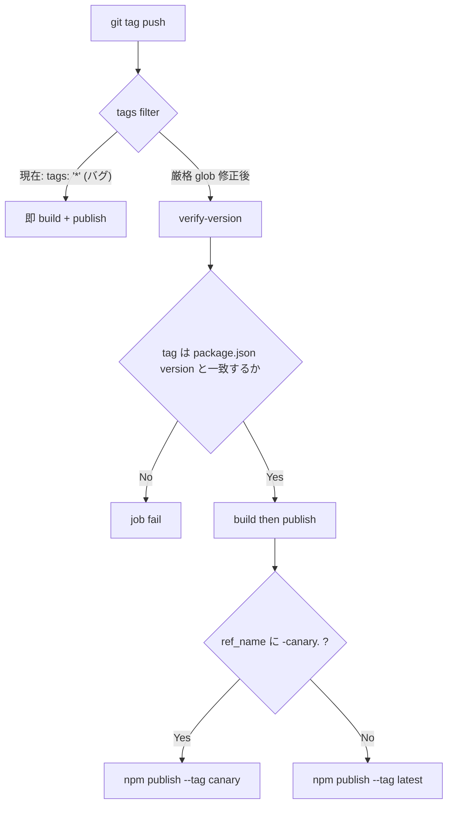

# npm-publish.yml のタグトリガが緩くタグと package.json の不整合で誤 publish される

- Priority: High
- Created: 2026-05-21
- Completed: 2026-06-12
- Polished: 2026-06-12
- Model: Opus 4.7
- Branch: feature/fix-npm-publish-tag-version-mismatch

## 必要性

**必要。** 現行 workflow は任意タグ (`tags: "*"`) で publish が走り、`package.json` の `version` とタグ名の照合もない。canary 判定も `contains(github.ref, 'canary')` という部分文字列マッチのため、タグ名に `canary` を文字列として含むだけの誤タグでも canary 経路に入る。npm publish は取り消しが困難 (同名 version の再 push 不可、72 時間以降の unpublish 不可) なため、構造的ガードが必須。

## 目的

`.github/workflows/npm-publish.yml` の publish トリガと canary 分岐を本リポジトリのリリース命名規約に合わせて厳格化し、タグ名と `package.json` の `version` 不一致時は publish 前に fail させる。

## 優先度根拠

High。npm publish は外部依存を持つ全ユーザーに即座に影響する。リリース担当者の誤タグ操作で意図しない version が npm に載る、または canary / latest の経路を誤る事故が起きうる。

## 現状

### 状態遷移



`.github/workflows/npm-publish.yml:3-6`:

```yaml
on:
  push:
    tags:
      - "*"
```

canary 分岐 (`.github/workflows/npm-publish.yml:37`, `:63`):

```yaml
if: ${{ contains(github.ref, 'canary') }}
if: ${{ !contains(github.ref, 'canary') }}
```

- `github.ref` は `refs/tags/<tag-name>` 形式。`github.ref_name` は `<tag-name>` 部分のみ (例: `2025.2.0-canary.0`)
- `package.json` の `version` とタグ名 (`github.ref_name`) の照合は無い
- 既存タグは `v` プレフィックス無し。CalVer (`2020.1.0` 〜 `2026.1.0-canary.1` で約 176 件) と CalVer 移行以前の semver (`0.1.0` 〜 `1.16.0` で約 42 件) が混在 (`git tag -l` 参照)。旧 semver の再 push は想定しないため、新 glob で非 match になっても実害なし
- 現行の `package.json` `version` は `2026.1.0-canary.1` で同名タグも既に push 済み。次回の canary push は `2026.1.0-canary.2` 以降を想定
- GitHub Actions の `on.push.tags` filter は glob 構文 (<https://docs.github.com/en/actions/writing-workflows/workflow-syntax-for-github-actions#patterns-to-match-branches-and-tags>)。`*` は `/` 以外の 0 文字以上の任意文字列を表し、`-` や `.` などの区切り文字も飲む。glob 単独では厳密な形式検証ができないため、別ジョブでのスクリプト検証が必要

## 設計方針

**役割分担:** 2 つの glob は `on.push.tags` のトリガ用の粗フィルタで OR 結合。canary タグは canary glob と非 canary glob の両方に match する。canary / non-canary の振り分けは job の `if` で行い、タグ名と version の厳密照合は `verify-version` が担う。glob 自体は「4 桁年で始まる CalVer 以外を発火させない」粗ガードで、glob を 2 つに書き分けるのは canary 命名規約 (`<version>-canary.<n>`) を workflow ファイル上で明示する目的。

**間接ガード:** `verify-version` 失敗時は `build` が success にならず後続 publish が走らない、という `build` 経由の間接ガード設計を採用する。GitHub Actions のデフォルト挙動として、`needs:` を持ち `if:` を持たないジョブは依存ジョブが全 success のときのみ実行される。将来 `build` に `if: always()` 等を付けるとガードが破れるため、`build` の `if:` を弄らないこと。

### 1. `on.push.tags` を厳格 glob 2 つに変更する

```yaml
on:
  push:
    tags:
      - "[0-9][0-9][0-9][0-9].[0-9]*.[0-9]*"
      - "[0-9][0-9][0-9][0-9].[0-9]*.[0-9]*-canary.[0-9]*"
```

### 2. `verify-version` ジョブを新設する

`jobs:` 直下、現行 `build:` の直前に挿入する。ジョブのキー順序は他の publish 系ジョブ (`runs-on:` → `needs:` → `permissions:` → ...) に合わせるが、`verify-version` は `build` の前段で表示名を分かりやすくするため意図的に `name:` を付ける。`ubuntu-slim` 上で `setup-node` を経由して `node -p` で `package.json` を読む (既存 `build` ジョブと同じ runner image / node version に揃える)。トップレベル `permissions:` の継承を断ち `contents: read` のみを明示する (このジョブは publish しないため id-token 不要)。

タグ名は GitHub Actions security hardening best practice (<https://docs.github.com/en/actions/security-for-github-actions/security-guides/security-hardening-for-github-actions#using-an-intermediate-environment-variable>) に従い step 単位の `env:` 経由で受け取り、shell リテラルへの直接展開を避ける。git refname 仕様によりタグ名にシェルメタ文字 (空白・引用符・`$` 等) は本来入らないが、防御層を二重に持つため env 経由を徹底する。

`actions/checkout` のデフォルト `ref` によりタグ時点の `package.json` を読む。`actions/checkout` / `actions/setup-node` の SHA は同ファイル内の他ジョブと完全に揃える:

```yaml
verify-version:
  name: Verify tag matches package.json version
  runs-on: ubuntu-slim
  permissions:
    contents: read
  steps:
    - uses: actions/checkout@df4cb1c069e1874edd31b4311f1884172cec0e10 # v6.0.3
    - uses: actions/setup-node@48b55a011bda9f5d6aeb4c2d9c7362e8dae4041e # v6.4.0
      with:
        node-version: 22
    - name: Compare tag name with package.json version
      env:
        TAG_NAME: ${{ github.ref_name }}
      run: |
        PKG_VERSION=$(node -p "require('./package.json').version")
        if [ "$PKG_VERSION" != "$TAG_NAME" ]; then
          echo "::error::Tag ${TAG_NAME} does not match package.json version ${PKG_VERSION}"
          exit 1
        fi
        echo "Tag ${TAG_NAME} matches package.json version ${PKG_VERSION}"
```

shell 挙動: GitHub Actions の `run:` は既定で `bash --noprofile --norc -eo pipefail` で実行される (<https://docs.github.com/en/actions/writing-workflows/workflow-syntax-for-github-actions#using-a-specific-shell>)。`node -p` がノンゼロ終了した場合は `set -e` (errexit) によりコマンド置換失敗時点でスクリプトが中断し `exit 1` となる (`bash --noprofile --norc -eo pipefail` のような明示的設定無しの bash 旧バージョン環境では errexit が代入文に伝播せず `PKG_VERSION` が空文字となるが、その場合は空文字 ≠ `TAG_NAME` で `exit 1` が発火する保険経路がある)。いずれの経路でも fail-closed。canary を名乗りつつ命名規約に沿わない誤タグ (例: `2025.2.0-canary.x` / `2025.2.0-canary.` / `2025.2.0-canary`) は、非 canary glob で拾われたあと `verify-version` で `package.json` の現在値と一致せず必ず fail する (極稀に glob にも `if` にも掛からないタグは workflow run 自体が発火しない)。いずれの経路でも publish には進まない。

### 3. `build` ジョブに `needs: [verify-version]` を追加する

`build:` の `runs-on: ubuntu-slim` の直後に 1 行挿入する (他ジョブのキー順序 `runs-on:` → `needs:` と揃える)。`build` ジョブの `steps:` 配下 (既存の `actions/checkout` 以下 8 step) は無編集のまま:

```yaml
build:
  name: Build
  runs-on: ubuntu-slim
  needs: [verify-version]
  steps:
    # 既存の steps はそのまま
```

`slack_notify` (`needs: [npm-publish-canary, npm-publish]`、`if: ${{ !cancelled() }}`) は本 issue では変更しない。

### 4. canary 判定を `github.ref_name` の `-canary.` 部分一致に変更する

`npm-publish-canary` / `npm-publish` の `if` を以下に変更する:

```yaml
# npm-publish-canary
if: ${{ contains(github.ref_name, '-canary.') }}

# npm-publish
if: ${{ !contains(github.ref_name, '-canary.') }}
```

glob で `-canary.` を含むタグは canary 命名規約 (`<version>-canary.<n>`) のみに絞られるため `contains` の部分一致でも誤判定は発生しない。

## 完了条件

### コード変更

`verify-version` を先に新設してから `build` の `needs:` を追加することで、編集途中も常に valid な参照関係を保てる順序で書く:

- [ ] `on.push.tags` を `"*"` から上記 glob 2 つへ変更する
- [ ] `jobs:` 直下、現行 `build:` の直前に `verify-version` ジョブを新設する
- [ ] `build` の `runs-on:` の直後に `needs: [verify-version]` を追加する
- [ ] canary 判定を `contains(github.ref_name, '-canary.')` / `!contains(github.ref_name, '-canary.')` に変更する
- [ ] 既存の publish ステップ (`npm publish --no-git-checks` / `--tag canary`) は変更しない

### 検証

本 issue は `.github/workflows/npm-publish.yml` 1 ファイルのみの編集で SDK ソース無変更。`pnpm run lint` / `pnpm run typecheck` は YAML を対象としないため意味を持たず実行しない。本リポジトリは現状 `actionlint` を CI / pre-commit に組み込んでいないため、YAML 構文の本番検証は GitHub Actions パーサーによるアップロード時の検証 (PR 上で workflow ファイル 自身が paths match していなくても yaml syntax error は GitHub 上で警告表示される) に委ねる。

- [ ] `git diff .github/workflows/npm-publish.yml` で変更点 1-4 が反映されていること、既存 step 本体が無編集であることを目視確認する
- [ ] glob の書式妥当性を bash の `case` 文で補助確認する (GitHub Actions filter pattern と bash glob は実装が異なり厳密な等価性は保証されないため、最終的な glob 動作は GitHub Actions の filter pattern 仕様 URL (現状節参照) で確認する):

  ```bash
  for tag in 2025.2.0 2025.2.0-canary.0 2025.2.0-canary.10 2026.1.0-canary.1 \
             1.16.0 v2025.2.0 feature-canary-foo 2025.2.0.alpha; do
    case "$tag" in
      [0-9][0-9][0-9][0-9].[0-9]*.[0-9]*-canary.[0-9]*) echo "canary MATCH: $tag" ;;
      [0-9][0-9][0-9][0-9].[0-9]*.[0-9]*) echo "non-canary MATCH: $tag" ;;
      *) echo "NO MATCH: $tag" ;;
    esac
  done
  # 期待:
  #   CalVer 系 (2025.2.0 / 2025.2.0-canary.0 / 2025.2.0-canary.10 / 2026.1.0-canary.1) は MATCH
  #   1.16.0 / v2025.2.0 / feature-canary-foo は NO MATCH
  ```

  `2025.2.0.alpha` は bash でも GitHub Actions filter pattern でも non-canary MATCH する (`[0-9]*` が末尾の任意文字列を飲むため)。本番では `verify-version` で `package.json` version と不一致になり fail する想定で、glob 単独で除外しないことを許容する。

- [ ] `verify-version` スクリプトの一致 / 不一致経路をリポジトリルートで実行確認する (`node -p` は cwd 依存):

  ```bash
  # リポジトリルート (.../sora-js-sdk) で実行
  for TAG_NAME in 2026.1.0-canary.1 2025.2.0; do
    export TAG_NAME
    bash --noprofile --norc -eo pipefail -c '
      PKG_VERSION=$(node -p "require(\"./package.json\").version")
      if [ "$PKG_VERSION" != "$TAG_NAME" ]; then
        echo "::error::Tag ${TAG_NAME} does not match package.json version ${PKG_VERSION}"
        exit 1
      fi
      echo "Tag ${TAG_NAME} matches package.json version ${PKG_VERSION}"
    '
    echo "TAG_NAME=$TAG_NAME exit=$?"
  done
  unset TAG_NAME
  # 期待: TAG_NAME=2026.1.0-canary.1 (現状の package.json version と一致) → success ログ + exit=0
  #       TAG_NAME=2025.2.0 (不一致) → ::error:: ログ + exit=1
  ```

- [ ] 実機 publish と PR 上での tag push テストは行わない (tag push は本番 publish workflow をトリガし誤 publish のリスクがある)。fail 経路の動作確認は上記ローカル検証で代替し、本番タグでの fail は構造上再現できないことを許容する

### 変更履歴

- [ ] `CHANGES.md` `## develop` の `### misc` セクション内、既存 `[FIX]` 群末尾 (現在の `- [FIX] macOS の Google Chrome stable インストール ...` の次行) に追記する。種別順 CHANGE → ADD → UPDATE → FIX を守る (マージ順が前後しても同種別群末尾に置く)

  ```
  - [FIX] npm-publish workflow のタグトリガを厳格化し、タグ名と package.json の version が一致しない場合は publish 前に fail させる
    - @voluntas
  ```

## マージ後フォローアップ

`npm-publish.yml` は tag push まで実行されないため、次回 canary tag push (`2026.1.0-canary.2` 以降を想定) 時に Actions タブの該当 run で以下を確認する:

- `verify-version` ジョブが success (緑チェック) で、Compare ステップに `Tag ... matches package.json version ...` のログが出ていること
- `build` ジョブが success であること
- `npm-publish-canary` ジョブが success、`npm-publish` ジョブが Skipped (灰色チェック) であること

## スコープ外

- workflow `permissions` の最小権限化 (issue 0026)
- `npm publish --provenance` 追加 (issue 0033)
- `npm publish --no-git-checks` フラグの再評価 (0033 で provenance 導入時に併せ検討)

## マージ順

`0024 → 0026 → 0033` を推奨する。0024 と 0026 はいずれも `npm-publish.yml` を編集するが編集箇所は競合しない (0024 は `on.push.tags` / publish ジョブの `if` / 新規 `verify-version` ジョブ + `build` への `needs:` 追加、0026 はトップレベル `permissions:` の `id-token: write` 1 行削除 + e2e 系 5 workflow への `permissions: contents: read` 追加)。0024 のほうが workflow 構造変更が大きく後続 PR の差分が読みやすくなるため、`0024 → 0026` の順を推奨する。

## 解決方法

`.github/workflows/npm-publish.yml` に対して以下 4 点を反映した。

1. `on.push.tags` を `"*"` から CalVer 系 2 つの厳格 glob (`[0-9][0-9][0-9][0-9].[0-9]*.[0-9]*` と `[0-9][0-9][0-9][0-9].[0-9]*.[0-9]*-canary.[0-9]*`) に変更し、4 桁年で始まる CalVer 以外のタグでは workflow が発火しないようにした
2. `jobs:` 直下 (`build:` の直前) に `verify-version` ジョブを新設した。`permissions: contents: read` のみを明示してトップレベル `permissions:` (`id-token: write` / `contents: read`) の継承を断ち、`actions/checkout` と `actions/setup-node@v6.4.0` (node 22) を経由して、step 単位の `env:` 経由で受けた `TAG_NAME` (`github.ref_name`) と `node -p "require('./package.json').version"` の結果を比較する。一致しない場合は `::error::` を出して `exit 1` する
3. `build` ジョブの `runs-on: ubuntu-slim` の直後に `needs: [verify-version]` を追加した。`verify-version` が fail / cancel / skipped になった場合は `build` も skip され、後続の `npm-publish-canary` / `npm-publish` も skip される間接ガード経路が成立する (`build` の `if:` は付けない)
4. `npm-publish-canary` と `npm-publish` の `if:` を `contains(github.ref, 'canary')` から `contains(github.ref_name, '-canary.')` / `!contains(github.ref_name, '-canary.')` に変更した。`-canary.` を末尾区切り込みで判定することで `-canaryfoo` のような誤判定を排除する

既存の publish step (`npm install -g npm@latest` / `npm publish --no-git-checks` / `npm publish --no-git-checks --tag canary`) と `slack_notify` ジョブは無編集のまま維持した。

検証はリポジトリ内で bash の `case` 文による glob 挙動の補助確認と、`verify-version` スクリプトの一致 (`TAG_NAME=2026.1.0-canary.1` で exit 0)・不一致 (`TAG_NAME=2025.2.0` で `::error::` + exit 1) 経路をローカル実行で確認した。tag push による実機 publish 経路の検証は誤 publish のリスクがあるため行っていない (issue 完了条件で許容)。
