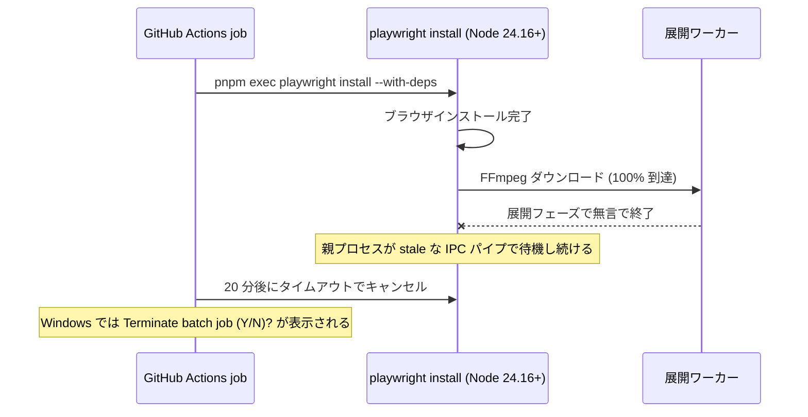

# Playwright を 1.59.1 から 1.60.0 へ更新して Node 24 での install ハングを修正する

- Priority: High
- Created: 2026-06-01
- Completed: 2026-06-01
- Model: Opus 4.8
- Branch: feature/fix-playwright-install-hang-node24

## 目的

e2e-test ワークフローが Node 24 のマトリクスで全 OS において失敗し続けているのを修正する。原因は Playwright 1.59.1 の既知バグで、Node 24.16+ において `playwright install` がブラウザ/FFmpeg のダウンロード完了後の展開フェーズでハングする。Playwright 1.60.0 で修正済みのため、依存を更新する。

## 優先度根拠

High とする。

- e2e-test ワークフローはスケジュール実行 (平日 JST 10:00-16:00 に 30 分ごと) と push 時に走る常用 CI であり、現在 Node 24 の全マトリクスが恒常的に失敗している。
- 失敗ジョブは 20 分のタイムアウトに到達するまでハングするため、CI 実行時間とコストを無駄に消費している。
- 通知が `failure_and_fixed` のため、失敗のたびに Slack 通知が飛び続ける。

## 現状

`package.json` の `devDependencies` で `@playwright/test` が `1.59.1` に固定されている (`package.json:43`)。

失敗 run: https://github.com/shiguredo/sora-js-sdk/actions/runs/26736394051

ジョブ一覧と失敗の切り分け:

- 失敗しているのは Node 24 のジョブのみ。OS は ubuntu-24.04 / macos-15 / windows-2025-vs2026 の全てで失敗する。
- Node 22 / Node 25 のジョブは全て成功している。

`pnpm exec playwright install <browser> --with-deps` ステップのログを時系列で確認すると、いずれの OS でもブラウザのインストール完了後、FFmpeg のダウンロードが 100% に到達した直後から約 18-20 分間まったく出力がなく、ジョブの `timeout-minutes: 20` に到達してキャンセルされている。

- Linux (Node 24): FFmpeg 100% 到達 `05:10:52` → 次の出力は `05:30:23` の `The operation was canceled.`
- Windows (Node 24): FFmpeg 100% 到達 `05:11:46` → 次の出力は `05:30:10` の `Terminate batch job (Y/N)?`

Windows で表示される `Terminate batch job (Y/N)?` はハングの原因ではない。ジョブのタイムアウトによるキャンセルが cmd 配下のバッチプロセスに Ctrl+C を送った結果として表示されるものであり、OS 非依存の install ハングが本質である。

これは Playwright の既知バグであり、Node 24.16+ で `playwright install` がダウンロード完了後の展開で展開ワーカーが無言で死に、親プロセスが stale な IPC パイプで固まる。Playwright 1.60.0 で修正されている。

参考: https://github.com/microsoft/playwright/issues/40724

## 設計方針

`@playwright/test` を 1.60.0 に更新する。`@playwright/test` は `playwright` および `playwright-core` を内部依存として引き込むため、これらも 1.60.0 系へ揃う。バージョンは現状の方針 (完全固定) に合わせて `1.60.0` とピン留めする。

## 完了条件

- `package.json` の `@playwright/test` が `1.60.0` になっている。
- `pnpm-lock.yaml` が更新され、`playwright` / `playwright-core` が 1.60.0 系に揃っている。
- e2e-test ワークフローの Node 24 マトリクスが全 OS で install ステップを通過し、ハングしなくなる。
- 既存の Node 22 / 25 のジョブが引き続き成功する。

## 解決方法

1. `package.json` の `"@playwright/test": "1.59.1"` を `"@playwright/test": "1.60.0"` に変更した。`pnpm install` で `pnpm-lock.yaml` を更新し、`playwright` / `playwright-core` も 1.60.0 系に揃えた。
2. `CHANGES.md` の `## develop` の `### misc` に `[FIX]` エントリを追記した (CI/開発依存の更新であり、ライブラリ利用者の機能には影響しないため misc が妥当)。

### 検証結果

e2e-test ワークフローを `feature/fix-playwright-install-hang-node24` で手動起動 (run 26737741680) し、Node 24 の全 9 ジョブ (ubuntu-24.04 / macos-15 / windows-2025-vs2026 × Chromium / Google Chrome / Google Chrome Beta) が 3-6 分で成功した。修正前は install ステップが約 18 分ハングして 20 分のタイムアウトでキャンセルされていたため、ハングが解消されたことを確認した。Node 22 / 25 のジョブも引き続き成功している。
